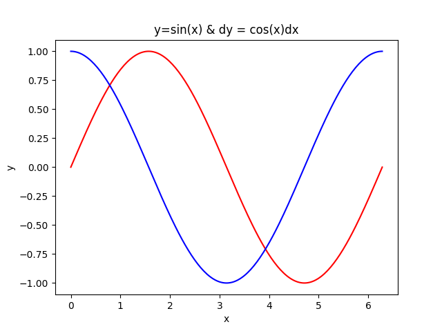

# 自动微分的Pytorch实现

> 环境：pytorch + ipython

基础代码：

```python
In [9]: x = torch.arange(4.0)

In [10]: x
Out[10]: tensor([0., 1., 2., 3.])

In [11]: x.requires_grad_(True)
Out[11]: tensor([0., 1., 2., 3.], requires_grad=True)

In [12]: x.grad

In [13]: y = 2 * torch.dot(x,x)

In [14]: y
Out[14]: tensor(28., grad_fn=<MulBackward0>)

In [15]: y.backward()

In [16]: x.grad
Out[16]: tensor([ 0.,  4.,  8., 12.])
```

课程作业：

1. 执行反向传播函数之后再次执行，查看效果？
- 疑似`x.backward()`和`y.backward()`都遇到了报错？KIMI的答案是：如果你没有在第一次反向传播后清空梯度，再次运行反向传播会导致梯度累加。这可能会导致错误的梯度值，进而影响权重的更新。
2. 在控制流的例子中，我们计算`d`关于`a`的导数，如果将变量`a`更改为随机向量或矩阵，会发生什么？
- 疑似又报错了。

code:

```python
import torch
print("————————标量————————")
def f(a):
    b = a*2
    while b.norm() < 1000:
        b = b*2
    if b.sum() > 0:
        c = b
    else:
        c = 100 *b
    return c
a = torch.randn(size=(),requires_grad=True)
print(a)
d=f(a)
print(d)
d.backward()
print(a.grad)
print(a.grad == d / a)
print("————————向量————————")
# 声明一个向量
a = torch.randn(3,requires_grad=True)
print(a)
d=f(a)
print(d)
try:
    d.backward()
    print(a.grad)
    print(a.grad == d/a)
except Exception as e:
    print("Error:",e)
```

information:

```bash
————————标量————————
tensor(1.3423, requires_grad=True)
tensor(1374.4960, grad_fn=<MulBackward0>)
tensor(1024.)
tensor(True)
————————向量————————
tensor([-0.3818,  2.0206,  2.3055], requires_grad=True)
tensor([-195.4644, 1034.5695, 1180.4403], grad_fn=<MulBackward0>)
Error: grad can be implicitly created only for scalar outputs
```
原因：默认情况下，PyTorch只能对标量结果（单一数值）求梯度 （==是得到的函数需要是标量函数/多项式！！==）
解决方式：
提供一个和 `d` 一一对应的向量，这样求梯度就变成了对每个元素逐一求导。

```python
import torch
print("————————向量————————")
# 声明一个向量
a = torch.randn(3,requires_grad=True)
print(a)
d=f(a)
print(d)
try:
    d.backward(torch.ones_like(d))
    print(a.grad)
    print(a.grad == d/a)
except Exception as e:
    print("Error:",e)
```

运行结果：

```bash
————————向量————————
tensor([ 1.8428,  1.0790, -0.5471], requires_grad=True)
tensor([ 943.5038,  552.4567, -280.1193], grad_fn=<MulBackward0>)
tensor([512., 512., 512.])
tensor([True, True, True])
```

> 我的疑问：有没有什么例子是a是一个包含x1,x2...xn的向量，d是和x1,x2...xn有关的标量函数，计算其梯度？

答：

构造函数：设向量$\mathbf{a} = [x_1,x_2,\dots,x_n]$, $\mathbf{d} = \sum_{i=1}^n x_i^2$。现在计算 `d` 相对于每个 $x_i$ 的梯度

```python
import torch
a = torch.randn(5,requires_grad=True)
print(a)
b = (torch.norm(a))**2
print(b)
b.backward()
print(a.grad)
```

结果：

```bash
tensor([ 0.0104, -0.0109, -0.9510, -1.0698, -0.6101], requires_grad=True)
tensor(2.4212, grad_fn=<PowBackward0>)
tensor([ 0.0207, -0.0219, -1.9019, -2.1397, -1.2201])
```

5. 使 $f(x) = \sin(x)$，绘制 $f(x)$ 和 $\frac{df(x)}{dx}$ 的图像，其中后者不使用 $f'(x) = \cos(x)$。

我做的答案：/和标答一致，只不过多几个变量orz

```python
import matplotlib.pyplot as plt
import numpy as np
import torch
x = np.linspace(0,2*np.pi,200)
# print(x)
y=np.sin(x)
plt.plot(x,y,c="red")
x2=torch.tensor(x)
x2.requires_grad_(True)
y = torch.sin(x2)
try:
    y.backward(torch.ones_like(y))
    d = x2.grad
    d3 = d.detach()
    d2 = d3.numpy()
    x4 = x2.detach()
    x3 = x4.numpy()
    plt.plot(x3,d,c="blue")
    plt.xlabel('x')
    plt.ylabel('y')
    plt.title("y=sin(x) & dy = cos(x)dx")
    plt.show()
except Exception as e:
    print("Error:",e)
```


---

## 错误/解决方案：

1. 需要梯度的Tensor不可以直接转换成Numpy数组，因为会破坏梯度计算：
- 修复办法：使用`.detach()`,来复制原张量的数据