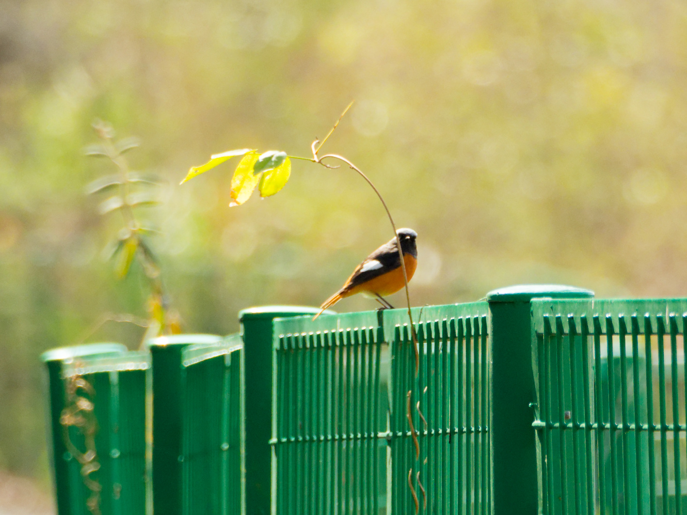

!!! note "0203 & 0204 定海湿地公园 & 叉河水库"

???+ note "观测明细"
    - 观测时间：15:00 - 16:30；12:30 - 14:30
    - 湿地公园：伯劳；白头鹎；白鹡鸰；灰鹡鸰；大山雀；远东树莺（疑）
    - 叉河水库：普通鸬鹚；苍鹭；小鹀；北红尾鸲；大山雀；伯劳

# 北红尾鸲

-   
    
    ---
    **记录**
    - 种类：北红尾鸲
    - 性别：雄性
    - 行为：站立

