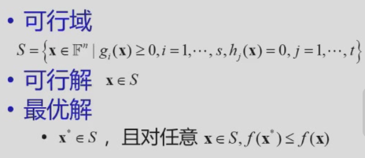
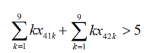
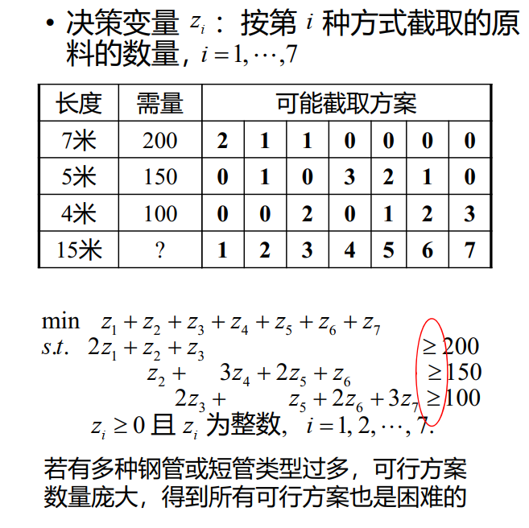
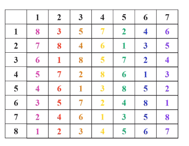
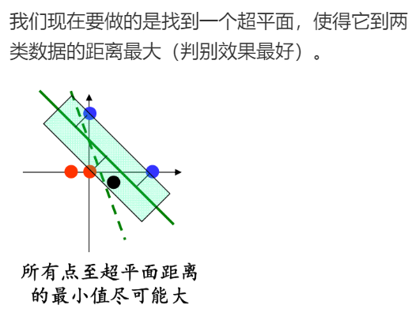
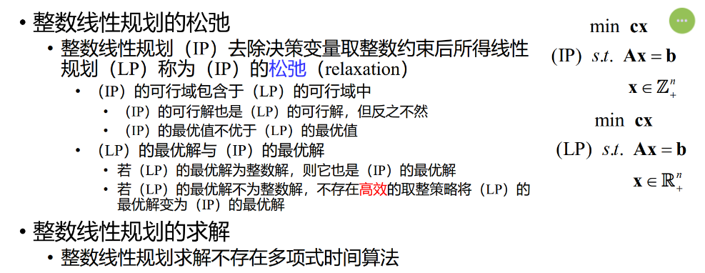
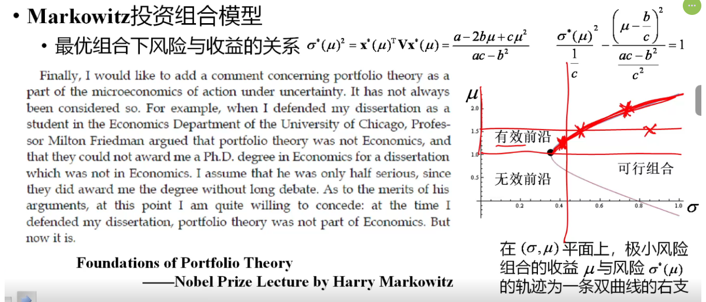

# 1. 数学规划
!!! abstract "Tag"  
	**运筹、优化**  
  
  
## 运筹学  
  
运筹学的主要分支：  
  
- 数学规划（Mathematical Programming）  
  - 线性规划（Linear Programming）  
  - 目标函数为线性函数，约束条件为线性等式或不等式  
  - 非线性规划（Nonlinear Programming）  
  - 整数规划（Integer Programming）  
  - 多目标规划（Multiobjective Programming）  
- 组合优化（Combinatorial Optimization）  
- 随机运筹  
  - 排队论（Queuing Theory）  
  - 库存论（Inventory theory）  
  - 可靠性理论（Reliability Theory）  
- 博弈论（Game Theory）与决策理论（Decision Theory）  
  
数学基础：  
  
  
  
## 数学规划  
  
- 若干个变量在满足一些等式或不等式限制条件下，使目标函数取得最大值或最小值  
(条件极值等等，都属于这个范畴)  
  
  
  
!!! tip
    - 理论上, 等式约束也可以转换成不等式约束  
      - 譬如f(x)=0 $\Rightarrow$ f(x)≥0 && f(x)≤0  
    - 一般不出现≠  

  
  
最优解不一定是唯一的，最优值是唯一的，如需求解，求解唯一最优解即可  
  
  
  
|            | 目标函数 $min\{f(x)\}$                                    | 约束条件 -- $g_i(x)≥0 或 h_j(x)=0$ |  
| ---------- | ----------------------------------------------------- | ----------------------------- |  
| 线性规划       | $\sum_{i=1}^n c_ix_i$, 即 $\mathbf{cx}$                | $\mathbf{Ax=b}$               |  
| 二次规划       | $\sum_{i=1}^n a_ix_i^2$, 即 $min \{\mathbf{x^T A x}\}$ | $\mathbf{Ax=b}$               |  
| 带二次约束的二次规划 | $\sum_{i=1}^n a_ix_i^2$, 即 $min \{\mathbf{x^T A x}\}$ | 线性/二次等式/不等式                   |  
| 线性分式规划     | $min\{\frac{\mathbf{cx}+d}{\mathbf{ux}+v}\}$          | $\mathbf{Ax=b}$               |  
  
  
## 整数规划  
  
整数规划（integer programming）：  

- 至少有一个决策变量限定取整数值   
  - 整数决策变量意义   
    - 用于表示只能取离散值的对象的数量   
    - 用于表示约束条件之间的逻辑关系或复杂的函数形式   
    - 用于表示非数值的优化或可行性问题（e.g. 排班问题，难以用数值表示，设整变量）   
- 特殊整数规划   
  - 部分决策变量取整数值的数学规划特称为混合整数规划（Mixed Integer Programming, MIP）   
  - 0-1规划：决策变量仅取值0或1的数学规划  
- 按约束条件  
  - 无约束优化  
  - 约束优化  
  
  
  
  
  
  
  
先将x拉成列矩阵，因为线性表示的话，只能$\mathbf{Ax=b}$  
那么要逐个矩阵相乘,  
  
$A=\begin{bmatrix}1&1&...&1&|&0&0&...&0&|&0&0&...&0\\0&0&...&0&|&1&1&...&1&|&0&0&...&0\\0&0&...&0&|&0&0&...&0&|&1&1&...&1\\一&一&一&一&|&一&一&一&一&|&一&一&一&一\\1&0&...&0&|&1&0&...&0&|&1&0&...&0\\0&1&...&0&|&0&1&...&0&|&0&1&...&0\\0&0&...&1&|&0&0&...&1&|&0&0&...&1\end{bmatrix}$  
  
(前四行→行向量，代表$\sum_{j=1}^n x_{ij}=a_i, i=1, ...,m$ ,后四行→列向量，代表$\sum_{i=1}^m x_{ij}=b_j$)  
$\mathbf{x}=[x_{11},x_{12},...,x_{1n},x_{21},...,x_{2n},...x{m1},...x_{mn}]^T$  
  
设$c_{ij}$为由产地i到销地j的运输单价  
  
$x_{ij}$是  
  
这样构造的方式可以将原先$n\times n$的表示变成线性的表示  
  
  
  
  
$x_{11}≠x_{13} \Rightarrow$ 不等号不允许存在  
  
  
  
对任意$i,j$, $x_{ij1},x_{ij2}...x_{ij9}$ 中恰有一个取值是1 等效为 $\sum_{k=1}^9 x_{ijk}=1 ,i,j=1...9$  
(0,1的使用!)  
  
每一行填入的数字各不相同 $\Rightarrow$ 第i行只有一个数字是k $\Rightarrow$  
  
$\sum_{j=1}^9 x_{ijk}=1$  
  
  
  
-----  

!!! info "番外：条件的表示："  
  	- 假设需要表示条件，第4行1，2列中所填数之和大于5：  
    - $x_{41j_1}=1,x_{41j_2}=1,j_1+j_2=5$

    	- 错误1：下标的变量不可以进入约束条件  
    	- 错误3：出现逻辑关系，是在1式和2式满足的情况下，才会出现3  
  
正确的方法：对数字$k$而言，$∵\sum_{k=1}^9=1,∴k=\sum_{k=1}^9 \times k$，为数字本身  
所以  
  
  
  
!!! quote "问题背景"  
	现有 W 米长的钢管若干。生产某产品需长为 $w_i$ 米的短管 $b_i$ 根，i=1,2,⋯,n,$n=\sum_{i=1}^{k}b_i$。如何截取能使材料最省？  
  
  
决策变量：$x_{ji}$ 表示第 j 根钢管截取第 i 种短管的数量  
约束条件：  
$\sum_{i=1}^k x_{ji}w_i≤W$, 钢管的量有限  
  
$x_{ji}≥b_i$  
  
目标函数：  
  
事实上，只要$\sum_{i=1}^{k}x_{ji}>0$, 使 j 最小  
  
所以定义一个新的0-1变量：  
  
$y_j=1$,第$j$根钢管被截取；0，其他  
  
$min\sum_{j=1}^n y_j$  
  
  
  
  
$\sum_{i=1}^n x_{ji}≤y_i$ 问题：每一根钢管只被截了一次，$\sum_{i=1}^n x_{ji} ≤ 1$ ×  
  
所以进行改进，把钢管的实际长度加入不等式里，即$\sum_{i=1}^n x_{ji} \times w_i ≤ W\times y_i$  
$y_j=1, \Rightarrow \exists i,x_{ji}>0$  
  
另一种方式：  
  
  
  
  
## 装箱问题  
  
!!! quote "背景"  
	给定一系列大小已知的物品 和若干个容量相同的箱子， 如何将物品放入箱子中，使所用箱子数尽可能少  
  
  
三维（即箱子：长$\times$宽$\times$高）的情况往往不使用数学规划，而是使用启发式算法  
  
## 选址问题  
  
!!! quote "背景"  
	设在平面上有$n$个点，第$j$个点的坐标为$(x_j,y_j)$. 求一个面积最小的圆，使这$n$个点均为该圆内的点  
  
  
**决策变量**：圆心坐标 $(x_0,y_0)$，圆半径 $r$  
目标函数：$r^2$   
约束变量：$(x_j-x_0)^2+(y_j-y_0)^2\leq r^2$，$j=1,2,\cdots,n$      
  
$\Rightarrow$二次约束的二次规划类型  
  
化简，展开，$x_j^2-2x_0x_j+x_j^2+y_j^2-2y_0y_j+y_j^2 \leq r^2$  
因此进行化简$\rightarrow$  
**决策变量**改为 $\lambda=r^2-(x_0^2+y_0^2)$  
**目标函数**改为 $\min\lambda+(x_0^2+y_0^2)$  
**约束条件**改为 $\lambda+2x_0x_j+2y_0y_j\geq x_j^2+y_j^2$，$j=1,2,\cdots,n$  
(思想：通过变形，更容易求解，化二次为一次)  
  
!!! abstract "总结"  
	- 自查：
    	- 是否遗漏问题隐含约束？  
    	- 数学规划（所建立模型的）最优解和问题的最优解是否对应？  
	- 技巧：  
    	- 复杂目标函数和约束条件的简化  
    	- 0-1变量的灵活运用  
  
  
  
## 时间分配问题  
  
!!! quote "问题背景"  
	有 $T$ 天时间可用于安排复习 $n$ 门课程，每天只能复习一门课程，每门课程至少复习一天。用 $t$ 天时间复习第 $j$ 门课程可使该门课程提高 $p_{jt}$ 分。如何制定复习计划可使所有课程提高的总分尽可能大？  
	
 
| 课程  | 1天  | 2天  | 3天  | 4天  |  
| --- | --- | --- | --- | --- |  
| E   | 3   | 5   | 6   | 7   |  
| C   | 5   | 5   | 6   | 9   |  
| M   | 2   | 4   | 7   | 8   |  
| P   | 6   | 7   | 9   | 9   |  
  
设第$j$门复习了$t$天是1，其他是0,设这个是$\alpha(t)$  
决策变量是$\alpha_{jt}$  
目标函数 $\sum_{t=1}^4\sum_{j=1}^4 p_{jt}\alpha_{jt}$最大  
约束条件是，$\sum_{t=1}^4\sum_{j=1}^4 t\alpha_{jt}\leq T$  
  
  
!!! note  
    - **决策变量**：
      - $x_{jt}$ 表示第 $j$ 门课程是否复习 $t$ 天，$j=1,2,\cdots,n$，$t=1,2,\cdots,T$  
      - $x_{jt}=\begin{array}{ll}1,&\text{第j门课程复习t天}\\0,&\text{其他}\end{array}$  
    - **目标函数**：$\max\sum\limits_{j=1}^n\sum\limits_{t=1}^Tp_{jt}x_{jt}$  
    - **约束条件**：$\sum\limits_{t=1}^Tx_{jt}=1$；$\sum\limits_{j=1}^n\sum\limits_{t=1}^Ttx_{jt}\leq T$  

| 课程  | 1天  | 2天  | 3天  | 4天  |  
| --- | --- | --- | --- | --- |  
| E   | 3   | 5   | 6   | 7   |  
| C   | 5   | 5   | 6   | 9   |  
| M   | 2   | 4   | 7   | 8   |  
| P   | 6   | 7   | 9   | 9   |  

动态规划  
$f_j(t)$:用 $t$ 天时间复习第 $j$ 门课程可使该门课程提高 $p_{jt}$ 分  
类似递推的方法  
$f_j(t)=max\{p_{js}+f_{j-1}(t-s)\}$ $p_{js}$是第$t$天提升的分数，$f_{j-1}(t-s)$是之前提升的分数  
$f_{j-1}(t)$可以用同样的方法去做，由此层层递推回到$f_1(t)$  
  
!!! info "Breaks"
  	- Symmetry and separation(对称性和分离性)    
  	- Breaks(出现连续的客场或主场比赛--这是我们不愿看到的)    
  	- The carry-over effect    
  
  
## 图的因子分解  
图 $G$ 的因子分解，指将 $G$ 分解为若干边不重的因子之并——因子指至少包含G的一条边的生成子图。  
一个图G的 $n$ 因子，是指图G的 $n$ 度正则因子——正则因子指所有顶点的度数都是 $n$ 的因子。  
一个 $K-8$ 完全图的 1 - 因子分解如下（不同颜色的边表示不同的因子）：  
  
  
  
  
  
同时，我们也可以根据因子分解，给出主客场的安排（**尽量不安排连续的客场或主场比赛**），例如第一轮和第二轮中：  
  
根据这条路的开头和结尾，我们给出了主客场的安排。  
  
但我们的第八支队伍还没有安排，但无论怎么安排，都会出现breaks：  
  
这时排出来 6 种break，而这**已经是最少的break了**，接下来我们给出一般情况下至少有的break数。  
安排原则1:满足任何两支球队之间刚好有一场比赛，并且一共就只有四场比赛  
安排原则2:尽量少的breaks  
  
!!! quote "问题"  
	对 $n$（偶数）支队伍的赛程，用形如 HAH…HA，长度为 $n-1$（奇数）的字符串表示每支队伍的主客场安排，称为**模式**（pattern）求证：$n$ 支队伍的单循环赛程，全程所有队伍总break数至少为 $n-2$  
  
  
1. 首先只有两种可以满足no break:  
HAHAHAHA  
AHAHAHAH  
2. 其次，证明任意两支队伍都不相同  
由于单循环赛制，每两支队伍必须比赛，假设他们的比赛场次是j，则第j次他们不可能同时是H/A  
  
→ 所以只有n-2个break  
  
!!! note "镜像双循环赛程"  
    $n$ 支队伍的镜像双循环赛程，全程所有队伍总break数至少为 $3n-6$    
    1. 若半程没有break，则全程也没有break，这样的队伍至多有两支（HAHAH-AHAHA，AHAHA-HAHAH）    
    2. 若半程有且仅有一个break，由于模式字符串长度为奇数，在前后半程之间有一个break（H **A A** H **A - A** **H H** A H），break数为 $3$    
    3. 若半程有至少两个break，全程break数至少为 $4$    
    所以总break数至少为 $3(n-2)$    

2+2(n-2)+?  
  
不考虑连续两场比赛的break, 只考虑同一阶段中两场比赛之间的$double-round break$,  
如果不考虑两个阶段的话，是否有一个下界？  
结论：小到2(n-4)  
  
1. 若半程无break,则全程无break(两支队伍)    
2. HAAHAHA,则镜像之后，AHHAHAH, 至少要出现两个break    
阶段之间→反过来一定是阶段内部    
阶段内部→一定阶段之间    
  
  
法制的 break 数可以到 0 ，最终我们采用法制。  
  
### 数学规划  
  
我们来到实际问题：有 $10$ 支队伍，每阶段两场比赛  
  
**决策变量**：$x_{ijk}=\begin{cases}1,&\text{第}k\text{轮第}i\text{支队伍在主场对阵第}j\text{支队伍}\\0,&\text{其他}\end{cases}$  
  
**约束条件**：  
- 无论是主场还是客场，总有一主一客，$\Rightarrow$ $x_{ijk}+x_{jik}=1$  
- 任意两队在前后半程各交手一次，$\sum_{k=1}^{18}x_{ijk}=1$  
- 任一队不连续与种子队（用 $I_s$ 表示）对阵：$\sum\limits_{j\in I_s}\left(x_{ijk}+x_{jik}+x_{i,j,k+1}+x_{j,i,k+1}\right)\leq1,\mathrm{~}i\in I\setminus I_s,k=1,\cdots,18$  

#### 1.每支队伍先主后客的总次数尽可能均衡   
每支队伍先主后客的总次数尽可能均衡：先定义辅助变量改写这个约束条件。  
设$y_{il}=\begin{cases}1,&\text{第}l\text{阶段第}i\text{支队伍为先主后客}\\0,&\text{第l阶段第}i\text{支队伍为先客后主}\end{cases}$  
要建立y和x之间的联系：  
$x_{ijk}$ 与 $y_{il}$ 之间的关系：  
$y_{il}=1\Leftrightarrow\sum\limits_{j=1}^{10}x_{i,j,2l-1}=1\text{且}\sum\limits_{j=1}^{10}x_{j,i,2l}=1
$  
设$z_i=\sum\limits_{j=1}^{10}x_{i,j,2l-1},z_j=\sum\limits_{j=1}^{10}x_{j,i,2l}$, $y_{il}=z_i \cdot z_j$  
对此进行**线性化**：  
有约束条件  
$\begin{cases}
y_{ij}\leq z_i\\y_{ij}\leq z_j\\y_{ij}+1≥z_i+z_j
\end{cases}
$  
  
- 若$y_{ij}=1$ 则$z_i≥1,z_j≥1$,只能取1  
- 若$z_i,z_j$取1，则$y_{ij}+1≥z_i+z_j$,则$y_{ij}$只能取1，则满足了当且仅当，且为线性约束  
  
改写一下就是：  
  
$\begin{cases}\sum\limits_{j=1}^{10}\left(x_{i,j,2l-1}+x_{j,i,2l}\right)\leq1+y_{il}\\y_{il}\leq\sum\limits_{j=1}^{10}x_{i,j,2l-1}\\y_{il}\leq\sum\limits_{j=1}^{10}x_{j,i,2l}\end{cases}
$  
- 每支队伍先主后客的总次数尽可能均衡时，$4\leq\sum\limits_{l=1}^{9}y_{il}\leq5$，$i=1,2,\cdots,10$  
  
#### 2. 各阶段连续客场的次数尽可能少  
在法制双循环赛制中 $x_{i,j,1}=x_{j,i,18}$, $x_{i,j,k}=x_{j,i,k+8}$, $k=2,3,\cdots,9$，$i,j=1,2,\cdots,10$，$i\neq j$  
定义辅助变量 $w_{il}=\begin{cases}1,&\text{第}l\text{阶段第}i\text{支队伍两场比赛均为客场}\\0,&\text{其他}\end{cases}$，$i=1,2,\cdots,10$，$l=1,2,\cdots,9$  
$x_{i,j,k}$ 与 $w_{il}$ 之间的关系：  
$w_{il}=1\Leftrightarrow\sum\limits_{j=1}^{10}x_{j,i,2l-1}=1 \text{且} \sum\limits_{j=1}^{10}x_{j,i,2l}=1
$  
改写一下就是：  
  
$\begin{cases}\sum\limits_{j=1}^{10}\left(x_{j,i,2l-1}+x_{j,i,2l}\right)\leq1+w_{il}\\w_{il}\leq\sum\limits_{j=1}^{10}x_{j,i,2l-1}\\w_{il}\leq\sum\limits_{j=1}^{10}x_{j,i,2l}\end{cases}$  
**目标函数** 为：$\min \sum\limits_{i=1}^{10}\sum\limits_{l=1}^{9}w_{il}$  
  
## 支持向量机  
  
!!! quote "问题背景"  
	将一数据集 $S$ 分为 $C_1,C_2$ 两类，每个数据有 $n$ 个特征。我们应该如何通过训练集来找出一个超平面，使得它判别效果最好？  
  
  
  
我们拟将一数据集 $S$ 分为 $C_1,C_2$ 两类。每个数据有 $n$ 个特征，用 $n$ 维实向量表示，我们有训练集 $S'=\{\mathbf{x}_1,\cdots,\mathbf{x}_m\}$，其中 $\mathbf{x}_i\in \mathbb{R}^n$，记 $y_i=\begin{cases}1, \mathbf{x}_i\in C_1\\-1, \mathbf{x}_i\in C_2\end{cases}$。  
  
超平面: $\mathbf{w}\cdot\mathbf{x}+b=0$ (分割的直线s.t.缓冲区尽量的大，则新的数据集不会被误判)  
  
  
  
$\mathbf{w}$是决策变量  
  
$y_i=\begin{cases}1, \mathbf{x}_i\in C_1\\-1, \mathbf{x}_i\in C_2\end{cases}$  
  
1. 训练集的数据保持准确：  

$\begin{aligned}&\max \min\limits_{i=1,\cdots,m} |\mathbf{w}\cdot\mathbf{x}_i+b|\\s.t.\quad&y_i(\mathbf{w}\cdot\mathbf{x}_i+b)\geq 0,i=1,\cdots,m \cdots (I)\\&\|\mathbf{w}\|=1\end{aligned}$  
若（1）有解，（1）  
$\begin{aligned}&\max \min\limits_{i=1,\cdots,m} y_i(\mathbf{w}\cdot\mathbf{x}_i+b)\\s.t.\quad &\|\mathbf{w}\|=1\end{aligned}$  
  
上为2  
  
2包含了1，证明，2的最优解包含在1的内  
  
  
  
若$(\mathbf{w_0},b_0)$是III的最优解，则$(\frac{\mathbf{w_0}}{\sqrt{\mathbf{w_0}\cdot\mathbf{w_0}}},\frac{b_0}{\sqrt{\mathbf{w_0}\cdot\mathbf{w_0}}})$是II的最优解  
证明：  
设($w^{*},b^*$)为III的最优解，  
  
  
数学规划求解  
  
## 线性规划  
### 标准型  
- 线性规划的矩阵形式  
- $min \{\mathbf{cx}\}$, s.t. $\mathbf{Ax=b},\mathbf{x≥0}$  
  
- 目标函数极小化  
- 决策变量取非负值  
- 所有约束均为等式约束，不等式都进行转化  
  - $\mathbf{Ax \leq b}, \Leftrightarrow Ax+y=b,y≥0$  
- 线性规划最优解的类型：  
  - 唯一最优解  
  - 无穷多最优解  
  - 无可行解  
  - 有可行解，但最优值无下解  
  - exclude！！有限个最优解  
设A是行满秩矩阵，$rank(\mathbf{A})=m$  
$rank(\mathbf{A})<m$,冗余约束  
  
不妨设$\mathbf{A}$的前$m$列线性无关  
将$\mathbf{A}$分块为$\mathbf{(B,N)}$, 其中  
决策变量$\mathbf{x}$相应分为{x_b//x_N}分别成为基变量和非基变量  
则原来的标准问题转换为$min cx$
$s.t. (B N)(x_b//x_N)=b$
  
令$x_N = 0$，则$x_B=B^{-1}b$则称x=(B-1b//0)是相应基于B的基本解  
当B-1b≥0时，x可行，称为基本可行解  
  
线性规划基本定理  
若有可行解→必有基本可行解  
若有最优解→必有最有基本可行解  
即  
  
  
所以线性规划的最优解，只需要在所有基本可行解中寻找  
最多有$C_m^n$？？？？？？  
  
单纯形法：从一个基本可行解转到另一个基本可行解，并使目标值下降。迭代有限次，找到最优解或判断最优值无界  
  
单纯形法是指数时间算法。存在含 $m$ 个变量 $m$ 个约束的线性规划，单纯形法需要进行 $2^m-1$ 次迭代  
  
实践表明，对多数线性规划问题，单纯形法迭代次数为变量和约束数的多项式函数  
  
#### 多项式时间算法  
1979年，Khachiyan给出了求解线性规划的第一个多项式时间算法 —— **椭球算法**。  
1984年，Karmarkar给出了实际效果更好的多项式时间算法——**内点法**，产生了深远的影响  
  
## 整数线性规划  
- 松弛  
- 相比线性规划的最优解会小一点  
  
  
## 分枝定界法  
 IP: $\min -30x_1-36x_2, s.t.\begin{cases}x_1+x_2\leq 6\\5x_1+9x_2\leq 45\\x_1,x_2\geq 0,x_1,x_2\in\mathbb{Z}\end{cases}$  
我们先求解松弛问题：  
LP: $\min -30x_1-36x_2, s.t.\begin{cases}x_1+x_2\leq 6\\5x_1+9x_2\leq 45\\x_1,x_2\geq 0\end{cases}$  
==利用线性规划==：**画图**易得，松弛问题的最优解为 $(x_1,x_2)=(\frac{9}{4},\frac{15}{4})$，目标函数值为 $-202.5$  
由于最优解不是整数解，我们将松弛问题的可行域分为两个子可行域：  
<u>选择最优解中任一不取整值的变量，在（IP）中分别加入一对互斥的约束，形成两个分支：</u>  
$x_1\geq 3,x_1\leq 2$  
把$(\frac{9}{4},\frac{15}{4})$最优解切掉，从而分别去找两边的最优解：  
对于第一个子可行域，我们有：  
IP: $\min -30x_1-36x_2, s.t.\begin{cases}x_1+x_2\leq 6\\5x_1+9x_2\leq 45\\x_1\geq 3\\x_1,x_2\geq 0,x_1,x_2\in\mathbb{Z}\end{cases}$  
LP: $\min -30x_1-36x_2, s.t.\begin{cases}x_1+x_2\leq 6\\5x_1+9x_2\leq 45\\x_1\geq 3\\x_1,x_2\geq 0\end{cases}$  
画图易得，松弛问题的最优解为 $(x_1,x_2)=(3,3)$，目标函数值为 $-198$。此时为整数解，停止迭代。  
对于第二个子可行域，我们有：  
IP: $\min -30x_1-36x_2, s.t.\begin{cases}x_1+x_2\leq 6\\5x_1+9x_2\leq 45\\x_1\leq 2\\x_1,x_2\geq 0,x_1,x_2\in\mathbb{Z}\end{cases}$  
LP: $\min -30x_1-36x_2, s.t.\begin{cases}x_1+x_2\leq 6\\5x_1+9x_2\leq 45\\x_1\leq 2\\x_1,x_2\geq 0\end{cases}$  
画图易得，松弛问题的最优解为 $(x_1,x_2)=(2,\frac{35}{9})$，目标函数值为 $-200$，此时 $x_2$ 不是整数，我们将松弛问题的可行域分为两个子可行域：  
$x_2\geq 4,x_2\leq 3$  
对于第一个子可行域，我们有：  
IP: $\min -30x_1-36x_2, s.t.\begin{cases}x_1+x_2\leq 6\\5x_1+9x_2\leq 45\\x_1\leq 2\\x_2\geq 4\\x_1,x_2\geq 0,x_1,x_2\in\mathbb{Z}\end{cases}$  
  
LP: $\min -30x_1-36x_2, s.t.\begin{cases}x_1+x_2\leq 6\\5x_1+9x_2\leq 45\\x_1\leq 2\\x_2\geq 4\\x_1,x_2\geq 0\end{cases}$  
  
画图易得，松弛问题的最优解为 $(x_1,x_2)=(\frac{5}{9},4)$，目标函数值为 $-198$。此时不为整数解，但是继续做下去，函数值只会更大，所以停止迭代。  
  
  
对于第二个子可行域，我们有：  
  
  
  
IP:   
$\min -30x_1-36x_2, s.t.\begin{cases}x_1+x_2\leq 6\\5x_1+9x_2\leq 45\\x_1\leq 2\\x_2\leq 3\\x_1,x_2\geq 0,x_1,x_2\in\mathbb{Z}\end{cases}
$  
  
  
  
LP:   
$\min -30x_1-36x_2, s.t.\begin{cases}x_1+x_2\leq 6\\5x_1+9x_2\leq 45\\x_1\leq 2\\x_2\leq 3\\x_1,x_2\geq 0\end{cases}
$  
画图易得，松弛问题的最优解为 $(x_1,x_2)=(2,3)$，目标函数值为 $-168$。此时为整数解，停止迭代。  
所以，整数规划的最优解为 $(x_1,x_2)=(3,3)$，目标函数值为 $-198$。  
  
==剪枝==：明显不包含整数最优解，剪掉这一枝  
如何知道？求出不是最优解--> 进行定界：  
可以求出松弛问题的最优值，最优值可以作为界  
  
## 数学规划建模  
  
航空公司机组优化排班问题  
  
## 0-1变量  
e.g.分段函数  
$f(x)=\begin{cases}0,x=0\\a+bx,x\geq 1\end{cases}
$  
看上去是非线性、不连续的函数，如何转换成线性的函数呢？  
先改造这个函数:  
$f(x)=\begin{cases}0+bx,x=0\\a+bx,x\geq 1\end{cases}
$  
再定义辅助变量  
$y=\begin{cases}0,x=0\\1,x\geq1\end{cases}
$  
则$f(x)$可以表示为$F(x,y)=ay+bx$  
而如果不在数学规划中明确$x,y$取值之间的关系，可能出现$x=1,y=0$的情况，与原函数的定义不符  
要表示 $x \geq 1 <-> y=1$ 即$y=1 \Rightarrow x\geq 1$ 则$x\geq y$   
  
e.g.2 逻辑函数  
若条件1成立，则条件2成立  
定义$y_i=\begin{cases}1,条件i成立\\0,其他\end{cases}$  
如何用线性约束来表示？  
推理，若$y_1=1,$则$y_2$必然取1.  
所以可以写$y_2\geq y_1$  
条件1和条件2至少有一个成立  
$y_1+y_2\geq1$  
  
条件1和条件2至少有一个成立时，条件3，4，5中至少一个成立  
条件太多了……定义一个新变量$z$  
定义$z=\begin{cases}1,条件1，2至少有一个成立\\0,其他\end{cases}$  
则写出新变量和原变量的关系：  
$y_1+y_2\geq1 \Rightarrow z=1 \Rightarrow z\geq y_1+y_2$ ,但这样子会导致$y_1$和$y_2$一共只有一个变量为1，会少一些值  
$y_1+y_2 \leq 2z$  
则原问题转换为，若z成立，则条件3，4，5中至少一个成立  
则$y_3+y_4+y_5\geq z$  
  
思考：  
$y=\begin{cases}a,0<x<1\\b,2<x<3\\c,4<x<5\end{cases}
$应该怎么表示？  
  
### 设施选址问题：  
有$n$个居民小区需提供服务，$m$处地点开设服务点  
在地点$i$开设服务点需要的费用是$f_i$,设置在地点$i$的服务点为小区$j$提供服务所需的运营费用是$c_{ij}$  
选择若干地点开设服务点，并且选取若干点作为服务对象，使每个小区至少有一个服务点为其提供服务，且总费用最小  
推广：  
- （不相容约束）某些==小区对==不能同时由某一服务点提供服务  
- （双指派约束）每个==小区==由两个服务点提供服务，且某些==小区对==需有一公共服务点  
  
目标函数$min\sum\sum(c_{ij}x_{ij})+\sum(f_iy_i)$  
决策变量:  
$y_i=\begin{cases}1,若在地点i开设服务点\\0,其他\end{cases}
$  
$x_{ij}=\begin{cases}1,i给j服务\\0，其他\end{cases}
$  
约束条件：  
$y_i\geq x_{ij}$  
至少有一个服务点：$\sum_{i=1}^mx_{ij}\geq 1, j=1,2,\dots m$  
  
若写成：$y_i\geq\sum x_{ij}$ ，可能会一个服务点只服务一个小区，因为理论上，$\sum x_{ij} \in [0,+∞]$, 然后$y_i \in [0,1]$, 这样莫名其妙把$\sum x_{ij}$限制在$[0,1]$之间了，导致产生的不属于最优解  
  
除非写$My_i\geq \sum x_{ij}$，但是不完全等价  
  
一些本身的条件，$x_{ij}\in {0,1} \dots$  
  
- （不相容约束）某些==小区对==不能同时由**任何的一个**服务点提供服务  
$x_{ij}+x_{ik}\leq 1$，$\forall (j,k)\in E, \forall i=1,\dots,m$  
  
!!! question  
	$z_{pq}=\begin{equation}0,其他\\1;p,q 由某一服务点服务\end{equation}
$  
	$x_{ip}+x_{iq}\geq 2z_{pq}$   
	问题：反了？  
  
  
$\sum_{j=1}^n x_{ij}=2,i=1\dots m$  
$x_{ij}+x_{lj}\geq x_{ik}+x_{lk}-1 ，\forall(j,k)\in E, \forall i,l =1,\dots,m$  
  
思路, 设k的服务点，i和l；j的服务点也是i和l  
  
若$k服务点\Rightarrow i,l$，则j服务点中的其中一个必定是i,l中的一个  
$\Rightarrow x_{ij}+x_{lj}\geq 1$  
j作为服务点，i和l中必须有一个  
所以表示一下k的服务点是i和l,即$x_{ik}+x_{lk}=2$  
若k的服务点不是i和l，则这个约束作废  
对$x_{ik}=1,x_{lk}=1$，才能起作用  
  
## 多目标规划  
给定约束条件下，多个可数值化的目标函数同时极小化的问题  
数学语言表示：  
$min \mathbf{f(x)}=f_1(\mathbf{x})+f_2(\mathbf{x}),\dots,f_P(\mathbf{x})
$  
  
  
- 绝对最优解：$\mathbf{x^{*} \in S_a}$  
  - 对任意$\mathbf{x}\in S,f_k(x^{*})\leq f_k(\mathbf{x})$  
- Pareto最优解 $S_P$  
  - 不存在$x \in S，s.t.f_k(x)\leq f_k(x^*) ,k = 1,\dots p$, 至少一个不等号为严格不等号（翻译成大白话：不存在另一个最优解，每一个上都比我更好，且有一个严格的比我好（>,<））  
- 弱Pareto最优解： $S_{wp}$  
  - 不存在$\mathbf{x} \in S,s.t.f_k(x)<=f_k(x^*)$  
  
多目标规划解的关系  
  
 $S_a\subseteq S_{wp}\subseteq S_p\subseteq S$  
  
若 $\mathbf{x}^*\in S_a$，但 $\mathbf{x}^*\notin S_p$，则存在 $\overline{\mathbf{x}}\in S$ 和某个$k$，使得$f_k(\overline{\mathbf{x}})<f_k(\mathbf{x}^*)，f_l(\overline{\mathbf{x}})\leq f_l(\mathbf{x}^*)，l\neq k$，与$\mathbf{x}^*\in S_a$矛盾  
  
 $S_a=S_{wp}$ ，则称 $S_a$ 为**Pareto最优解**，此时 $S_a=S_{wp}=S_p$  
  
### 线性加权加法  
- 线性加权和法：  
  - 求解单目标规划$(SP_{\lambda})$  
  
  
  
  
- 主要目标法  
  - 确定一个目标函数，如$f_1(x)$,为主要目标，对其余$p-1$个目标函数，选定一定的界限值$u_k,k=2,\dots,p$ ，求解单目标规划   
  - min $f_1(\mathbf{x}),s.t.f_k(\mathbf{x})\leq u_k,k=2,\dots,p,\mathbf{x}\in S$  
  - $u_k$的选取可参考$min f_k(\mathbf{x})$  
- 理想点法  
  - 取$f_k^0$(相当于理想点)，求解单目标规划$\quad\left(P_{i}(\alpha)\right)\min\limits_{\mathbf{x}\in S}\left(\sum\limits_{k=1}^{p}\lambda_{k}\left(f_{k}(\mathbf{x})-f_{k}^{0}\right)^{\alpha}\right)^{\frac1\alpha}$（意思：和这个理想点的距离最小）  
  - 其中$\lambda \in \Lambda = \{\lambda|\lambda \geq 0,\sum^p_{k=1}\lambda =1\}$  
 
- 分层排序法  
   
# 投资组合  
  
  
  
对任意参数$\mu$, 选择资产投资组合$\mathbf{x^*}(\mu)$,在收益达到给定值$\mu$的前提下，组合的风险最小  
则目标函数是  
使用主要目标法  
$min(\mathbf{x^T V x})$  
s.t. $\mathbf{x^T\mu}=\mu,\mathbf{x^T e}=1$   
这是一个只含等式约束的二次规划  
  
使用微积分中的拉格朗日方法  
令$L(\mathbf{x},\lambda_1,\lambda_2)=\mathbf{x^T V x}-\lambda_1(\mathbf{x^T\mu}-\mu)-\lambda_2(\mathbf{x^T e}-1)$  
L对x求偏导  
L对$\lambda_1$求偏导  
L对$\lambda_2$求偏导  
  
  
  
最优组合下风险与收益的关系：  
  
  
  
  
  
