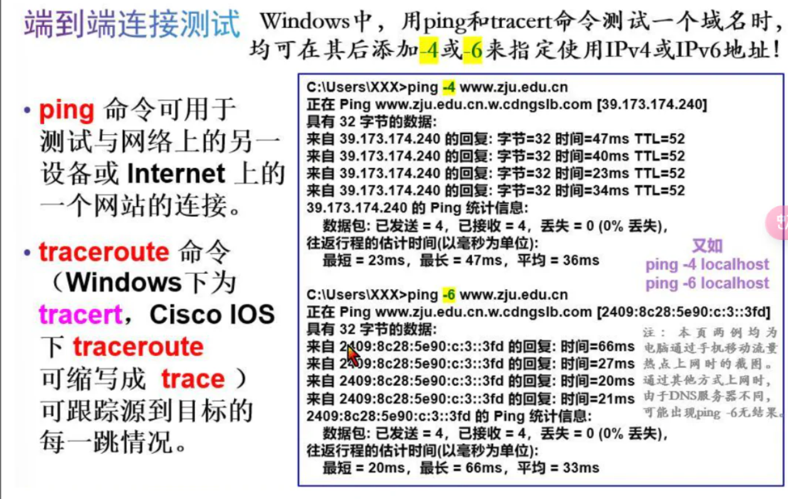
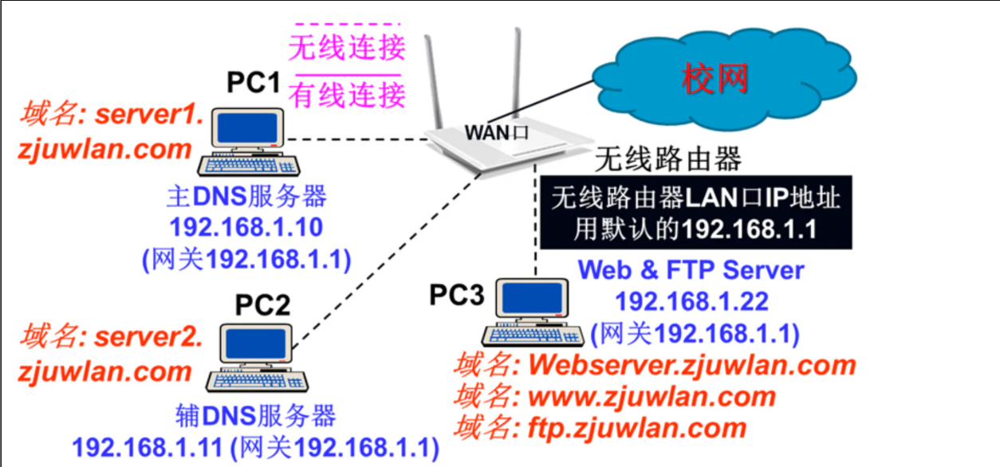

# Lecture4

- 模块1-3 4-7 8-10 在线考试✓
- PT选做实验：6.14 23:59前截止

- 以学在浙大里的实验压缩包为准
- 由于选的是最后一个实验，可以做模块前面的PT小实验

- 选做考试：
- PTSA：2.5h 6:14 23:59截止


## Cisco OS

### 一、操作系统

- 内核+外壳
- GUI/CLI界面

- 如何访问？：
- 带外：控制台（Console）RJ-45反转线/USB电缆（B型），使用专用管理通道
- 带内：
	- SSH：Secure Shell 安全外壳，需要IP地址
	- Telnet：不安全，需要IP
	- 访问路由器：
		- 电脑：反转线，用PC桌面Desktop上的终端程序Terminal访问路由器
		- （相似设备）：交叉线
- 终端访问程序：
- PuTTY,支持带内带外访问；Xshell

### 二、Cisco IOS 操作模式

- 用户EXEC模式-execute
	- 特征：\>
	- 只允许有限的基本监控命令

- 特权EXEC模式
	- 特征：“#”结尾


- 全局配置模式 Switch **(config)#** 
>会修改它的状况

- 分为：
	- 线路子配置模式 控制台、SSH、Telnet --->Router **(config-line)#**
	- 接口子配置模式 Router **(config-if)#** if→interface
	- 其他子配置模式（不要求）

enable命令：用户→特权模式
disable命令 （不常用） ：特权→用户
exit：也可以推出

**config terminal ：特权EXEC模式命令→全局配置模式**

VTY：虚拟远程终端
SSH 与 Telnet 访问均纳入VTY线路管理

- 用line 全局配置模式命令后跟要访问的管理线路类型 Router(config)# 或 Switch(config)# 和编号(如 vty 0 15 进入线路子配置模式。Router(config-line)# 或 Switch(config-line)# 
- 用interface 全局配置模式命令后跟要访问的接口类型 或 console 0 和编号(如 fa0/1 或 g0/0 或vlan 1进入接口子配置模式。Router(config-if)# 或 Switch(config-if)#
fa 0/1 fastethernet 0/1
gigabethernet 0/0 g0/0
vlan 1:虚拟网络1，每个交换机都会有
end命令或者ctrl z返回到特权EXEC模式
for e.g.

```
line vty 0 15
line console 0
```

IOS帮助：
直接输入？ 当下模式下支持什么命令+简介
记不完整了：cl？ cl开头，参数记不完整：继续打？
命令语法检查：会反馈，报错

快捷键：
向下箭头：回车，重新执行
方向是：向下：新；向上，旧

ENTER显示下一行
空格键显示下一屏
Tab自动补全命令

命令和关键词课缩写为能唯一确定该命令或关键词的最短字符数
configure→conf（不能缩写为con，以con开头的命令不止一个，否则ambiguous command）
熟练使用缩写可以节省大量工作量


路由器名称：
记住：**全局配置模式！**


password → pass
configurate terminal → conf t 
en enable

最后用login来启用


- 用 copy running-config startup-config **特权EXEC模式命令** 可将当前最新的运行模式保存到启动配置文件中（保存到启动配置文件中去） copy run start 
- 修改运行配置：
	- 逐个删除命令，手动“no”
	- copy startup-config runnin-config 将启动配置文件复制到运行配置，立即生效，简写为 copy start run
	- 特权EXEC模式：reload 重启设备
- 如果将不理想的更改到了启动配置文件中，要清除启动配置
	- erase startup-config 
	- 再用reload
- 加密密码：
	- 	- 
	- 交换机：
		- 物理端口：没有IP地址
		- 虚拟接口: 有IP地址

虚拟接口配置
```
Switch#conf t
Router
```


 ```
 show ipv6 interface brief
```
详细信息：
show interfaces→ sh int / sh ip int




IOS ping和tracert 用户模式和EXEC特权模式都可以用

## 网络服务与传输层协议

DNS 
web服务器
FTP服务器

Telnet / SSH 可以远程控制

用户层、传输层、互联网层、网络接入层

TCP：确认报文是否收到

TCP将报文切分成较小片段，按顺序编号传出

在接受主机上，TCP按顺序号重组数据段，以恢复原报文并将传回上层应用，返回一个“确认”


先建立连接，再通过确认来可靠通信


窗口大小：TCP会话的目的设备一次可以接受和处理的字节数

滑动窗口：TCP终端可在会话中调节窗口大小

拥塞：只有原设备才可以检测到，超时，没有收到对方确认，源设备可以减少发送字节数，不能减少窗口大小（由目的设备决定）目的设备在网络拥塞的时候，也不知道应该建议新的窗口大小。

UDP协议：
不先建立连接，也无确认机制，不可靠通信
无需对方确认
效率最高的传送机制
无确认和重传机制
不跟踪数据段顺序号，也不重组，
应用场合：音频流、视频流、IP语音（VoIP) 典型场合Internet广播

丢失少量数据包：
	- UDP：听到轻微时间中断
	- TCP：重新发送，暂停传输来收到数据包，中断更明显

TCP/IP端口号
源服务、目的端口

Web/FTP实验注意: 两个服务不能用同一端口号，否则会端口冲突

源端口：源端口号由发出设备随机生成

源和目的主机相同→不同的端口号可以区分会话，可以区分不同的目标服务类型，会话不会混淆！

IP地址和端口号组合→套接字（socket）
四个的组合→套接字对
套接字对确定之后，就可以独一无二的标记和跟踪

端口号：1~65535


DNS：实验三：
将域名和IP地址相关联
包含一张表，域名和IP的对应关系
DNS服务使用53端口
DNS域名：分层树状结构
www.baidu（第二层域名）.com(第一层域名/根上的域名)
DNS:正向解析、正向查找、正向搜索
反向解析/反向查找/反向搜索
IP→域名，是否允许使用这个服务？（用处：资格验证）
!!! 国内的DNS根服务器

中国IPv6 DNS 服务器 

测试DNS服务效果的方法：

1. 
```
ping www.zju.edu.cn
```
2. 【建议】
```
nslookup www.zju.edu.cn
```


FTP 
建立连接及发送控制命令默认21端口，传输数据默认20端口
端口号可修改
windows等电脑都内置了FTP客户端软件

此电脑 快捷键：windows徽标键+E键
ftp://xxx:nnn（端口号21可不写）

to do：
复习一下电缆的规律

## 讨论题



1、在实验三拓扑图所示的网络结构中，三台电脑的TCP/IP设置中的首选DNS服务器与备用DNS服务器地址应如何设置？

2、如果将三台电脑的TCP/IP设置中的“首选DNS服务器”与“备用DNS服务器”分别都设置为：10.10.0.21与10.10.2.21（即校网DNS服务器），能否正确解析本网络中所出现的全部域名？为什么？

3、在PC1的本地DNS数据库中，若只配置了本网络中出现的几个域名与IP地址的对应关系，且又未配置转发器，请问PC1能否解析校网中的其它域名？为什么？

4、在不断开PC1且PC1运行正常的情况下，如何单独检验PC2的域名解析功能？

5、为什么DNS服务器要配置两台？你认为这样做可以提高整个网络系统的什么性能？

6、如果访问Web服务器或FTP服务器报错，你认为可能是什么原因造成的？

答案：
1 首选DNS:192.168.1.10 备用DNS: 192.168.1.11
2 不能，因为无法解析本网络中的域名和DNS的对应关系
3 不能，如果没有转发器，仅有本地DNS数据库，就无法将校网域名发送给校网DNS查询，所以无法解析
4 在命令控制台里输入 nslookup server2.zjuwlan.com 192.168.1.11，即指定辅DNS的地址
5 这样可以防止其中一个DNS崩溃导致服务器不可用；鲁棒性
6 可能没有分配给Internet来宾帐户IUSR（即匿名用户）适当权限，也有可能是相应的DNS配置错了
