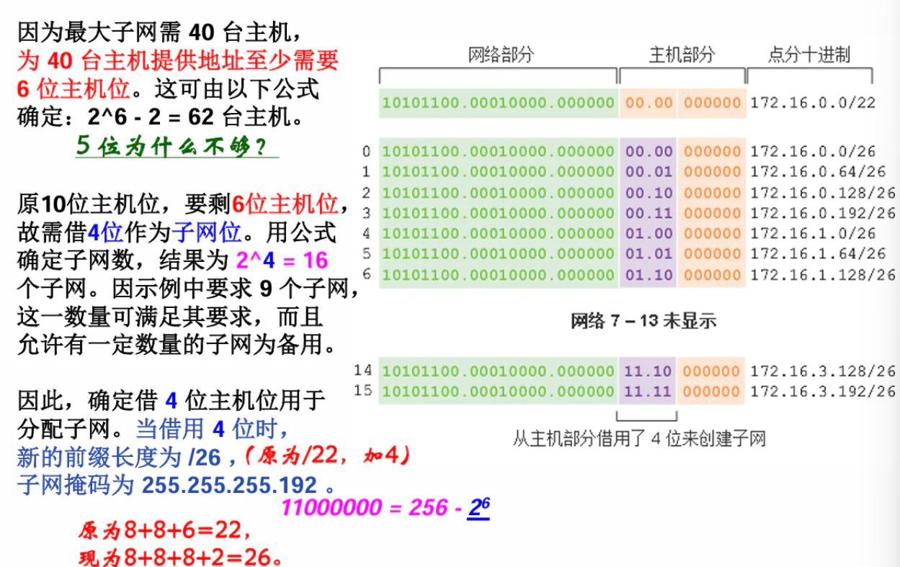

# Lecture 6

子网掩码
> **子网划分的意义：** 通过子网划分流程减小网络大小，创建更小的广播域

**子网划分的实质：** 从原来的主机位中借用一些位（来作为所谓 的子网位），这样剩下来的主机位就 少了，相应一个网络中能容纳的主机 数量也少了，相当于从原来的大网络 变成了小网络。

e.g.
原来有16位主机位， 一个网络可容纳216-2=65534台主机， 是个大网络！借用8位，还剩8位， 每个网络可容纳28-2=254台主机， 就相当于划分成了28=256个小网络！

A类，/8➔/24，借了16位

## 如何对IPv4网络划分子网？

企业可进一步使用前缀 **/16** 对10.0.0.0/8地址进行子网划分，具体做法是： **借用8位主机位来增加网络位到16位**（借用的8位主机位现在叫做子网位/子网部分） 这能让企业定义28=256 个子网（10.0.0.0/16 ~ 10.255.0.0/16）（∵8位子网位）， 每个子网可连接216-2=65,534 台主机（∵16位主机位）

### 子网划分公式

公式 $2^k$ 用于计算子网划分可创建的 **子网数**，k是从主机部分借用的位数

子网划分后的**网络地址**，通常也称为**子网地址** ，即 网络部分和子网部分照写，主机部分全0

例五：如左图显示的拓扑要求7个子网。 对指定地址192.168.20.0/24进行 传统子网划分，可借用3位主机位(/27) 满足其7个子网（0~3、4~6）、并且 每个子网最多28个主机IP地址的需求。 虽然该传统子网划分满足要求，但它 产生大量未使用地址，造成地址浪费。 
例如：三个WAN 连接的子网中， 每个子网仅需2个地址，而现在每子网 有30个可用地址，显然这三个子网中 每个子网有28个未使用地址只能浪费！ 因为如前所述，它们无法在其他网络正常使用！

检查：
**编址图方法**可用来确定已分配 的地址块和未来可用的地址块， 有助于防止重复分配地址。

#### 例题：202.151.37.0

#### 计算子网的广播地址? 

- 它属于.24 子网，下一个子网是.32 ，故这个子网的广播地址 计算如下：32 – 1 = 31，即广播地址为194.53.45.31/29

## IPv6

全局路由前缀（48位）、子网ID(16位)、接口ID(64位)

AP通道号：3