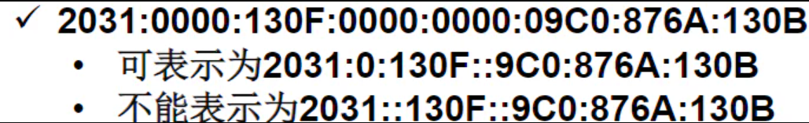
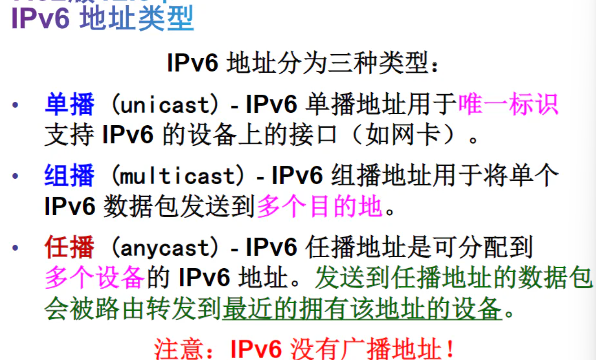
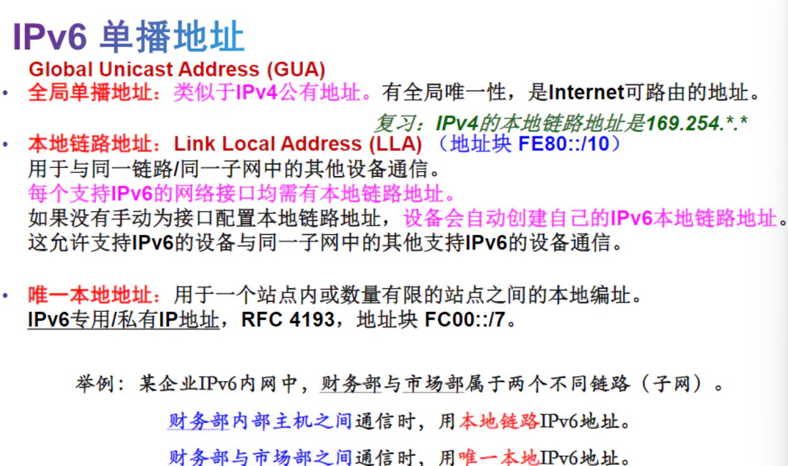

# 无线网络应用

!!! abstract 
	- 2023-2024学年 夏学期 周三下午第9~10节，晚上11~13节
	- 授课：张昱老师
	- 这是记得并不完整的笔记.

!!! tip 
	- 这门课的就读体验非常非常非常的好！实验和理论内容都很有意思
	- 大家都会告诉你这门课的给分非常好，但是不意味着你**可以摆**！周三班的加分项实在太多了，本摆子最后就惨遭正态了……

## Lecture 0.

- 192.168.3.3 **组号** L10
- 校网测速：http://speedtest.zju.edu.cn/
- 双频（两个频段都支持）<u>802.11n</u> 2.4G 5G
- AP:Access Point 接入点个数 AP入室
- 802.11AC 单频：5G
- ZJUWLAN-Secure SSID
- https://itc.zju.edu.cn/2020/1009/c7943a2205201/page.html
- WiFiman App
- WiFi 6 支持 2.4GHz 5GHz
- 5G-A商用网络
- 缩写
	- WWAN：无线广域网技术

## Lecture 1.

### 1.2 网络组件

- 设备
- 介质（网线、光纤（光脉冲）→无线介质）
- 服务

### 1.3 网络表示方式

- 网络图：表示不同设备的连接
- 网卡：网络接口卡（NIC）
- 端口：Port
- 接口：Interface

### 1.4 拓扑图

[实验总结要求拓扑图] 相当于网络中的地图

- 物理拓扑图：房间号，如何安装 MAC地址（不能变）
- 逻辑拓扑图：设备、端口、逻辑地址（主机名称、IP地址、组信息和应用程序） IP地址（可以变）

### 1.5 网络类型

- LAN：局域网
	- 有限网、高速带宽
- WAN：广域网
	- 通常依赖于SP/ISP（服务提供商）
	- WAN互联各个地区的LAN
	- WAN通常提供LAN的较慢链路（WAN分给每个个体的带宽是有限的，相比LAN较慢）
	- 多个LAN通过WAN连接而互联，然后WAN彼此连接
- internet：泛指 Internet：全球互联的网络

### 1.6 网络连接

- DSL（数字用户线路）
	- 通常小型办公室/家庭用户：非对称DSL(ASDL)：下载>上传
- 企业：**专线**
	- 对称DSL(SDSL):相同的下载、上传速度

### 1.7 可靠网络

- 冗余：若一条线路失败，使用另一条线路
- 可扩展性：能够支持、兼容新用户，不影响现有用户
- 服务质量（QoS）
- 安全性（物理上的+信息安全）

### 1.8 网络安全

- 外部威胁←防火墙
- 内部：……

### 1.9 网络趋势

- BYOD：自带设备
- 云计算、雾计算

## Lecture 2.

- 通信的三要素：源、目的、通道
- 规则/协议：
	- 封装：帧（提供目的地址、源地址）
	- 帧的格式：帧寻址（目的MAC地址、源MAC地址）+封装的消息（含目的IP地址和源IP地址）
	- 目的+来源+开始标志+收信人+寄信人+封装的数据
	- 协议里规定：消息时序
		- 访问方法
		- 流量控制
		- 响应超时（协议规定：若超时，应该如何反应）
	- 消息传输选项（单播、多播、广播）
- 协议：HTTP,FTP,TCP,IP →定义了交换消息的通用格式
- 协议簇
- OSI参考模型：
	- 上：与用户近，下：与介质近 
	- 物理层：机械、电气的物理连接→规定
	- 数据链路层：（包装人员）通过公共介质交换数据帧的方法。物理MAC地址
	- 网络层：逻辑IP地址
	- 传输层：发送层：分段 接收端 重组
		- 功能：分段传输重组
	- 会话层：提供组织对话和管理数据交换的服务
	- 表示层：规定了通用的表示方式/格式
	- 应用层：接口/服务
- TCP/IP模型(更多说它的名称)
	- 用户<---应用层 HTTP、传输层 TCP、互联网层 IP、网络接入层
	- 以太网：最常用的有线局域网 Wifi：无线局域网

## 一、 IP地址

### I. IP地址简述

如何为一个网卡提供多个IP地址？

- IP地址：32位IP地址，由国际协议第四版（IPv4）定义
	- 前三个八位字节：网络部分
	- 最后一位：主机位置
	- →分层寻址
	- **注意**： MAC : 无层次 ；IP ：分层寻址
- 子网掩码：也是32位，点分十进制记法
	- 表明哪一部分是网络，哪一部分是主机
	- 如何看呢？
		- 都化为二进制之后比较：
			- 子网掩码1的部分，网络部分；0，主机部分
	- 最常见的
		- A类默认：255.0.0.0
		- B类默认：255.255.0.0
		- C类默认：255.255.255.0（最常见的）
	- 前缀长数=子网掩码中1的位数 
		- e.g. 255.0.0.0 → /8

> e.g. 子网掩码决定了主机的比特位数

- 计算1：能够分配给主机的数量？
	- 以255.255.255.0为例：
		- 一共有8位，共$2^8$=256 
		- 减去两个位置：
			- 主机位全部为0：代表网络的标志位置，不分配给任何主机：
			- 主机位全部是1：广播，分配给所有主机
		- 所以$256-2=254个主机$
- 计算2：计算网络地址（是否属于同一逻辑网络？）
- 在实验中：若物理上连接网线/热点，但ping不通，或许是**物理通但逻辑不通**，需要<u>修改IP地址</u>，使其位于同一逻辑网络

### II. IP地址的分类

- A类：大型组织 $2^{24}-2$
- B类：中型网络 $2^{16}-2$
- C类：小型网络 $2^8-2$

> A、B、C商用； ~~D类：组播；E类实验室~~

如何区别？看IP地址的网络部分！

## 二、 公有和私有地址

> 延缓IPv4耗尽的方法是保留私有地址，仅供组织内部使用。这样，组织内部无需使用公有地址就能互相通信。

>区别：私有地址不能上Internet [在互联网上不会碰头], 公有可以上Internet

- RFC1918标准在A、B、C类都保留了数个地址范围作为私有地址，包含1个A类，16个B类和256个C类。
-   
- 特殊地址：
	- 环回地址：127.0.0.1，默认地址，主机用这个特殊地址将流量指向自身（如果能ping通，就可以正常上网） 又写作localhost
		- 指令：ping -4 localhost (输入IPv4的地址，否则有可能IPv6)
	- 本地链路地址：169.254.*  （异常的！通信一般也异常！）
		- Windows主机在没有动态分配IP地址的DHCP服务器给它自我分配IP地址的时候，使用169.254.\*.\* 进行自我配置
		- 也就是说，当自动获取IP地址失败的时候，自己给自己分配一个IP地址
		- 仅**Windows**
		- 解决方法：改成<u>手动设置静态地址</u>
	- TEST-NET 教学用地址
- 路由器：
	- WAN口：连接外网
	- 标有1234：内网口LAN
- NAT协议：
	- 由于Internet上不允许使用私有地址，因此，需要通过某种过程将私有地址转换为公有地址，本地客户端才能在Internet上通信。
	- NAT协议：用于将私有地址转换为可路由的公有Internet地址的过程称为网络地址转换(NAT)。
	- 当数据包从内网传输到外网时，通过网络地址转换（NAT），可以将传出数据包的私有源IP地址转换为公有源IP地址。
	- 同样地，当数据包从外网传输到内网时，借助NAT，可以将传入数据包的公有目的IP地址转换为私有目的IP地址。
- LAN口和WAN口的网络部分不能相同
- 广播地址：
	- 主机部分全1：广播目的IP地址
		- 仅主机部分为1：定向广播地址
	- 广播MAC地址：目的MAC地址：FF-FF-FF-FF-FF-FF 
- 组播地址：
	- 属于某一组播组的设备
	- 以01-00-5E开头，然后将组播IP地址低23位换算成剩下6个十六进制位值（将IP后8位十进制→十六进制）

## IPv6

### I. 表示方法：

- IPv6 ~~最短~~ 的表示方法：
	- 格式 x:x:x:x:x:x 
	- x是一个写成十六进制形式的16位二进制数 x=ABCD
	- 字段中前导零可以省略
	- 连续的零可以简写成::，但是只能用一次:: 
		- 例如：0:0:0:0:0:1→表示为::1

  - 注意：
	- 前缀长度表示格式：IPv6地址/前缀长度
		- 前缀长度的范围为0 到128，典型的前缀长度是/64。
		- 后面剩余部分统称为接口ID（相当于IPv4地址的主机部分）
### II. 地址类型：

- 单播/组播/任播

#### 2.1 单播地址

## 四、IPv4和IPv6共存

- 堆栈
- 隧道：通过IPv4传播IPv6数据包
- 转换：IPv4和IPv6的转换

## 五、获取IP地址的方式

### 5.1 静态方式分配

- 手工配置：IP,掩码，网关
- 网络打印机、服务器
- 方法：网络和Internet:更改网络适配器设置

**后面听不下去了，有点摆了TT**

> WLAN为什么选择2.4GHz和5GHz？
> 无线LAN速度和可靠性比不上有线LAN。

WPAN：最小的无线网络，连接外围设备
WLAN：使用RF技术并遵循IEEE 802.11标准 （局域网）

>AP 用于连接无线主机和有限以太网络中的主机

SSID: 区分大小写的字符串，最好不要出现**中文**

>同一个WLAN中SSID相同、通道相同

**无线通道**

>配置接入点：
   设置：SSID、频段（Channel）、是否允许SSID广播

无线客户端: STA

诊断软件：https://www.ntrsoft.net

>及时关掉，否则会占用信道资源！

## 实验2：

### 2.1 器材

路由器型号：TL-WDR5640  [802.11ac]
AP型号：TL-CPE210 
无线网卡：TL-WDN6280

### 2.2 要求

- 路由器实验：
	- 三台电脑都是校园测速网
	- 无线路由器Web配置页面[三台同时打开？]
		- 为什么AP的Web配置页面打不开？怎么打开+连校网
		- <mark>tips</mark>: 一个网卡可以设置多个IP
- 交换机和路由器不要插混：Switch

## 讨论题

### II. 实验二 无线路由器、无线AP的配置应用及WLAN接入外网实验 在线讨论题

题目：
1、日常生活中所说的“无线网络名称”或“无线热点名称”，其专业术语中文全称是：________，英文缩写是：________。  

2、如果同一片区域中存在多个无线网络，则这些无线网络应使用相同还是不同的通道？为什么？  
本次实验你们大组无线路由器实验中用的是5G频段的哪个通道？无线AP实验中又用的是2.4G频段的哪个通道？

3、网络拓扑图如附件实验二拓扑图.jpg所示。
（1）使用无线路由器接入校网，用户PC连接在路由器的 口，各PC的默认网关地址为路由器的________口的地址。

（2）使用无线路由器接入校网，配置各PC的IP地址时，各PC的IP地址的网络部分和主机部分是否相同？这表明这些IP地址位于同一个网络还是不同的网络？各PC的默认网关与各PC的IP地址是否属于同一网络？

（3）3台PC使用同一台无线路由器接入校网时，需要从校网上获得________个IP地址，IP地址分配给________。

（4）3台PC使用同一台无线AP接入校网时，需要从校网上获得________个IP地址，IP地址分配给________。

4（选做）、你知道自己家里上网的无线路由器支持什么WLAN标准吗？802.11N？802.11AC？802.11AX？802.11BE？  
（提示：从无线路由器型号可以查到；只需回答支持的最高WLAN标准即可。）

5（选做）、你知道自己的手机支持什么WLAN标准吗？802.11N？802.11AC？802.11AX？802.11BE？  
（提示：从手机型号可以查到；只需回答支持的最高WLAN标准即可。）

1. 服务集标识符(Service Set Identifier) 缩写是SSID
2. 应使用不同的通道，可以避免相互冲突或干扰。本次我们用的是5G频段的40通道，无线AP实验中2.4G频段通道号是3
3. （1）LAN口；LAN口IP地址
	（2）网络部分相同，主机部分不同；同一网络；同一网络
	（3）1个IP地址，分配给路由器WAN口
	（4）3个IP地址，分配给3台主机
5. 支持WiFi6 →802.11ax
## 实验笔记

1. 铜缆布线：
	- 非屏蔽双绞线 (UTP)
	- 屏蔽双绞线 (STP)： 屏蔽双绞线 (STP) 比 UTP 布线提供更好的噪声防护。但是，与 UTP 电缆相比，STP 电缆更加昂贵而且不易安装。和 UTP 相同，STP 也使用 RJ-45 连接器。
	- 同轴电缆
2. 直通&
	-  **以太网直通电缆** 
		- 最常见的网络电缆类型。它通常用于主机到交换机和交换机到路由器的互连。
	- **以太网交叉电缆** 
		- 用于互连相似设备的电缆。例如，交换机到交换机、主机到主机或路由器到路由器的连接。但是，由于网卡使用介质相关接口交叉（auto-MDIX）来自动检测电缆类型并进行内部连接，因此现在已将交叉电缆视为传统电缆。
	- **注意**: 另一种类型的电缆是思科专有的全反电缆。它用于连接路由器或交换机的控制台端口。

### 路由器背板图

## Lecture 7

- 结构化故障排查技术：（建议初学者使用）
	- 自上而下：当故障简单/故障由特定软件所致，适合采用该方法
	- 自下而上
	- 分治法

>OSI常见故障一览:

7&6&5 DNS解析问题 
4 重传问题、端口问题、TCP窗口问题
3 网络层 IP寻址问题、IP地址冲突问题、路由问题和协议错误
2 数据链路层
1 物理层

- 故障排除的方法：
	- 试错法：根据经验进行推断
	- 替换法：

- ipconfig:IP地址、子网掩码、默认网关
- ipconfig /all 包括MAC地址、默认网关、DNS服务器的IP地址

ipconfig /release：释放当前的DHCP绑定的IP地址等信息
ipconfig /renew：请求从DHCP服务器重新获取或续租IP地址等配置信息

nbtstat ：查看在TCP/IP协议之上运行NetBIOS服务的统计数据，并可以查看本地远程计算机上的NetBIOS名称列表
方便之处：通过IP地址，可以找到MAC地址/计算机名称

>先ping，再用arp -a看，也可以查找到本网段内其他主机IP地址所对应的MAC地址

## 常见问题

### 1. 连通性问题

并不是所有无线标准都是兼容的。

- a,b wifi 1和2 
- ax wifi 6
- n wifi 4
- g/b 2.4GHz频段
- a 5G频段
- be/bn wifi 7/8

