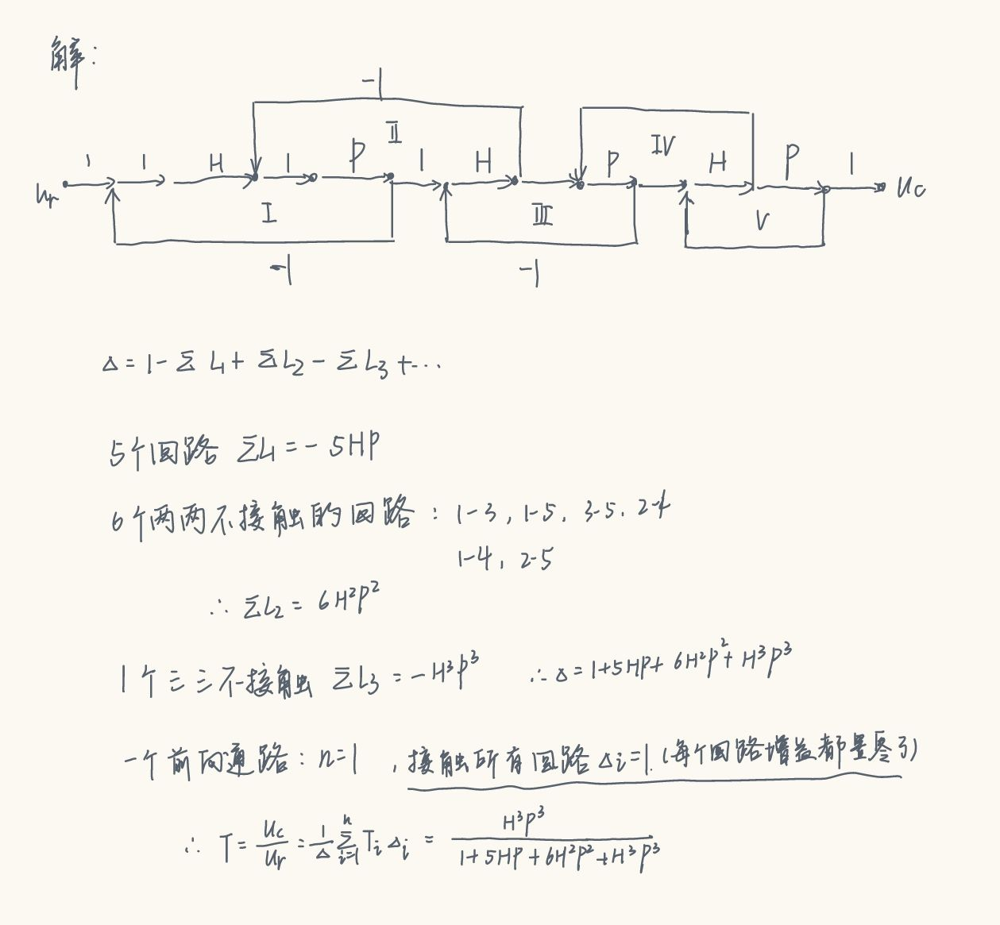

# 控制论

!!! warning
	24-25秋冬 控制论复习课笔记  
	扒了前几年智云，随手整去考场的ww   

题型：主要是简答题

## I. 控制的概念与系统构成

**助教PPT**

**历年题：**

1. 2023-2024 春夏：如图所示的水箱液位自动调节系统设计稳定供水的控制方案，画出控制框图（试卷原图中包括进水口、出水口、浮球、给定电位计、电机、阀门）

## II. 传递函数

### A. 系统结构

##### 1. 串联系统

$$Y=H_1\cdot H_2 \cdots H_n$$
##### 2. 并联系统

$$Y=H_1 + H_2 + \cdots + H_n$$

##### 3. 负反馈系统
$$G'=\frac{G}{1+GH}$$

##### 4. 如何化简？

3. 例题1：

另一道比较难的例题见课件，感觉无非算的仔细一点

##### 5. 信号流图(SFG)--梅逊增益公式

1. 信号流图表示法与框图的转换

每一个综合点/引入引出点都是一个新的信号点

2. 信号流图的变换：

y=ax-by

若没有公共节点：不接触
否则：接触

一道信号流的化简例题：

例题：

## III. 稳定性

### 3.1 劳斯判据

给一个`g(s)=`的形式

例题/23-24考试题

$s^3+6s^2+5s+K=0$ 判断使$K$稳定的范围

解：套公式：

| $s^3$ | 1                   | 5   |
| ----- | ------------------- | --- |
| $s^2$ | 6                   | K   |
| $s^1$ | $-\frac{(k-30)}{6}$ |     |
| $s^0$ | K                   |     |

$\Rightarrow 0<K<30$

## IV. 时域频域分析

- 延迟/**滞**时间$t_d$：响应曲线到达稳态值50%所需的时间。
- 上升时间$t_r$：
	- 【无振荡系统】响应曲线从稳态值的10%到90%所需时间；
	- 响应曲线从稳态值的5%到95%所需时间； 
	- 【有振荡系统】响应曲线从零开始至第一次到达稳态值所需的时间。
峰值时间$t_p$：响应曲线到达第一个峰值所需的时间
调节时间$t_s$：响应曲线从零开始到进入稳态值的 95%~105%（或98%~102%）误差带时所需要的时间。
超调量：
稳态误差：
频率特性曲线：
幅相曲线：

比例(P)控制能迅速反应误差，从而减小稳态误差。但是，比例控制不能消除稳态误差。比例放大系数的加大会引起系统的不稳定。

积分(I)控制的作用是：只要系统有误差存在，积分控制器就不断地积累，输出控制量，以消除误差。因而，只要有足够的时间，积分控制将能完全消除误差，使系统误差为零，从而消除稳态误差。积分作用太强会使系统超调加大，甚至使系统出现振荡。

微分(D)控制可以减小超调量，克服振荡，使系统的稳定性提高，同时加快系统的动态响应速度，减小调整时间，从而改善系统的动态性能。

------

## 部分历年卷答案补充 && 上课主题补充

钱学森之所以能够创立《工程控制论》，是因为他将控制论的理论应用于工程领域，特别是在自动化、无线电电子学、航天技术及系统工程等专业中。《工程控制论》是钱学森在1954年在美国用英文发表的专著，它主要研究具体工程技术的控制系统，运用的主要工具是连续数学，如在建造飞机、控制导弹、航天器飞行等方面。

与维纳的《控制论》相比，钱学森的《工程控制论》更侧重于工程实践和应用。维纳的《控制论》则更多地是哲学的和数学的，它揭示了机器中的通信和控制机能与人的神经、感觉机能的共同规律，为现代科学技术研究提供了崭新的科学方法。《工程控制论》把控制论变成了一门真正具有可实践性的学科，而维纳的《控制论》则为控制论领域提供了理论基础和科学定义。

两者的联系在于，钱学森的《工程控制论》是在维纳《控制论》的基础上发展起来的，它将控制论的基本原理应用于工程领域，使之更加具体化和实用化。同时，控制论通过信息和反馈建立了工程技术与生命科学和社会科学之间的联系，这种跨学科性质使得控制论的原理和方法可以应用于多个领域，包括工程控制论、生物控制论、神经控制论、经济控制论以及社会控制论等。

**在PID控制中如何权衡上升时间Tr和最大超调量σp的关系？如何减少系统稳态误差e(∞)?**

在PID控制中，上升时间（Tr）和最大超调量（σp）是两个重要的性能指标，它们之间存在一定的权衡关系。以下是如何在这两者之间进行权衡以及如何减少系统稳态误差的方法：

- **权衡上升时间Tr和最大超调量σp**
	- **调整比例增益Kp**：增大Kp可以加快系统的响应速度，从而减小上升时间，但同时也会导致系统超调量增大。因此，需要在增大Kp以加快响应速度和控制超调量之间找到一个平衡点.
	- **调整积分时间Ti**：增大Ti可以减小超调量，但会增加系统的响应时间，从而增大上升时间。因此，在调整Ti时，需要根据系统的具体要求，权衡响应速度和超调量之间的关系.
	- **调整微分时间Td**：增大Td可以减小超调量，但可能会导致系统对高频噪声的敏感度增加。因此，在调整Td时，需要考虑系统的噪声特性，避免引入过多的噪声干扰.
	- **采用复合控制策略**：例如，将PID控制与其他控制策略（如模糊控制、自适应控制等）相结合，可以在一定程度上同时优化上升时间和超调量。这些高级控制策略可以根据系统的动态特性和误差变化情况，实时调整控制参数，实现对系统的精确控制.

- **减少系统稳态误差e(∞)**
	- **增大积分增益Ki**：积分控制可以消除系统的稳态误差，但过大的Ki可能会导致系统出现过度调节现象。因此，在增大Ki以减小稳态误差时，需要注意系统的稳定性和调节时间.
	- **增加开环增益或积分环节个数**：提高系统的开环增益或增加积分环节的个数，可以降低扰动信号引起的稳态误差。但同时，这也可能会影响系统的稳定性，因此需要在增大增益和保持系统稳定之间进行权衡.
	- **采用复合控制**：将反馈控制与扰动信号的前馈或与给定信号的顺馈相结合，可以进一步减小系统的稳态误差。这种复合控制方式可以同时考虑系统的动态特性和外部扰动，实现对系统的精确控制.
	- **优化系统设计**：在系统设计阶段，合理选择系统的结构和参数，可以有效减小系统的稳态误差。例如，选择合适的传感器和执行器，提高系统的测量精度和控制精度，从而降低误差。

**智能控制中的专家系统有哪两种主要方法？画出各自的简要框图。概要说明两者间的主要区别和特点。**

13讲，具体抄PPT

在智能控制中，专家系统主要有两种类型：直接型专家控制器和间接型专家控制器。以下是它们的简要框图和主要区别：

- **直接型专家控制器**
	- **框图**：抄PPT
	- **特点**：
	  - 直接取代常规控制器，直接控制生产过程或被控对象。
	  - 知识库和推理机相对简单，通常由几十条产生式规则构成。
	  - 适用于需要实时控制的简单任务。

- **间接型专家控制器**
	- **框图**：抄PPT
	- **特点**：
	  - 与常规控制器相结合，进行间接控制。
	  - 能够实现优化适应、协调、组织等高层决策的智能控制。
	  - 适用于需要复杂决策和优化的任务。

- **主要区别和特点**
	- **控制方式**：直接型专家控制器直接控制对象，而间接型专家控制器通过与常规控制器结合进行控制。
	- **知识库复杂度**：直接型的知识库相对简单，适合实时控制；间接型的知识库更为复杂，适合处理复杂的决策任务。
	- **应用场景**：直接型适用于简单的实时控制任务，如模拟操作工人的智能；间接型适用于需要高层决策和优化的复杂系统。
	- **灵活性和扩展性**：间接型专家控制器由于其复杂的知识库和推理机制，具有更高的灵活性和扩展性。

**采样控制系统**

采样控制系统是一种离散时间控制系统，其中连续时间信号通过采样和保持过程转换为离散时间信号进行处理。以下是采样控制系统的常用结构：

1. **基本结构**
- **采样器（Sampler）**：
	  - 功能：将连续时间信号 \( x(t) \) 采样成离散时间信号 \( x[n] \)。
	  - 工作原理：在每个采样周期 \( T \) 的开始时刻，采样器对输入信号进行瞬时采样，形成一系列离散的信号值。
	- **数字控制器（Digital Controller）**：
	  - 功能：根据采样得到的离散信号，进行数字信号处理和控制算法计算，输出控制信号 \( u[n] \)。
	  - 组成：通常包括数字信号处理器（DSP）、微处理器（MCU）等硬件，以及相应的控制算法软件。
	- **零阶保持器（Zero-Order Hold, ZOH）**：
	  - 功能：将离散时间控制信号 \( u[n] \) 转换为连续时间信号 \( u(t) \)。
	  - 工作原理：在每个采样周期内，保持器将采样时刻的信号值保持不变，直到下一个采样时刻。
	- **被控对象（Plant）**：
	  - 功能：根据输入的连续时间控制信号 \( u(t) \) 进行响应，产生输出信号 \( y(t) \)。
	  - 特点：可以是机械、电气、液压等不同类型的系统，其动态特性决定了控制系统的性能。

- **闭环结构**
	- **反馈环节**：
	  - 功能：将被控对象的输出信号 \( y(t) \) 通过反馈路径送回输入端，与参考信号进行比较。
	  - 作用：实现对系统的闭环控制，提高系统的稳定性和控制精度。
	- **误差检测器（Error Detector）**：
	  - 功能：计算参考信号与反馈信号之间的误差 \( e(t) \)。
	  - 作用：为数字控制器提供误差信息，以便进行控制算法的调整和优化。
	- **闭环控制回路**：
	  - 通过误差信号 \( e(t) \) 的采样、数字控制器的处理和控制信号的输出，形成一个闭环的控制回路，实现对被控对象的精确控制。

- **优点**
	- **灵活性高**：数字控制器可以根据不同的控制需求和系统特性，灵活地调整控制算法和参数。
	- **可靠性强**：数字控制器具有较高的可靠性和抗干扰能力，能够在复杂的工业环境中稳定工作。
	- **易于实现**：随着数字信号处理技术和计算机技术的发展，采样控制系统的实现变得越来越简单和经济.

- **应用场景**
	- **工业自动化**：如电机控制、机器人控制、生产线自动化等。
	- **航空航天**：如飞行器的姿态控制、导航系统等。
	- **汽车电子**：如发动机管理系统、车身稳定控制系统等.
	- **通信系统**：如信号处理、数据传输等。
