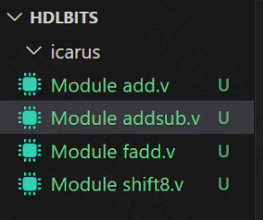
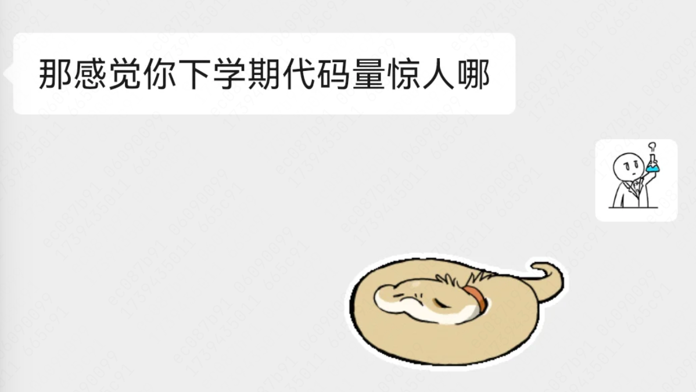

# 2025 年 2 月

## 25.1.10 - 1.11  
【1.10 **早起**：七点半，但早饭鸽了QAQ // **午觉**（貌似没睡着）**晚上**1：31 晚睡  用了11h手机TT】  
【1.11 **早起**：六点半  **午觉**：15：30-16：00 】  

想来想去今天并没有那么适合去旅游，本来想去杭州随便什么地方走走的QAQ 却发现还是更像给这个糟糕的学期收个尾。那就静下心来整理一下嚎了！
看起来事情多但都是一些琐碎的小事情~  

- ~~打扫寝室卫生~~  
- ~~吃饭，取回小龟，收拾小龟~~   
- ~~打扫个人卫生~~  
- 写计划  
- 买书  
- ~~整理回家要带的行李!  ~~
- ~~跑尧坤楼~~，申二课三课
- ~~整理电基笔记，放到notebook~~  
- 改历年卷，电子版  
- 整理数模笔记/汇编用过资源  
- 整理C程/大物笔记  
- 电设/复变/大物+一些反思  
- 修缮自制zjuers.com，整理工作流    
- 总结复习一路楼！      
- ~~replyview 集思广益 （嘿嘿）~~  （自行解决，不写了）
- 出发寻找一些寒假/下学期的课程资料  

## 25.1.12 ： 沉迷图灵完备（楽）

## 25.1.14

总结一下……
Turing complete 又缓慢推进了几个关卡（今天花了两三个小时，我是菜狗……），现在ALU做完啦，这游戏真好玩, 而且让我想的很多   
学期总结开了个头，还不错，写了大半部分    
hpc今天停课了浅摆   
书借了+看了一章   
Verilog: HDLBits Basic完成，看了一些菜鸟教程，大概入门了    

虽然今天摆烂了，但是So Nice    

## 总结一下我寒假已经做完的事情   

1.学习上：比较后悔的点，只学习了一些计组知识，学习了Verilog，有待推进   
2.规划和整理上：  
- 完善了笔记本（有待进一步完善）   
- 了解了托福并确定了自己对于备考托福的一些大致规划，进一步资料之后花时间整理一下       
- 花了不少刷手机的时间，基本对升学有了个大致的概念   
- 在退出->邮件被鸽->迷茫之后，纠结了很多事情，但最终大致坚定了自己之后读phd的想法以及有了进一步的计划   

3.学生工作上：   
- 忙了一礼拜辩论，虽然遗憾失败       
- 忙了一礼拜招生   
- 撰写了acee pros and cons, 若干和学弟妹的chat. 实话说感觉自己有点不配www    
- 返校宣讲上，帮助了两个妹妹~    

4.其他：  
- 去了台州+温州   
- 回母校+和高中同学团建，碰到了两年没见的化学老师       
- 车速终于爬到80码了，单趟终于50km了www        
- 打卡了家里几个小众景点   
- ~~刷完了所有阿瓦隆和狼人杀并决定戒掉桌游和综艺~~   
- 和8友玩了几局阿瓦隆+水群！   

## 25.2.4

**日期** ： 2025.2.4

**状态** ： 🟩

### 主要活动

- 上午：10:30-12:30 启真杯复赛，完成了现场组工作人员工作   
- verilog推进了很大一部分，已经基本能写了orz 希望明天能掌握完(写完)基本的language使用的习题，开始数电模块       
- 下午：整理了CA, 马原还有专业课的资料，形成了方法论       
- 晚上花了半小时锻炼  
- 剩下时间忙着帮室友发征友帖了，同时删了500多张照片   

### 反思&感想  
- 今天终于没有沉迷劣质多巴胺了   
- 以后再也不要在床上玩手机了，不管睡前还是醒后，都锁锁机吧orz   
- 希望明天列个再合理点的计划，期望放低再放低     
- 之后列计划的时候注意：把收集资料等这些琐碎的事情再拆解一下，穿插着做。还是不要用大段的时间做，也不要上来就做琐碎的事情，没有成就感。   
- 快点学计组 orz  

**日期** ： 2025.2.5

**状态** ： 🟧

### 主要活动

- 上午：吃瓜好室友征友，吃太久了，忏悔TNT
- 下午：完成了所有课程资料整理工作，是很庞大的工程，也花了很久
- 晚上：
    - 去东大街逛了一圈，开车回家~   
    - 查论文未果   
    - 和8u聊天到十二点
    - 半夜确定了新的想法   

### 反思&感想  
- 又沉迷劣质多巴胺了....不要再把时间花在【看热闹】上。不要【什么都说】。很多场合【不值得】。希望能再改变一点。        
- 最大的感慨还是家乡的变迁。之前破破旧旧的弄堂完全不一样了。有一些不真实和难受的感觉，但真的是【旅游业】对地貌的巨大影响。  

## 25.2.5

**日期** ： 2025.2.5

**状态** ： 🟨    

### 主要活动   

- 上午起的有一点晚了，主要是因为赖床www 从2.6开始早睡早起orz      
- 进行了进一步的阅读，clone了一个仓库跑跑看看，并且发送了邮件   
- 完成了一路楼的整理和施工！      
- 看了一些（主要是）whynottv， tql      
- 完成了自己收藏夹的施工，决定这两天纯用html和js糊一个导航页   
- 练了《Experience》,算是没鸽掉自己一天一小时的承诺. 练习过程中发现自己跟不上90一拍，只能回去哈农，属于童年噩梦了orz   
- 学习进度依旧缓慢，明天必须努努力完成计划. Verilog今天堪堪写完了Module部分，写了4道练习题，碰到了一道全加器。但是突然感觉自己基本会写一些模块了，终于知道这玩意儿在讲什么了……明天继续加油，继续学数电！   
- 今天没锻炼，单词鸽了，本子也没买，忏悔www 明天一定好好过。    

### 反思与感想   
- 今天感触最深的是Neal说的【自我承诺】。感觉自己真的对自己太轻言放弃了。希望之后能对自己更郑重一点。就像Neal所说，【我无论如何都要在六点起床】。  

---

### 后记

0：20！

## 25.2.6

**日期** ： 2025.2.6    

**状态** ： 🟩    

### 主要活动   

- 写完了navigation，爽了！  
- 今天终于出门买了单词本，并且背了50个单词。果然行动是老师orz   
- 完成了gmail注册和探索！感谢中国好室友！  
- Vivado和Logisim的初步探索完成了，感觉胜利在望   
- 晚上摆烂了...莫名心情低落，明天早起重新开始吧，好好写Verilog，好好写lab，好好学计组和CPU.

### 反思&感想   
- 今天又练了一下《Experience》，然后又听了一下原曲，真的差的太远了，有点点小失落。但母上又说，听不出来，觉得，还挺神奇的。但事实就是欠火候，弹不好，四五指仿佛不是我的，之后再练。
- 今天又没早起成功，为了早起，我决定晚上干脆不学了，早点睡觉，反正晚上也做不了什么事情。  
- 今天又没锻炼...现在倒觉得晚上太冷迈不动步子，下午出去转转挺好的。   
- 今天其实压力一直有点大，有点难以表述，主要还是想的太多，又push不动自己吧。还是讲讲今天的遭遇：今天终于联系上老师了，然后要从现在开始学AI和大模型，从DNN学起，学CS231N，emmm 感觉ok，但有点心累，因为开学前确实得抽时间，完成某道数电的Lab，完成计组的Lab，学完C++。今天又把这门课加进了计划。但总觉得好难，或者说我Push自己不够紧...压力自然而然就上来了。   
- 还有就是老师对本科生的怀疑吧，认为我做不了硬件，先叠甲，觉得老师真的挺好的，但当时有点应激，在想自己其实也可以胜任，也努力在自学硬件知识，但确实，现在会的太少。好在感觉自己如果坚持说要做硬件，也有学习MLsys的希望！本来说，这个学期抽抽空能不能写一写一生一芯的Lab（除了PA1，预学习部分我也做了蛮多了）但后来觉得，自己还是先对自己合理要求，合理估计吧，左顾右盼也做不成事情。硬件上我对自己的要求，感觉主要是1.抽空把PA完成，不知道有没有 2.认真完成数电计组的预学习，然后上完体系结构这门课，再难也不要汽修，或许就够了！这毕竟也是我去选课的目的之一，不然自学罢了。 记住，**左顾右盼毫无用处**，不要想的多做得少！   
- 总之下学期会是挺忙碌的，现在也是。但努力应该没问题吧。 然后现在开始一定要尽力。    
- 人的专注阈值是有限的，尤其是在家里，push不动自己。今天看了🍼前辈的一路，好棒的形式！决定明天用番茄钟好好计时，少刷手机，好好休息。        
- 明天开始不许水98水群了。   

## 25.2.7

**日期** ： 2025.2.7，周五   

**状态** ：     

### 习惯打卡：  

- 早起时间：7：51 √  
- 早睡时间：00：29 ×  
- 手机时长：4h57min (0点后47min) ×  
- 单词：35/50 √  
- 锻炼： × 

### 主要活动   

- 上午：Verilog: 40min
- 下午：Verilog: 60min   
- 晚上：单词打卡   
- 制定相应AI学习计划，但没落实，买了本书   
- 外面吃饭
- 《哪吒》   

### 反思&感想   

- 温暖的床耽误了事业，下午也是，晚上也是。起床和睡觉都没那么难，加油改正！    
- 今天压力好大，闭上眼想起压抑的北三和压抑的主图，想起压抑的寝室和压抑的课堂。还是劝自己放宽心，好好学。事实是：【现在多学点，将来少熬点，或许科研也能多推一点】   
- 《哪吒》：打斗有点点看的难受，不知道是不是因为自己不怎么看电影orz感觉看的也不仔细，观后感也有人太多人写过，自己没有独特的感悟。但是敖光真的好帅（误     
- 晚上出门吃饭了，吃了300多，虽然感觉服务菜品什么都很到位。我猜所谓的300多可能是父亲搪塞过去的借词，应该快400了。难过…… 如果他们懒得烧饭，我也大可以学学，而不是让他们选择出门之后为花的钱难过……我终究不太孝顺哇       

## 25.2.9

**日期** ： 2005.2.9

**状态** ： 🟨    

### 主要活动   

- 前100 words 复习，新学95 words  
- Verilog 状态机写明白了，HDLBits完结  

## 25.2.10

**日期** ： 2025.2.10，周一    

**状态** ： 🟧 

### 习惯打卡：  

- 早起时间：8：30  
- 早睡时间：23：30   
- 手机时长：6h8min ×   
- 单词：×  
- 锻炼：×  

### 主要活动   

- 完成AI相关的资料整理，完善收藏夹 --1h30min
- 录制《Experience》   
- 修Navigation, 修Notebook --- 1h30min      
- 工作：1h开会+1h工作   

### 反思&感想   
- 啥也没干。明天干脆录屏录一天，该好好学习，恢复学校那种状态了   

## 25.2.16  

**日期** ： 25.2.16，周日    

**状态** ： 🟧   

### 习惯打卡：  

- 早起时间：8：37 ×  
- 早睡时间：预计 23：45，早睡 √   
- 手机时长：5h26min   
- 单词：×，明天开始  
- 锻炼：×，明天开始  

### 主要活动   

- 上午：继续工作，还有太多太多事情   
- 下午+晚上：gap
    - 睡觉   
    - gap, 去玩了一把剧本杀    
    - 计组RISC-V，一头雾水ing

### 反思&感想   

明天再写吧，晚上在寝室真的不适合写，以后不要睡前写，出自习室前十分钟写这个吧……    
以后不要再耗任何奇奇怪怪的事情了，从明天开始，列好计划就完成，不要再拖；不要耗人际关系，不要耗工作，工作也就是一些事情而已，别太内耗，事情太多就分下去

