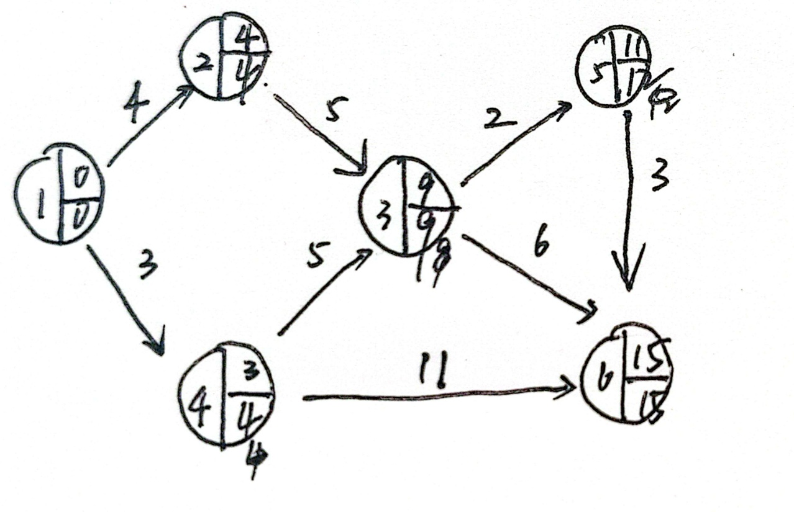
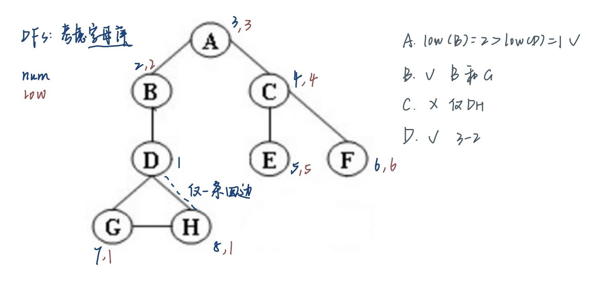

# 图
## 1 基础知识


### 1）结构体声明（可能给了）

```c
typedef struct AdjVNode *PtrToAdjVNode; 
struct AdjVNode{
    Vertex AdjV;
    PtrToAdjVNode Next;
};

typedef struct Vnode{
    PtrToAdjVNode FirstEdge;
} AdjList[MaxVertexNum];

typedef struct GNode *PtrToGNode;
struct GNode{  
    int Nv;
    int Ne;
    AdjList G;
};
typedef PtrToGNode LGraph;
```

### 2）拓扑排序
- 拓扑序：对于任意两个顶点 $i,j$，如果 $i$ 是 $j$ 的前任，则在线性顺序中 $i$ 要出现在 $j$ 之前
- 每处理完一个顶点 V 后，就需要让从 V 出发与 V 邻接的顶点的入度 -1，相当于在图上移除了顶点 V 以及它的所有出边
- 入队：V目前的入度是0

> [!note]- 拓扑排序的流程-AI版
> 1.  **第一步：初始化。**
>     *   计算图中所有顶点的入度。
>     *   找到所有入度为0的顶点，把它们放进一个容器里（通常用**队列**，用栈也可以）。
> 
> 2.  **第二步：循环处理。**
>     *   当容器不为空时，不断重复以下操作：
>         a. 从容器里取出一个顶点 `V`（比如从队列里`Dequeue`）。这个 `V` 就是当前可以“完成”的一个任务。
>         b. 把 `V` 加入到我们的拓扑排序结果序列中（或者直接打印出来）。
>         c. **“解锁”后续课程：** 遍历所有从 `V` 出发的边 `<V, W>`。对于每一个邻接点 `W`，我们都做一件事：**将 `W` 的入度减一**。
>         d. **发现新的起点：** 在上一步减一后，如果发现某个邻接点 `W` 的入度**变成了0**，这意味着它的所有先修课程都已经被我们处理完了！太好了，它现在是新的“可以开始的点”，立刻把它也**放入容器**（`Enqueue`到队列里）。
> 
> 3.  **第三步：收尾检查。**
>     *   当循环结束后（容器为空），我们检查一下拓扑排序结果序列里的顶点个数。
>     *   如果个数等于图的总顶点数，那么恭喜，我们成功找到了一个拓扑排序。
>     *   如果个数**小于**图的总顶点数，这意味着什么？说明图中途再也找不到入度为0的点了。这是为什么呢？因为图里存在一个**环 (cycle)**！陷入了“鸡生蛋、蛋生鸡”的死循环，永远无法完成。
> 

检验拓扑排序的代码：

```c
bool IsTopSeq(LGraph Graph, Vertex Seq[]){
    //先计算出度
    int degree[Graph->Nv];
    for(int i=0;i<Graph->Nv;i++){
        degree[i]=0;//初始值为0
    }
    for(int i=0;i<Graph->Nv;i++){
        //遍历邻接的边
        PtrToAdjVNode tmp = Graph->G[i].FirstEdge;
        while (tmp != NULL) {
            degree[tmp->AdjV-1]++;
            tmp=tmp->Next;
        }
    }
    for(int i=0;i<Graph->Nv;i++){
        if(degree[Seq[i]-1]!=0){
            return false;
        }
        PtrToAdjVNode tmp = Graph->G[Seq[i]-1].FirstEdge;
        while (tmp != NULL) {
            degree[tmp->AdjV-1]--;
            tmp=tmp->Next;
        }
    }
    return true;
}
```

### 3）AOE网


+ 计算EC：找到第一个事件到最后一个事件之间*最长*的路

>注： 图如果是有环的，因为**正成本环(positive-cost cycles)**的存在，这种算法无法实现。然而这里已经规定是无环图，所以无需担心

从起点 $v_0$ 开始，对于任意的 $a_i = <v, w>$，我们有

$$
	EC[0] = 0 \quad EC[w] = \max\limits_{(v,w) \in E} \{EC[v] + C_{v, w}\}
$$

>按**拓扑序**计算

+ 计算 LC：从终点 $v_8$ 开始，对于任意的 $a_i = <v, w>$，我们有
$$
	LC[8] = EC[8] \quad LC[v] = \min\limits_{(v,w) \in E} \{LC[v] - C_{v, w}\}
$$
>按**逆向拓扑序**计算

+ $<v, w>$ 的**空闲时间(slack time)** = $LC[w] - EC[v] - C_{v, w}$
+ **关键活动(critical activity)**：空闲时间为0的活动
+ **关键路径(critical path)**：所有边的空闲时间均为0的路径

### 4）最短路算法

#### 1. BFS实现：

```c
struct TNode{
    int dist;
    Vertex path; //存储顶点名称就够了！
};

struct queuestruct{
    int head;
    int tail;
    int* q;
};

typedef struct queuestruct *PtrToQueue;

PtrToQueue init(int n){
    PtrToQueue q=(PtrToQueue)malloc(sizeof(struct queuestruct));
    q->head=0;
    q->tail=0;
    q->q=(int*)malloc(n*sizeof(int));
    return q;
}

PtrToQueue enqueue(int n,PtrToQueue q){
    q->q[q->tail]=n;
    q->tail++;
    return q;
}
int dequeue(PtrToQueue q){
    int tmp=q->q[q->head];
    q->head++;
    return tmp;
}
int isempty(PtrToQueue q){
    if(q->head==q->tail){
        return 1;
    }
    else{
        return 0;
    }
}
void BFS(LGraph Graph, Vertex S) {
    struct TNode tnodes[Graph->Nv];
    for(int i=0;i<Graph->Nv;i++){
        tnodes[i].dist=1000;
        tnodes[i].path=-1;
    }
    tnodes[S-1].dist=0;
    //入队
    PtrToQueue q=init(3*MaxVertexNum);
    enqueue(S,q);
    while(isempty(q)!=1){
        int v=dequeue(q);
        PtrToAdjVNode tmp=Graph->G[v-1].FirstEdge;
        while(tmp!=NULL){
            if(tnodes[tmp->AdjV-1].dist==1000){
                tnodes[tmp->AdjV-1].dist=tnodes[v-1].dist+1;
                tnodes[tmp->AdjV-1].path=v;
                q=enqueue(tmp->AdjV,q);
            }
            tmp=tmp->Next;
        }
    }
}
```

#### 2. Dijkstra

伪代码，应该不会真的需要实现：

```c
void Dijkstra(Table T)
{
    Vertex V, W;
    for(;;)  // O(|V|)
    {
        V = smallest unknown distance vertex;
        if (V == NotAVertex)
            break;
        T[V].Known = true;
        for (each W adjacent to V)
            if (!T[W].Known)//还没访问到的话
                if(T[V].Dist + Cvw < T[W].Dist) // 这步操作被称为“松弛”
                {
                    Decrease(T[W].Dist to T[V].Dist + Cvw); 
                    T[W].Path = V;
                } // end-if update W
    } // end-for(;;)
} // now work for edge with negative cost
```

### 4）网络流

1. 在**残量图(residual graph)** $G_r$ 中找一条 $s \rightarrow t$ 的简单路径，该路径被称为**增广路径(augmenting path)**
2. 增广路径的流量为路径上的所有边中最小的流量，用该流量更新**流量图(flow graph)** $G_f$
3. 更新 $G_r$，并移除流量为0的边
4. 如果 $G_r$中还存在 $s \rightarrow t$ 的路径，回到步骤 1，否则终止程序


改进：具有撤销能力。应该不考吧

### 5）最小生成树

如何理解**最小生成树(minimum spanning tree)**？
+ “树”：无环且边的数量为 $|V| - 1$
>因此当图的边数 < $|V| - 1$时，该图不存在最小生成树
+ “最小”：保证生成树的所有边的权重和最小
+ “生成”：覆盖所有的顶点
+ 最小生成树存在的**充要条件**是图$G$是**连通的**
+ 如果在生成树中添加一条边，就会形成一个*环*
+ 最小生成树是并不一定是唯一的，但最小生成树的**总权重是唯一的**

#### 5.1 Prim's Algorithm

+ 初始情况下，先将一个顶点作为树的**根**放入树内
+ 在每个阶段，添加边(u, v)，满足 (u, v) 的权重是来自已有生成树的顶点 u 和来自生成树外的 v 之间的所有边中权重最小的那条，且不产生环，然后将新的顶点 v添加至树里
+ 重复上述步骤，直至所有顶点均在生成树内

> [!note]- 可以对着它回忆一下
> 

#### 5.2 Kruskal's Algorithm

1. **无向无环图 (Undirected Acyclic Graph)**: 这种图也被称为 **森林 (Forest)**。
2. **连通分量 (Connected Component)**: 森林由一个或多个互不相连的部分组成，每一个部分就是一个连通分量。
3. **树 (Tree)**: 森林中的每一个连通分量都是一棵树。
4. **树的性质**: 对于任何一棵树，如果它有 v 个顶点 (vertices)，那么它一定有 v - 1 条边 (edges)。

方法：维持一片森林（一组树），适用于**稀疏图**中

+ 初始情况下，有 $|V|$ 棵单个节点构成的树
+ 添加一条边，可以合并两棵树。当算法结束时，应当只剩下一棵树。因此，我们很自然地想到使用**并查集**的算法
+ 挑选边（这里假设挑选边 $(u, v)$ ）时要注意的细节：

	+ 如果 u, v 在同一个集合内，则不能添加这条边（否则会出现环）
	+ 否则加入这条边，使用 `Union` 算法将两个集合合并起来
+ 用**堆**维护未被检验过的最小的边，每当检验一条边时，使用 `DeleteMin` 算法


### 6）DFS

```c
void DFS(Vertex V)
{
    visited[V] = true; // mark this vertex to void cycles
    for (each W adjacent to V)
        if (!visited[W])
            DFS(W);
}
```

- 当且仅当 1 次 DFS 能够遍历所有顶点时，无向图是连通的
- 当我们发现某条边 (v, w) 中的 w 已被标记过，用虚线画出这条边，称作“**回边 (back edge)**”，表示这条边不包含于生成树里:


#### 关节点 | Articulation Point

+ 当`G' = DeleteVertex(G, v)`至少有 2 个连通分量时，称`v`为**关节点(articulation point)** 或者 **割点(cut vertex)**
>换句话说，关节点的移除能够破坏图的连通性


  `Low(u)` 的计算公式：
$$
		\begin{align}
		Low(u) = & \min\{Num(u), \min\{Low(w)\ |\ w \text{ is a child of }u\} \notag \\
		& , \min\{Num(w)\ |\ (u, w) \text{ is a back edge}\}\} \notag
		\end{align}
$$
> [!example]+ 例子
> 
> 
> 
> 
> 
> 
> 
> 


```c
// Assign Num and compute Parents
void AssignNum(Vertex V)
{
    Vertex W;

    Num[V] = Counter++;
    Visited[V] = ture;
    for each W adjacent to V
        if (!Visited[W])
        {
            Parent[W] = V;
            AssignNum(W);
        }
}

// Assign Low; also check for articulation points
void AssignLow(Vertex V)
{
    Vertex W;

    Low[V] = Num[V]; // Rule 1
    for each W adjacent to V
    {
        if (Num[W] > Num[V])
        {
            AssignLow(W);
            if (Low[W] >= Num[V])
                printf("%v is an articulation point\n", v);
            Low[V] = Min(Low[V], Low[W]);  // Rule 3
        }
        else if (Parent[V] != W)
            Low[V] = Min(Low[V], Num[W]);  // Rule 2
    }
}

// Testing for articulation points in one depth-first search
void FindArt(Vertex V)
{
    Vertex W;

    Visited[V] = True
    Low[V] = Num[V] = Counter; // Rule 1
    for each W adjacent to V
    {
        if (!Visited[W])
        {
            Parent[W] = V;
            FindArt(W);
            if (Low[W] <= Num[V])
                printf("%v is an articulation point\n", v);
            Low[V] = Min(Low[V], Low[W]);  // Rule 3
        }
        else if (Parent[V] != W)
            Low[V] = Min(Low[V], Num[W]);  // Rule 2
    }
}
```

### 7）欧拉回路

- **欧拉路 (Euler tour)**：在笔不离纸的情况下，图上的每条边均被遍历一遍（一笔画）
- **欧拉环 (Euler circuit)**：在笔不离纸的情况下，图上的每条边均被遍历一遍，且最后回到起点的位置
- 无向图：
    - 当且仅当图是连通的，且**每个顶点的度为偶数**时，存在**欧拉环**
    - 当且仅当图是连通的，且**仅有两个顶点的度为奇数**时，存在**欧拉路**
- 有向图：
    - 当且仅当图是弱连通的，且每个顶点的**出度 = 入度**时，存在**欧拉环**
    - 当且仅当图是弱连通的，且有且仅有**一个**顶点的出度 = 入度 + 1，有且仅有**一个**顶点的入度 = 出度 + 1，其余顶点的出度 = 入度时，存在**欧拉路**
### 容易犯错的代码错误
- 如果图的编号是从1开始的，直接存进自己开的数组的时候要记得 -1. 
	- `degree[tmp->AdjV-1]`
	- `visited[v-1]`
	- `Graph->G[v-1].FirstEdge`

## 2 理论题

1. In a directed graph, the sum of the in-degrees must be equal to the sum of the out-degrees of all the vertices. （True or False）

> [!note]- Answer
> T！！
> 要从边的角度取考虑，尤其是有向图
> 因为每条边对应的顶点都有一个出度和一个入度，所以所有顶点的出度之和等于入度之和。

2. If a directed graph G=(V, E) is weakly connected, then there must be at least |V| edges in G.

×，$|V|-1$条边

3. If graph G is NOT connected and has 35 edges, then it must have at least （   ） vertices.

> [!note]- Answer
> 35 条边最少连接 9 个顶点，因此还需再加 1 个顶点，才能使整张图是不连通的，所以共 10 个顶点

4. A graph with 90 vertices and 20 edges must have at least （   ） connected component(s).
5. A graph with 100 vertices and 12 edges must have at most （   ） connected component(s).

> [!note]- Answer
> 围绕给的边，我用给的边连的越多，剩下的节点就越少。剩下的都只能一个点成为一个连通分量。
> 
> 先读题，q1 问至少有多少个连通分量，而 q2 问至多有多少个连通分量。
> 
> q1: 20 条边最多连接 21 个顶点（利用环），这 21 个顶点形成 1 个连通分量，再加上剩余 69 个单独的顶点，因此至少有 70 个连通分量
> 
> q2: 12 条边最少少连接 6 个顶点（利用完全图），这 6 个顶点形成 1 个连通分量，再加上剩余 94 个单独的顶点，因此至多有 95 个连通分量

6. In a weighted undirected graph, if the length of the shortest path from `b` to `a` is 12, and there exists an edge of weight 2 between `c` and `b`, then the length of the shortest path from `c` to `a` must be no less than 10.

> [!note]- Answer
> True.
> 反证法，设图是b-c-a，如果c-a是9的话，那么b-a只有11. 由此说明c-a至少要是10才不矛盾。

7. The minimum spanning tree of any weighted graph
A.must be unique
B.must not be unique
C.exists but may not be unique
D.may not exist

>[!note]- Answer 
> may not exists
>Exists only when the graph is connected


> [!note]+ Answer
> Gr中，每条边的双向流量和不变，答案是5.

8. Apply DFS to a directed acyclic graph, and output the vertex before the end of each recursion. The output sequence will be:

A.unsorted
B.topologically sorted
C.reversely topologically sorted
D.None of the above

> [!note]- Answer
> 递归的顺序是遍历1->遍历2->遍历3->.....->遍历n->返回n->返回n-1...->返回3->返回2->返回1
> 
> 返回的时候打印，因此是从最后一个结点开始打印到源点。是逆拓扑序。


9. 如图


> [!note]- Answer
> 
> 
> 如图：1起点6终点，1236，D

10. Apply DFS to a directed acyclic graph, and output the vertex before the end of each recursion. The output sequence will be:
A. unsorted
B. topologically sorted
C. reversely topologically sorted
D. None of the above

> [!note]- Answer
> 记得DFS是递归打印的！！所以越下面的越先打印，所以就是reversly topologically sorted, C√

11.  Which of the following algorithms can be used to solve the single source shortest path problem for an unweighted DAG?
I. Kruskal; II. Breadth-first search; III. Topological Sort; IV. Dijkstra
- [ ] A. I and IV only
- [ ] B. II, III and IV only
- [ ] C. All of them
- [ ] D. II and IV only

> [!note]- Answer
> B. Topological也是可以的，最后会进行一步松弛操作。没找到哪里讲的，硬记吧。

12. To find the articulation points for following graph by depth-first search tree start from node D, which of the following statement is wrong?


- [ ] A. `Low(B) > Low(D)`
- [ ] B. D has 2 children in depth-first search tree.
- [ ] C. There are 2 back edges.
- [ ] D. `Num(A) > Num(B)`

> [!note]- Answer
> 

13. 如图


> [!note]- 最大流问题的判断
> 这道题的正确答案（即**错误**的陈述）是 **A**。
> 
> 下面我们来详细分析为什么 A 是错误的，以及为什么其他选项是可能的。
> 
> ### 核心原则：流量守恒定律
> 
> 在网络流中，除了源点 `s` 和汇点 `t`，对于任何一个中间节点 `v`，必须满足：
> **流入该节点的总流量 = 流出该节点的总流量**
> 这是一个绝对不能违反的铁律。
> 
> ---
> 
> ### 分析选项 A: 边 (G,t) 的流量为 12 是可能的。
> 
> 我们来检查这个陈述是否符合流量守恒定律。
> 
> 1.  **看节点 G 的流出**：如果边 `(G,t)` 的流量是 12，那么从节点 G 流出的总流量至少是 12。
> 2.  **看节点 G 的流入**：根据流量守恒，流入 G 的总流量也必须是 12。
> 3.  **计算 G 的最大流入能力**：我们看看有哪些边指向 G？
>     *   `D -> G`，容量为 **7**。
>     *   `E -> G`，容量为 **1**。
> 4.  **得出结论**：即使这两条边都达到最大容量，能够流入节点 G 的最大总流量也只有 $7 + 1 = 8$。
> 5.  **发现矛盾**：流入 G 的流量最多是 8，但该陈述要求从 G 流出的流量是 12。这显然是**不可能**的，因为它违反了流量守恒定律。
> 
> 因此，陈述 A 是错误的。
> 
> ---
> 
> ### 为什么其他选项是可能的？
> 
> 我们要找的是**错误**的陈述，既然已经确定 A 是错误的，那么 B, C, D 都是可能的。我们可以简单分析一下它们的可能性。
> 
> *   **B. 边 (S,A) 流量为 10**：`s` 的总流出能力是 $10+5+8=23$。让 `s->A` 这条路满负荷（10）是有可能的，只要后续的节点能把这10个单位的流量成功传递到 `t`。比如 `A` 可以把 7 个单位给 `D`，3 个单位给 `B`，这是可行的。
> *   **C. 边 (S,C) 流量为 8**：同理，让 `s->C` 这条路满负荷（8）也是可能的。`C` 可以把这些流量分配给 `E` 和 `F`。
> *   **D. 边 (S,B) 流量为 5**：同理，让 `s->B` 这条路满负荷（5）也是可能的。`B` 可以把这 5 个单位的流量全部给 `E`。
> 
> 通过寻找一个最小割（Min-Cut），我们可以发现这个网络的最大流是 23。例如，割集 `S = {s, A, B, C, D}` 和 `T = {E, F, G, t}` 的容量为 `capacity(B,E) + capacity(C,E) + capacity(C,F) + capacity(D,G) = 5 + 3 + 8 + 7 = 23`。
> 这说明，为了达到最大流，源点 `s` 的流出总量很可能就是 23，即 `s` 的所有出边都达到饱和。因此，B, C, D 单独看都是非常可能在一个最大流方案中出现的。
> 
> **总结一下：**
> 解决这类问题最快的方法，就是检查每个选项是否违反了网络流的基本约束，尤其是**容量约束**（流量不能超过容量）和**流量守恒约束**。选项 A 在流量守恒上存在一个非常明显且无法解决的矛盾，因此是错误的陈述。
> 
> 你能够注意到这类问题的关键点，非常棒！继续加油，Slowist！

In an undirected acyclic graph G with 3 connected components, the number of edges will be 4 less than the number of vertices.

> [!note]- Answer
> 这道题的结论是 错误 (F)。
> 下面是详细的计算和推理过程：
> 核心知识点
> 无向无环图 (Undirected Acyclic Graph): 这种图也被称为 森林 (Forest)。
> 连通分量 (Connected Component): 森林由一个或多个互不相连的部分组成，每一个部分就是一个连通分量。
> 树 (Tree): 森林中的每一个连通分量都是一棵树。
> 树的性质: 对于任何一棵树，如果它有 v 个顶点 (vertices)，那么它一定有 v - 1 条边 (edges)。
> 推理过程
> 题目中的图 G 是一个有 3个连通分量 的无向无环图。这意味着 G 是一个由 3棵独立的树 组成的森林。
> 我们假设这三棵树分别为 树1, 树2, 树3。
> 设 树1 有 v1 个顶点和 e1 条边。根据树的性质，我们知道 e1 = v1 - 1。
> 设 树2 有 v2 个顶点和 e2 条边。根据树的性质，我们知道 e2 = v2 - 1。
> 设 树3 有 v3 个顶点和 e3 条边。根据树的性质，我们知道 e3 = v3 - 1。
> 现在我们来计算整个图 G 的总顶点数 (V) 和总边数 (E)。
> 总顶点数 V = v1 + v2 + v3
> 总边数 E = e1 + e2 + e3
> 我们将上面三棵树的边和顶点的关系代入总边数的公式中：
> E = (v1 - 1) + (v2 - 1) + (v3 - 1)
> E = (v1 + v2 + v3) - (1 + 1 + 1)
> E = (v1 + v2 + v3) - 3
> 因为 V = v1 + v2 + v3，所以我们可以得到最终的关系式：
> E = V - 3
> 结论
> 我们推导出的正确关系是：边的数量比顶点的数量少 3 (E = V - 3)。
> 而题目中的陈述是：边的数量比顶点的数量少 4 (the number of edges will be 4 less than the number of vertices)。
> 这两个结论不相符，所以原命题是 错误 (False) 的。

