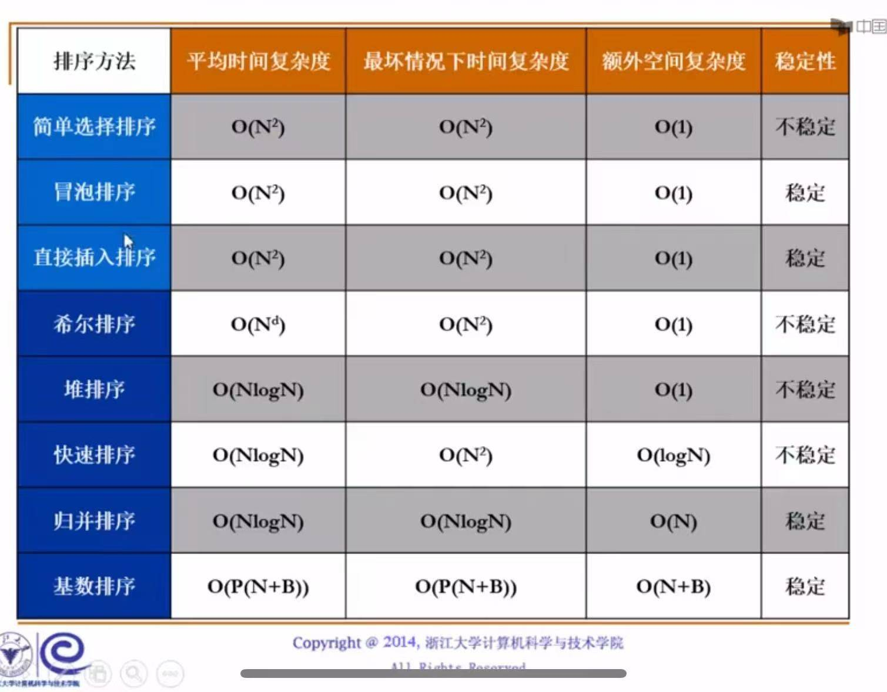
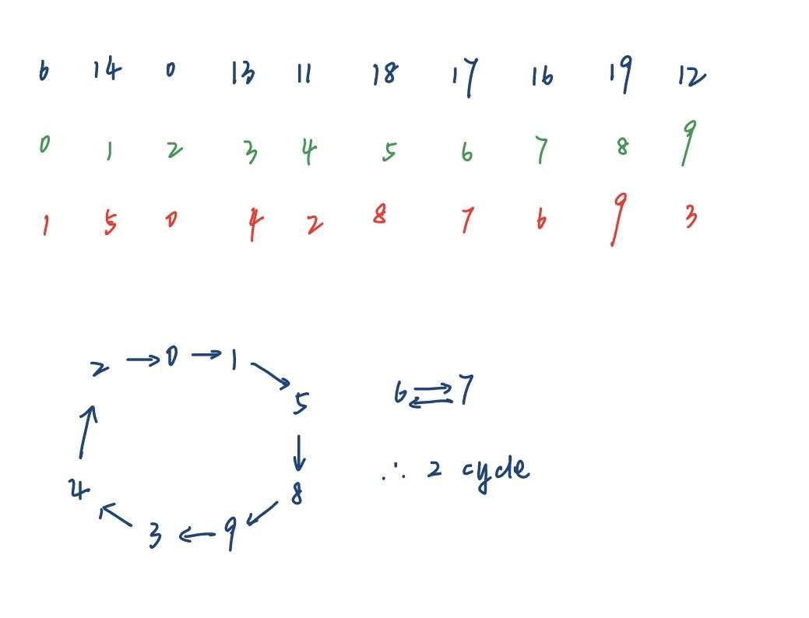
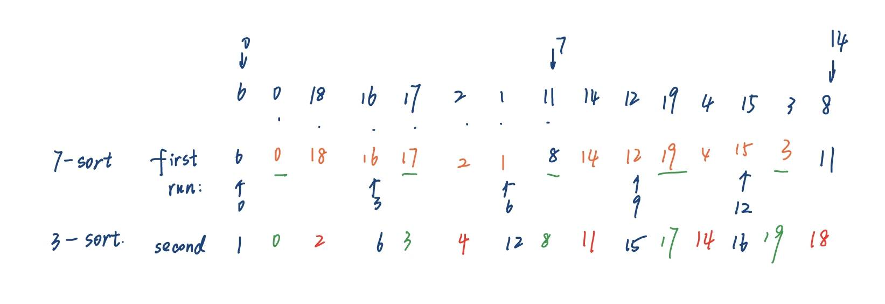
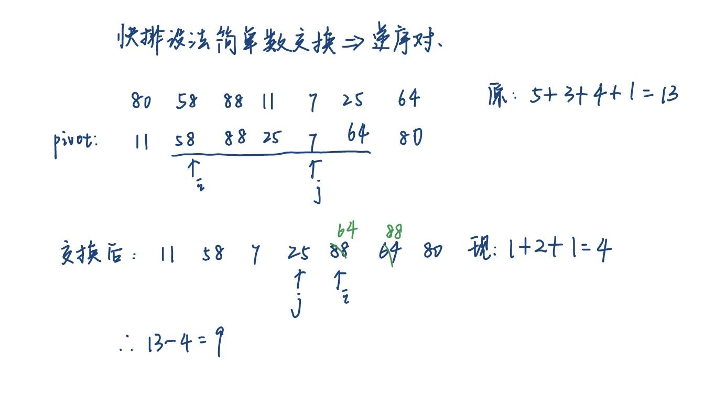

# 排序

> [!important] 稳定
> 一个排序算法是**稳定**的，指的是：**如果数组中有两个值相等的元素，在排序后，它们原来的相对前后顺序保持不变。**
> 
> 判断一个算法是否稳定，关键要看它的**元素交换（或移动）方式**：
> 
> - 如果算法中的交换是**跳跃式**的、**长距离**的，它就很可能是不稳定的。因为它可能会把一个后面的、值相等的元素直接换到一个靠前的位置。
> - 如果算法中的交换总是发生在**相邻**元素之间，或者它能保证相等元素不交换位置，那它通常就是稳定的。

算法一览表：



| 排序算法      | 平均时间复杂度      | 最坏时间复杂度    | 空间复杂度   | 是否稳定？   | 一句话核心思想            |
| :-------- | :----------- | :--------- | :------ | :------ | :----------------- |
| **冒泡排序**  | O(n²)        | O(n²)      | O(1)    | **稳定**  | 不断比较相邻元素，大的往后换     |
| **选择排序**  | O(n²)        | O(n²)      | O(1)    | **不稳定** | 每次从剩下部分找个最小的，放到前面  |
| **插入排序**  | O(n²)        | O(n²)      | O(1)    | **稳定**  | 像打扑克牌，把新牌插入已排好序的部分 |
| **希尔排序**  | O(n¹·³-n¹·⁵) | O(n²)      | O(1)    | **不稳定** | 分组的插入排序，缩小增量       |
| **堆排序**   | O(n log n)   | O(n log n) | O(1)    | **稳定**  | 建个最大堆，不断把堆顶和末尾换    |
| 快速排序      | O(nlogn)     | O(N²)      | O(logN) | 不稳定     |                    |
| 归并（Merge) | O(NlogN)     | O(NlogN)   | O(N)    | 稳定      |                    |

## 一、基本概念
- 数组中**逆序对**的个数 = 其插入排序过程中的**交换**次数
- 对于包含$N$个不同数字的数组，平均逆序对个数是$\frac{N(N-1)}{4}$. 任何通过**交换相邻元素**实现的排序算法，时间复杂度$\Omega(N^2)$

### Insertion Sort

重复 N - 1 趟排序，从 P = 1 到 P = N - 1 。排序前已知 0~P-1 位置上的元素是有序的。对于第 P 趟排序，我们将位置 P 上的元素向前 P 个元素移动，直到发现正确的位置。这样保证每趟排序结束后位置在 0 ~ P 上的元素是有序的。

核心思想：保证前面的地方是有序的

```c
void InsertionSort(ElementType A[], int N)
{
    int j, P;
    ElementType Tmp;

    for (P = 1; P < N; P++)
    {
        Tmp = A[P] // the next coming card
        for (j = P; j > 0 && A[j - 1] > Tmp; j--)
            A[j] = A[j - 1];
        // shift sorted cards to provide a position for the new coming card
        A[j] = Tmp; // place the new card at the proper position
    } // end for-P-loop
}
```

## 二、ShellSort


最坏运行时间：$\Theta(N^2)$
```c
void shellsort(int* a,int n){
    for(int k=n/2;k>=1;k/=2){
        for(int i=0;i<n;i+=k){
            int tmp=a[i];
            int j=i-k;
            //和同组的前面的元素比较
            for(j=i-k;j>=0&&a[j]>tmp;j-=k){
                a[j+k]=a[j];//往后挪
            }
            a[j+k]=tmp;
        }
    }
}
```

注意merge sort要排到不能排为止，所以要排很多组！！


## 三、HeapSort

## 四、MergeSort

- 时间复杂度$O(N \log N)$
- 分治：
要记住，Merge操作的最后是合并两个已经排好序的列表：


```c
void MergeSort(int* a, int n){
    //tmparray必须要开，因为需要将排序后的结果拷贝到tmparray中，最后一次性写进去，否则递归就会乱了。详见Merge函数
    int* tmp=(int*)malloc(n*sizeof(int));
    Msort(a,tmp,0,n-1);
}
void Msort(int* a, int* tmp, int begin, int end){
    if(begin<end){
        int center=(begin+end)/2;
        Msort(a,tmp,begin,center);
        Msort(a,tmp,center+1,end);
        Merge(a,tmp,begin,center+1,end);
    }
}
void Merge(int* a, int* tmp, int left, int right, int end){
    //tmp:存放排好序的数组
    //A:代处理的两个按顺序排放的数组
    int leftend=right-1;
    int lp=left;
    int rp=right;
    int tp=left;
    while(lp<=leftend && rp<=end){
        if(a[lp]<=a[rp]){
            tmp[tp]=a[lp];
            lp++;
            tp++;
        }
        else{
            tmp[tp]=a[rp];
            rp++;
            tp++;
        }
    }
    //如果左边没走完
    while(lp<=leftend){
        tmp[tp]=a[lp];
        lp++;
        tp++;
    }
    while(rp<=end){
        tmp[tp]=a[rp];
        rp++;
        tp++;
    }
    for(int i=left;i<=end;i++){
        a[i]=tmp[i];
    }
}
```

## 五、Quicksort

分治递归，时间复杂度$O(N \log N)$

+ 初始状态：我们将 `Pivot` 与**最后一个元素**交换，即把 `Pivot` 放入最后；`i` 从第一个元素开始，`j` 从**倒数第二个元素**开始
+ 当 `i < j` 时，
	+ 若 `i` 所指元素比 `Pivot` 小，`i++`，否则停止，等待交换
	+ 若 `j` 所指元素比`Pivot`大，`j--`，否则停止，等待交换
	+ 当 `i` 和 `j` 都停下来了，交换 `i, j` 所指元素

这样，数组中比 `Pivot` 小的元素在左边，比 `Pivot` 大的元素在右边

下图是pivot=6


最后`i>j`之后，交换最后一个元素和i。（此时j在3的位置，i在9的位置）

> [!note] 总结：各种排序中的 "run" 到底是什么
> 
> 历年卷中出现过很多关于排序的 "run" 问题：问第 k 次 run 后列表里的元素排序是什么？题目中的 run 可能和我们的直觉认识相冲突，为此我整理了一下常见排序的一次 run（表述不太清楚，欢迎大家的提议和改进！）：
> 
> + 选择、冒泡、插入：一遍外层循环
> + 希尔排序：一次 $h_k$-sort
> + 归并排序（以迭代版为例）：对于**整张列表**，每 $2^k$ 个元素进行归并排序，直到排完所有元素后的结果
> + 快排：对于**整张列表**，找到当前能找的所有支点(pivot)后的结果（如果不理解，可以回顾一下前面介绍的原理，以及对应的题目）

算法实现：

```c
void Quicksort(int* a, int n){
    qsort2(a,0,n-1);
}

void qsort2(int* a, int left, int right){
    if(left<right){
        //先找pivot
        int p=pivot(a,left,right);
        int i=left+1;
        int j=right-2;
        int tmp;
        int mid=(left+right)/2;
        while(1){//这里设无限循环是为了及时break掉指针交错的情况
            while(a[i]<p){
                i++;
            }
            while(a[j]>p){
                j--;
            }
            if(i<j){
                tmp=a[i];
                a[i]=a[j];
                a[j]=tmp;
            }
            else{
                break;
            }
            // i++;
            // j--;
        }
        tmp=a[i];
        a[i]=a[right-1];
        a[right-1]=tmp;
        qsort2(a,left,i-1);
        qsort2(a,i+1,right);//不能包含pivot!!, 所以i+1
    }
}

//寻找中间值
int pivot(int* a, int left, int right){
    int center=(left+right)/2;
    int tmp;
    //思路，先保证left是最小的
    if(a[left]>a[center]){
        tmp=a[left];
        a[left]=a[center];
        a[center]=tmp;
    }
    if(a[left]>a[right]){
        tmp=a[left];
        a[left]=a[right];
        a[right]=tmp;
    }
    //再保证right是最大的。
    if(a[right]<a[center]){
        tmp=a[right];
        a[right]=a[center];
        a[center]=tmp;
    }
    tmp=a[right-1];
    a[right-1]=a[center];
    a[center]=tmp;
    return a[right-1];
}
```

## 六、Table Sort


table一开始是对应的

> [!note]+ 过程
> 排序过程 (核心)：
> 现在，我们运行任何一种排序算法（比如快速排序、选择排序等），但要遵守一个新规则：
> - **比较规则：** 当算法需要比较 A 和 B 时，我们实际上比较的是 key[A] 和 key[B]。
> - **交换规则：** 当算法决定要交换 A 和 B 时，我们不交换 key 数组的内容，而是交换 table 数组中存储的索引。
> 
> 我们用“**选择排序**”来模拟一下这个过程：
> 
> **第一轮 (找最小的):**
> 我们遍历 key 数组，发现最小的键是 'a'，它的原始位置是索引 4。
> 所以，排序后的第一项应该是原始的第 4 项。
> 我们把索引 4 放到 table 的第一位。怎么放呢？通过交换 table[0] 和 table[4] (因为索引4一开始在table[4]里)。
> 交换后 table 变为: [4, 1, 2, 3, 0, 5]
> **第二轮 (在剩下的里面找最小的):**
> 我们要在 ['b', 'f', 'c', 'd', 'e'] 里找最小的。最小的是 'b'，它的原始位置是索引 1。
> 我们希望索引 1 出现在 table 的第二位。它已经在 table[1] 了，所以不用动。
> table 仍然是: [4, 1, 2, 3, 0, 5]
> **第三轮 (继续找):**
> 在 ['f', 'c', 'd', 'e'] 里找最小的。最小的是 'c'，它的原始位置是索引 3。
> 我们把索引 3 放到 table 的第三位。通过交换 table[2] 和 table[3]。
> 交换后 table 变为: [4, 1, 3, 2, 0, 5]
> ...以此类推，经过完整的排序算法后，table 数组最终就会变成 [4, 1, 3, 0, 5, 2]。


这个环可以看这张图理解：



## 七、桶排序 | Bucket Sort


### 八、Radix Sort


每一趟后的顺序按从左往右、从上往下的方向读取，比如 Pass 2 后的顺序为：0, 1, 8, 512, 216, 125, 27, 729, 343, 64

相当于先排个位，再排十位，再排百位，排到没有为止。

## 理论题

1.2 During the sorting, processing every element which is not yet at its final position is called a "run". To sort a list of integers using quick sort, it may reduce the total number of recursions by processing the small partion first in each run.

> [!note]- Answer
> No, This problem is to ask, what affects the recursion depth of the quicksort.
> 
> 你会发现，递归深度只和pivot的选择有关，因为每次实际上只是找出了小于pivot的数字和大于pivot的数字，所以就算modify一下吮吸，也不影响最后这些位置和pivot的相对大小，如果pivot每次都选最大或最小，递归深度是最大的。

During the sorting, processing every element which is not yet at its final position is called a "run". Which of the following cannot be the result after the second run of quicksort?

A. 5, 2, 16, 12, 28, 60, 32, 72
B. 2, 16, 5, 28, 12, 60, 32, 72
C. 2, 12, 16, 5, 28, 32, 72, 60
D. 5, 2, 12, 28, 16, 32, 72, 60

> [!note]- Answer
> pivot处理之后到了它应该到的位置，所以两次run之后，如果支点在中间的话应该是1+2=3次，不在中间是1+1=2次。数一下实际在位置上的点就可以了。

When sorting the array {6, 0, 18, 16, 17, 2, 1, 11, 14, 12, 19, 4, 15, 3, 8} in ascending order by Shell Sort using Hibbard’s increments ($h_k = 2^k - 1$), the sorting result after the first run is {6, 0, 12, 16, 4, 2, 1, 8, 14, 18, 19, 17, 15, 3, 11} and that after the second run is {1, 0, 2, 6, 3, 11, 15, 4, 12, 16, 8, 14, 18, 19, 17}. (T/F)

> [!note]- Answer
> 
> 
> 所以是T。

> When sorting the array `{76971, 19927, 31681, 98978, 19537, 40134, 65401, 60983, 92952, 83584}` in ascending order by Radix Sort, which of the following sorting results is IMPOSSIBLE?
- [ ] A. `{19927, 19537, 31681, 40134, 65401, 60983, 76971, 83584, 98978, 92952}`, after the first run of MSD Sort
- [ ] B. `{76971, 31681, 65401, 92952, 60983, 40134, 83584, 19927, 19537, 98978}`, after the first run of LSD Sort
- [ ] C. `{65401, 76971, 31681, 92952, 60983, 40134, 83584, 19927, 19537, 98978}`, after the second run of LSD Sort
- [ ] D. `{19927, 19537, 31681, 40134, 60983, 65401, 76971, 83584, 92952, 98978}`, after the second run of MSD Sort

> [!note]- Answer
> C×
> 注意：LSD和MSD是有区别的，LSD是基于现在的排序的基础上重排，MSD是在桶里递归的进行排序！！

> When sorting the array `{80, 58, 88, 11, 7, 25, 64}` in ascending order by Quick Sort, the pivot is selected by Median-of-Three Partitioning. After the first run, the number of inversions will decrease by ___.
- [ ] A. 2
- [ ] B. 9
- [ ] C. 3
- [ ] D. 5

> [!note]- Answer
> 
> 
> 选9

> After indirectly sorting the array `list[10] = {6, 14, 0, 13, 11, 18, 17, 16, 19, 12}` by Table Sort, the resulting index permutation array `table[10]` is made up of ___ disjoint cycles.
- [ ] A. 5
- [ ] B. 2
- [ ] C. 8
- [ ] D. 3

> [!note]- Answer
> 

