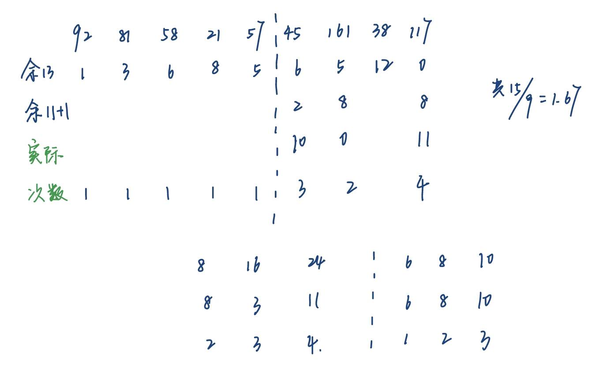

# Hash
## 1. 基本概念
对于每个标识符 x，我们定义一个**散列函数(hash function)** $f(x)$，用来表示 $x$ 在 `ht[]` 的位置，即下图中包含 x 的篮子(bucket)的索引

+ T 表示标识符的总数
+ n 表示 `ht[]` 中（即已排好序的）标识符的总数
+ **标识符密度(identifier density)** = $\dfrac{n}{T}$
+ **加载密度(loading density)**$\lambda = \dfrac{n}{s \cdot b}$


## 2. 单独链表法 | Seperate Chaining / Open Hashing

- 将所有散列值相同的键放入同一张链表中
- 我们要让 `TableSize` 尽可能接近键的数量，即让加载密度 $\lambda \approx 1$

## 3. 开放地址法 |  Open Addressing
- close hashing

```c
Algorithm: insert key into an array of hash table
{
    index = hash(key);
    initialize i = 0  // the counter of probing
    while (collision at index)
    {
        index = (hash(key) + f(i)) % TableSize;
        if (table is full) break;
        else i++;
    }
    if (table is full)
        ERROR("No space left");
    else
        Insert key at index;
}
```

### Linear Probing
$f(i)=i$, 线性探索

线性探测中预期探测次数关于加载密度的表达式：

$$
p = \begin{cases}\dfrac{1}{2}(1 + \dfrac{1}{(1 - \lambda)^2}) & \text{for insertion and unsuccessful searches}\\ \dfrac{1}{2}(1 + \dfrac{1}{1 - \lambda}) & \text{for successful searches}\end{cases}
$$
**次数，insertion>successful searches**

> [!example]- 一道判断
> - 题目：the expected number of probes for insertions is greater than that for successful searches in linear probing method
> - Answer: True

### Quadratic Probing
**二次探测 (quadratic probing)** 的函数为：$f(i)=i^2$

**定理**：若使用二次探测，且表的大小是一个质数，则当表至少有一半的空余空间时，新的元素总是能够被成功插入。

### Double Hashing

**双散列(double hashing)**的函数：$f(i) = i * \mathrm{hash}_2(x)$，其中$\mathrm{hash}_2(x)$为第 2 个散列函数

+ $\mathrm{hash}_2(x) \ne 0$
+ 确保所有位置都能被探测到

较好的散列函数：$\mathrm{hash}_2(x) = R - (x \% R)$，其中 R 为小于 `TableSize` 的质数

## 4. Rehashing

在二次探测中，我们有时会用到“**再散列(rehashing)**”的技巧

> [!info] 何时使用Rehashing
> + 被占用的表空间达到一半时
> + 插入失败时
> + 散列表的加载因数达到特定值时

具体做法：

+ 建立一张额外的表，大小是原来的两倍
+ 遍历原来的整张散列表中未删除的元素
+ 使用新的散列函数，将遍历到的元素插入新的表中

如果表内有N个键，则时间复杂度$T(N) = O(N)$

## 理论题


> [!note]- Answer
> 大坑题，这个要是冲突了就不知道要搜多久了，所以选D

Given an initially empty hash table `HT` with length 7, together with a hash function H(k)=k%7. Let us use linear probing to solve collisions. What is the average search length for successful searches after inserting 22, 43, 15 one by one into `HT`?

> [!note]- Answer
> C.
> 
> **基本信息：**
> *   哈希表长度: 7 (下标为 0 到 6)
> *   哈希函数: $H(k) = k \pmod 7$
> *   冲突解决方法: 线性探测法（即如果位置被占用，就依次尝试下一个位置）
> 
> **1. 插入 22:**
> *   计算哈希值: $H(22) = 22 \pmod 7 = 1$。
> *   哈希表位置 1 为空，直接放入。
> *   **查找 22 需要的比较次数为 1。**
> *   当前哈希表: `{_, 22, _, _, _, _, _}`
> 
> **2. 插入 43:**
> *   计算哈希值: $H(43) = 43 \pmod 7 = 1$。
> *   位置 1 已被 22 占用，发生**冲突**。
> *   线性探测：检查下一个位置 $1+1=2$。位置 2 为空，放入 43。
> *   **查找 43 需要的比较次数为 2** (先比较了位置1，再比较了位置2)。
> *   当前哈希表: `{_, 22, 43, _, _, _, _}`
> 
> **3. 插入 15:**
> *   计算哈希值: $H(15) = 15 \pmod 7 = 1$。
> *   位置 1 被占用（冲突）。
> *   线性探测：检查位置 2，也被占用（冲突）。
> *   继续探测：检查位置 3，为空，放入 15。
> *   **查找 15 需要的比较次数为 3** (依次比较了位置1、2、3)。
> *   当前哈希表: `{_, 22, 43, 15, _, _, _}`
> 
> **4. 计算成功查找的平均查找长度 (ASL):**
> 
> 成功查找到一个元素所需的比较次数，就等于当初插入它时的比较次数。
> 
> *   查找 22 需要比较 1 次。
> *   查找 43 需要比较 2 次。
> *   查找 15 需要比较 3 次。
> 
> 平均查找长度 = (所有成功查找的比较次数之和) / (元素个数)
> 
> $ASL_{成功} = \frac{1 + 2 + 3}{3} = \frac{6}{3} = 2$
> 
> 所以，最终结果是 2。
>
>---
>好像也可以算出$\lambda$之后直接套公式。 
x


 Given a hash table of size 13 with the hash function $H(Key) = Key \% 13$. Quadratic probing ($h_i(k) = (H(k) + i^2) \% 13$) is used to resolve collisions. Then after inserting `{20, 6, 2, 16, 27, 15}` one by one into the hash table, the address of 15 is ___.
- [ ] A. 2
- [ ] B. 6
- [ ] C. 11
- [ ] D. 4

> [!note]- Answer
> 
