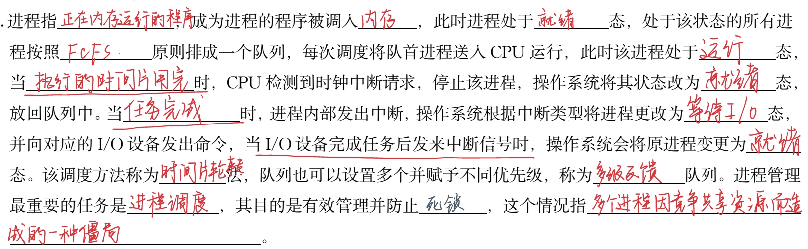

# 笔记

!!! warning 
    文末有pdf版

## 第一章 计算系统概述

### 1.0 计算机特点

- 运算速度快
- 计算精确度高
- 逻辑运算能力强
- 存储容量大、
- 自动化程度高
- 性价比高

信息系统的功能是能够为需要者提供特定的信息，支持用户快速、有效地输入信息、存储、处理和**获取**信息。

### 1.1计算机

#### 1.1.0 计算机系统的组成

- 计算系统=计算机+数据
- 计算机系统=硬件+软件

计算机系统 
                 - >硬件系统 ->处理器系统（主机）
                                      ->存储器系统
                                      ->I/O设备->输入设备
                                                      ->输出设备
                 - >软件系统 ->系统软件->操作系统
                                                        - >编程语言
                                                        - >工具软件
                                     ->应用软件->办公软件
                                                       ->其他应用软件

#### 1.1.1硬件
#### 1.1.2软件
- 计算机硬件之外的所有东西，包括<u>文档、程序、语言等</u>，都可以被归为软件。
- 系统软件
- 应用软件
#### 1.1.3 计算机分类
- 超级计算机：神威太湖之光
- 大型计算机
- 小型计算机
- 微机→PC  
**32位微机**：能同时处理32位二进制数
>微机中控制器的基本功能: 控制系统各部件正确地执行程序

- 嵌入式计算机
- 移动设备
### 1.2计算机简史 
#### 1.2.1计算机简史-硬件史
>计算机之父：巴贝奇
   世界上第一台计算机：1946

| 年份        | 设备              | 技术      |
| --------- | --------------- | ------- |
| 1642      | 帕斯卡加法器          | ...     |
| 1945-1954 | ENIAC(第一台通用计算机) | 电子管     |
| 1955-1960 | 第二代计算机          | 晶体管     |
| 20世纪60年代  | 第三代计算机          | 集成电路    |
| 1975-至今   | 第四代计算机          | 大规模集成电路 |
- 摩尔定律：当价格不变时，集成电路上可容纳的晶体管数目，约每隔**18个月**便会增加一倍，性能也将提升一倍。
- <u>1946～1954</u> 电子管（第一代）
- <u>1955～1960</u> （第二代） 晶体管 
- <u>1963～1975</u> （第三代）  集成电路
- <u>1975～至今</u>（第四代）**大规模集成电路**（LSIC）
>首次实现“存储程序”的计算机：冯·诺依曼设计的ENVAC
#### 1.2.2软件的进化
- **第一代**计算机：机器语言->汇编语言； 程序员必须记住所有二进制数字组合
>程序设计语言，按照和计算机硬件的接近程度，可以分为**机器语言**、**汇编语言**、**高级语言**
- **第二代**计算机：开始使用高级程序设计语言；脱离硬件束缚，软件不再捆绑硬件销售|高级编程语言的开发：FORTRAN（科学计算）和COBOL   （商业应用）
- **第三代**计算机：出现了操作系统，使用人群专业->用户 |统计软件包SPSS
- **第四代**计算机：1. 开发了更好用的操作系统（图形交互界面）
                            2. 出现了结构化程序设计语言，如：Pascal，C语言
                            3. 九十年代后，以**图形界面**为特征的**WINDOWS**操作系统取代字符界面的DOS操作系统
                            4. 面向对象的程序设计方法的出现
### 1.3计算机模型
建立计算机模型，一种是**黑盒**模型，它不考虑计算机的内部结构，在这种模型中输入相同的数据后能得到**相同的输出数据**。改进的模型加入了一个程序部分，它的输出结果取决于**控制处理的程序**。
##### 1.3.1数据处理机模型
- <u>黑盒模型</u>：计算机在数据处理过程中，**输入的数据相同，那么输出结果将能够重现（一致）**；输入的数据不同，输出结果也能够随之改变
-  <u>具有程序能力的数据处理机</u>

##### 1.3.2现代计算机模型（冯·诺依曼）
>奠定了现代计算机的结构理论基础

- CPU=运算器+控制器
- 五个子系统
  1. 输入（算术/逻辑运算）
  2. 运算器
  3. 存储器
  4. 控制器
  5. 输出
- 程序存储原理
  1. 要求程序和数据采用同样的格式——**二进制**【现代计算机之所以能自动地连续进行数据处理，主要是因为**具有程序存储功能**】
  2. 程序和程序执行所需要的数据在执行**之前**存放到内存储器中（数据和程序放在同一个存储器中）
  3. 如何使计算机自动执行程序
        ——执行程序时,给出程序所在的存储位置
  4. 程序存储的另一个重要理由：程序的“**重用**” 
- 程序和数据分开存放——**哈佛**结构(用于某些专用处理器系统和通用CPU芯片的内部)
### 1.4计算机组成
- 计算机的5个组成部分由CPU、主存储器、**输入/输出**三个子系统构成。
- 连接三个子系统的是**总线**（地址、数据、控制）。总线的作用是**计算机数据和控制信息的传输通道**。分为**地址**、**数据**、**控制** 
>计算机字长取决于**数据**总线的宽度
- 今天的计算机将CPU、存储器等电路部件放置在一个主板上，称为主机，通过电缆与I/O设备（统称外部设备，简称外设）相连。

#### 1.4.1 第一个部分：处理器系统(CPU)
###### 1.4.1.0 组成
- **ALU**: 算术逻辑单元
- CPU主要为单个芯片，也有多个芯片组成的**CPU阵列**。
- 从逻辑上，可分为5个部分，包括<u>运算器、控制电路、地址电路和数据寄存器与指令代码寄存器(寄存器组)</u>
-->内部功能：
- 运算器，执行算术运算和逻辑运算
- 数据寄存器，存放运算器执行运算所需的数据
- 指令代码寄存器，存放处理器执行操作需要的指令代码。
- 控制电路，产生并输出控制信号
- 地址电路，产生并输出地址信号
- 程序计数器：存放下一条指令所在单元地址
- 存储器系统的任务：存储**数据和程序**和参与运行程序
- 多核的意义：**把多个CPU核心和相关辅助电路封装在一个芯片**
###### 1.4.1.1 两种类型的处理器系统的设计
- CISC（complex）-*Intel公司*  ->（指令数量多,设计简单【因为指令系统比较完备】）
- RISC(reduce)-*Apple公司和神威（SW）处理器* ->（指令数量少优点：芯片结构简单、功耗小）
- 两种完全相反的设计方法。主要区别是<u>处理器所拥有的指令的数量和复杂程度不同</u>，而都是为了<u>提高计算机性能</u>
>不同制造商生产的不同系列的CPU,其指令系统具有如下特征:<u>相互不一定兼容</u>
###### 1.4.1.2 结构模型

###### 1.4.1.3 性能指标
- **主频**：衡量CPU运行速度的参数。CPU主频越高，运算和处理数据的速度就越快。（√）
- **CPU数量、内核数量**
- **字长**：处理器**一次**能够处理的最大二进制数的位数。(不是<u>一共</u>，可以多次处理)
- **协处理器**：不单独工作、在CPU的协调下完成任务，如：处理浮点运算的协处理器。
- **内部高速缓存器(Cache)**【位于CPU内的， Cache位于**CPU**和**内存**之间】
->衡量微机CPU性能的主要技术指标有：频率、字长、浮点运算能力
->目前主要的CPU厂商有Intel、AMD等公司。 

#### 1.4.2 部分2：存储器 

- <kbd>材质：传统为磁盘  30年前：半导体的，没有易失性的闪存->SSD U盘也是外存的一种</kbd>
###### 1.4.2.1功能和概况：
- 存储器系统的任务是<u>存储数据和程序</u>和<u>参与运行程序</u>
- 每个存储单位都有一个唯一标识->**存储地址**，用**二进制位**进行标识，存储单位的总数称为**存储容量**。-> 每个内存单元存储1个字节的地址，地址也按二进制位进行标识，连续存放。->内存空间和CPU地址总线数目有关。**
- **注意**：地址总线->寻址空间：$2^{32}$/$2^{10}$/$2^{10}$/$2^{10}$=$2^{2}$  这里的G只是一个单位，没有以字节为单位，不要想当然除以8。
【关于存储单位】
**区别【字长】和【字】和【字节】的概念：**
- 字长：CPU一次操作的最大数据长度，单位是**二进制位**；计算机的字长又叫“字”，是指处理器一次能够处理的最大二进制数的位数。
- 字节：八位二进制位
- 计算机存储最小单位：位（bit）

说明：
1. 计算机的字长又叫“字”，是指处理器一次能够处理的最大二进制数的位数。
2. 计算机存储器地址按二进制位模式进行标识，如10位二进制位地址能标识存储单元2^10个，即1024个。
3. 计算机存储模式规定，存储单元以位（bit）为单位，8个二进制位构成1个字节（Byte）。
4. 现代计算机之所以能自动地连续进行数据处理，主要是因为，它要求程序和数据采用相同的格式，程序在执行之前被存放到RAM中
###### 1.4.2.2组成
###### 1.4.2.2.1连接方式
- **内存**←缓存→**外存**
- **内存**→（直接相连）高速缓存→**CPU**【CPU直接读取的是RAM，与CPU直接互联，由CPU根据存储单元地址进行存取操作。】
- 内存可以被扩展

###### 1.4.2.2.2存储器的主辅结构
- 使用高速的半导体存储器作为主存储器（内存）
- 使用较低速的磁盘、光盘作为辅助存储器。（外存）

###### 1.4.1.4.5 基本工作原理：
->程序和数据存储在外存中，被执行的程序和数据从外存中调入主存运行，运行结束程序和数据被**重新存入外存**
->原因是：内存**快**而**小**，外存**慢**而**大**
->这种主存—辅存结构具有很好的互补性，同时也是经济的
---->主存容量小，有易失性,但速度快，承担运行程序的任务
---->外存速度慢，但容量大，持久保存，主要用于保存程序和数据；
ATTENTION:如果要作为外存的器件，都具有持久保存数据的能力。 x 【闪存】
##### 1.4.2.3内存(又称主存)
1. 材料：半导体（由半导体存储器组成，是电子器件，运行速度快）
2. 内存主要以**字节**形式存储。

  

3. 根据**存储信息方式**的不同，可将内存分为**RAM**和**ROM**
- 随机存取存储器(RAM)**(速度快、易失性)
  - 可以分为**动态RAM**（**DRAM**）和**静态RAM**（**SRAM**）
  - DRAM存取速度较慢，动态RAM制作**内存条**，静态RAM用作**高速缓冲器（Cache)**
- 只读存储器（ROM）
  - 典型应用：计算机的开机程序**BIOS和机器参数**就被保存在ROM中。计算机开机后首先执行的是<u>ROM</u>程序，该程序位于<u>BIOS</u>中。然后将位于外存的<u>控制程序</u>调入内存，并交付控制权。存放启动计算机所需要的BIOS （计算机每次开机都执行相同的操作，所以 BIOS程序是固定不变的，它被“固化” 在ROM 中。）
 >tips: 为了防止别人非法使用计算机，可以通过**CMOS**为计算机设置口令RI
 
  - 分类：
              ->PROM:一次性写入的存储芯片，数据一旦写入    不能被改写
              ->EPROM:如果数据需要被改写，就需要用一种紫外线光设备将原数据擦除后再重新写数据
              ->EEPROM:加电即可删除原来数据，以Byte为擦除单位，工艺相对复杂，价格很高，容量小。
 
- 外存储器
  - <kbd>外部存储器和内部存储器相比,它的主要特点是: <u>速度慢、容量大、价格低、非易失性</u></ksd>
  - 4.3.1 磁介质硬盘->存储介质为磁介质。
    - 磁盘的工作原理：在磁盘读写电路的控制下，**读写磁头**沿着盘片直线移动，盘片围绕中心轴高速旋转，按**扇区**进行数据的寻找和读取
    - 磁盘被划分为**磁道**，磁道被划分扇型区域，程序代码和数据以**扇区**为最小存储单位
  - 4.3.2 固态存储器（SSD）：
    1. 固态存储器(SSD)，存储介质是**闪存**，闪存从原理上讲是可改写的半导体存储器
    2. 类型：U盘，固态硬盘(Solid State Drives,SSD)

>CD-ROM: 具有多媒体功能的微型计算机系统中使用的CD-ROM是一种**只读型光盘**

例题：

##### 1.4.2.4 缓存：
缓存是在存储器之间进行速度匹配的技术，也用在主机和(<u>外设</u>)的连接上。【CPU与存储器，内存与磁盘】

##### 
###### 1.4.1.6 各种存储器的主要性能参数

*寄存器存储很快，但容量很小

#### 1.4.3 输入输出(端口)
- 输入设备：键盘（IBM键盘【标准键盘】和微软键盘）、鼠标
>光笔: 通常配合数字板或触控屏幕使用。它可以将手写或绘画转换为数字格式，以便在计算机上编辑、保存和共享。[输入设备]
- 输出设备：显示器（**CRT显示器和液晶显示器**）、打印机(**喷墨、激光和针式打印机**)
- 端口：是**外部设备与主机**连接器，又称接口(Interface)，带接口电路，负责在慢速的外设和高速的主机之间建立一个缓冲
   - 端口（接口）**是一种技术，也是一种标准**：<u>符合这个标准的设备都可以直接插入端口实现与计算机的连接</u>，这就是<u>即插即用</u>（Plug and Play，PnP）。
   - （源自判断题）外设的工作速度要比CPU及存储器慢许多，为此要设计能使其**与CPU及存储器能协同工作的部件**，这个协同设计就是接口。
   - 最常见：USB接口(Universal Serial Bus)（来自判断题）（USB叫做**通用串行接口总线**，它是计算机<u>连接外设的端口</u>，也是在<u>高速主机和慢速外设之间的缓冲</u>，因此它也是<u>一种接口</u>。) ->USB具有**热插拔**和**即插即用**的功能
   - 端口和主机的数据传输模式有两种：并行或串行。★
         —并行一次传输8位数据（字节模式）
         —串行每次传输1位数据（也是字节模式，**一次1B**）。
- USB的三种接口：
        - Type A: “公共口” Type B：小功耗数码产品 Type: 对称性 无方向性
                
        
#### 1.4.4 运算器
- 主要功能：算术和逻辑运算
...

---
### 1.5计算机分类
- **微型**计算机：台式机、笔记本

- 工作站（功能更为强大）
- 小型计算机
- 大型计算机
- 巨型计算机
### 1.6计算机应用领域
- 科学计算
- 数据处理：<-办公自动化
- 实时控制
- 辅助设计
### 1.7操作系统
#### 1.7.1定义：
**操作系统调度计算机资源，为用户使用计算机提供服务**
- 操作系统是计算机**硬件**和用户 (其他软件和人)之间的接口，位于计算机系统核心的操作系统，它使得用户能够方便地操作计算机，能有效地对计算机**软件和硬件资源**进行管理和使用。
- 通常，任何应用软件都需要依赖其运行环境，这个环境也叫做平台，它是指**操作系统**
- 操作系统又称为**内核**
- 通常的操作系统发行时也提供一个shell（外壳），用于用户操纵计算机，其中外壳是**用户和内核【操作系统】的接口**
**误区**：
- 未必所有软件都要通过操作系统（一些数据库无需）
- 操作系统是计算机<u>软件</u>和用户之间的接口，它使用户能够方便地使用软件完成相应工作。->F，前面一个划线处应该是硬件，后面漏提**硬件**
#### 1.7.2层次结构：
- 内核
- 用户接口
- ★操作系统分为：**进程管理器、存储器管理器、设备管理器和文件管理器**（见下1.7.4资源调度）
#### 1.7.3常见操作结构：
##### 1.7.3.0 多任务相关
- 目前，运行在微机和移动设备上的操作系统Windows、Mac OS、Android都是**单!用户多任务系统**.
- 操作系统的**多任务**就是操作系统可以同时运行多个程序
- 实时操作系统：计算机执行任务在规定的时间内响应并快速处理
- 计算机系统并行处理应具有最基本的功能是**协调多个处理器同时执行不同的进程**
##### 1.7.3.1 MS-DOS
- <u>单用户</u>操作系统
##### 1.7.3.2 Windows
- 在Windows中，用户使用**控制面板**管理硬件资源设置。
##### 1.7.3.3. Mac OS
- 强图形处理系统
##### 1.7.3.4. Unix/Linux
- 著名的<u>多用户多任务</u>分时操作系统。
- Linux是一套免费使用和<u>自由传播</u>的类Unix操作系统。

##### 1.7.3.5 移动设备操作系统

- Android（安卓）
Google公司收购了原开发商Android后，联合多家制造商推出的面向平板电脑、移动设备、智能手机的操作系统。基于Linux开放的源代码开发且仍然是免费系统。
-  iOS
Apple公司为其生产的移动电话iPhone 开发的操作系统。主要应用于Apple的i系列数码产品，如iPhone、iPAD等
#### 1.7.4 资源调度
- 操作系统庞大，但归结起来就是对各种应用程序使用CPU、存储器和外设进行调度，分为：
     - CPU调度（进程管理）
     - 内存调度（管理）
     - 设备管理：并不直接操控设备，而是通过**设备驱动程序**间接操控设备
     - 文件管理

##### 1.7.4.1 CPU调度：->负责调度进程
1. 比较常用的调度方法是**时间片轮转法**
2. 按照FCFS(First-Come, First-Served,先来先服务调度)原则，排成一个队列。
3. 每次调度，把CPU分配给队首进程，并令其执行一个时间片。 当执行的时间片用完时，由一个记时器发出一个时钟中断请求，该进程被停止，第2个时间片分配给第2个进程；依次循环。当进程获取时间片后有三种状态：
        时间片内未完成任务
        需要I/O操作
        任务完成，进程中止并退出内存

a：运行
2：时间片到
c：等待I/O
3：表示等待某个事件
1：表示进程被选中

##### 1.7.4.2 死锁
- **死锁**指多个进程因竞争**共享资源**而造成的一种僵局，若无外力作用，这些进程都将永远不能再向前推进。
- 发生死锁会导致系统处于无效等待状态，因此必须撤销其中的一个进程。例如在Windows中，可用“任务管理器” 终止没有响应也就是无效的进程。

##### 1.7.4.3 内存管理：
###### 1.7.4.3.1 单道程序与多道程序：
- 单道程序：内存中除一小部分装载操作系统，大部分被单一的程序所使用。
- 多道程序：可以装入**多个程序并“同时”执行**这些程序，由CPU轮流。按照内存和外存是否交换程序和数据进行划分，有两种实现多道程序的技术：
     - 非交换技术：程序运行期间全部在内存进行，不和外存交换数据。
        - 分为分区调度和分页调度：
        - 分区调度：内存被分成不定长的几个区， 每个程序占有一个区（存储空间是连续的），CPU按照进程调度在各个分区（程序）之间轮流执行。
                  - 造成的内存碎片比较多
        - 分页调度：内存和程序都被进行了划分，内存被分为大小相等的“帧”，而程序被分成和帧大小相等的“页”，系统根据程序的页的数量装入到同样数量的帧中。并且程序在内存中可以不连续存放。和分区调度相比，内存使用率增加，系统开销降低。
                - 缺陷：大程序无法运行
     - 交换技术：程序在运行期间需要和外存交换数据。

###### 1.7.4.3.2 虚拟内存：
- 概念：在磁盘上开辟一个比内存要大的空间(Win建议1.5倍）,把被执行的程序装载到这个区域中，并按照内存的结构进行组织。
- 虚拟内存（Virtual Memory）是在外存设置一个存储空间，通过虚拟存储技术来实现的。
- 当需要调入内存时，直接从虚拟内存中进行映射操作。

##### 1.7.4.4 设备管理：
- 设备无关性：操作系统从众多的I/O设备中抽象出若干通用类型，每个类型都可以通过一组**标准函数**（软件接口程序）来访问
- 设备的差异被**设备驱动程序**所封装。设备驱动程序一方面适合各类设备；一方面也提供了一组标准接口。
- 抽象出的通用的I/O设备**分类**：
    - 块设备（如磁盘）：信息存储在固定长度块（扇区）中；每个块有自己的地址；信息传递以块为单位
    - 字符设备（如键盘、鼠标器）：以字符为单位接收/发送
- 操作系统不直接操纵设备，它是通过管理设备的<u>驱动程序</u>间接使用设备
- 操作系统对于**硬盘**的管理是归于**外设**的，对磁盘中存储的程序和数据归类到文件管理中
##### 1.7.4.5 文件管理：
###### 1.7.4.5.1 文件＆文件系统
- 文件是一个存储在存储器上的数据的有序集合，并标记为文件名。
- 文件系统是所有文件的集合以及操作系统对文件的管理。
###### 1.7.4.5.1 文件名
- Windows系统环境下的文件名是由字符和数字组成的，分三部分，格式为：**<盘符> <文件名> .扩展名**，例：C:\(路径)TEXT.TXT
- 文件名：1～N个字符组成
- 扩展名为由“.”开始的若干个（一般为1～3 ）字符组成。扩展名的一个重要作用是计算机的程序是根据它们判断其用途的，并对数据文件建立与程序的关联。有些软件在创建文件的同时给出文件扩展名
- 在Windows中，能够被执行的程序文件的扩展名:  **.bat、exe和.com**
- 操作系统的**注册表**中有一个能被识别的文件类型清单

###### 1.7.4.5.2 文件系统
- FAT系统：
   - 操作系统通过建立文件分配表FAT，记录磁盘上的每一个簇是否存放数据。
   - 特点：
      -  小存储系统，系统开销小，系统损坏有可能被恢复
      - 大容量系统，分区数目增加，性能迅速下降
- NTFS系统：
   - Windows高版本推荐使用NTFS
   - NTFS也是以簇为单位来存储数据文件，实际支持的磁盘分区最大达**2TB**。
   - 系统文件可存在NTFS 盘或分区的**任何**物理位置，不必象FAT那样保存在**引导区**中，着就意味着<u>任何磁道损坏都不会导致整个磁盘不可用。</u>
   

- 在微软的操作系统中，文件的逻辑结构就是**目录结构**。文件系统必须为文件在物理设备上的存放确定一个规则，即文件的**物理存储结构**。
### 1.8 常用软件：
#### 1.8.1压缩工具：
##### 1.8.1.1 概况：
- (1) WinRar (2) 7-Zip
- WinRar和7-Zip是Windows系统中常用的压缩工具软件，这两款软件的数据压缩比(datacompression ratio ) 即原始数据长度/压缩后数据长度之比均高于Windows自带的zip功能，且都具备分卷压缩、加密压缩、生成自解压exe等功能。
- winRAR和7zip都是**无损压缩**
- 7-zip相比Win-rar在压缩含有相同内容的多个文件时具有更大的压缩比
## 作业题的收录
### <u>第一次</u>作业：
1. 数据就是指计算机中运行的数，它们可以被用来进行求值和输入输出。->F（数据不只是数字）
2. SSD的存储介质是磁性材料->F
3. 目前主要的CPU厂商有Intel、AMD等公司。 ->T
4. 现在的计算机都是使用集成电路的，包括外存也全部是半导体集成电路。->F (计算机确实使用超大规模集成电路，但是外存储器有多种，如固态硬盘是集成电路组成，而**机械硬盘**是使用**磁盘**存储，**光盘**使用**光介质**存储信息。)
5. 计算思维的本质是对求解问题的抽象和实现问题处理的**自动化**。
7. 依据程序存储原理，程序和数据在存储器中以（   ______）的格式存储。->*相同*（二进制格式）
8. 下列存储器中，存取速度最快的是<u>内存</u>（硬盘/光盘/U盘/内存）

## 第二章 数据表示与信息编码

### 一、十进制转换为二进制：

>windows 7以后的系统中的“计算器”就有在二进制数、十进制数、十六进制数和八进制数之间的转换的功能
>微型计算机中普遍使用的字符编码：ASCII
>ASCII:用7（不是8）位表示，最高位是符号位

**十进制整数部分用2整除，余数按顺序组合即得对应的二进制：45=${101101}_{2}$
十进制小数部分乘以2，将进位按序组合：0.625=${0.101}_{2}$**
计算过程：

### 二、有符号整数的表示：
1. 原码：约定：二进制最高位0表示正数，1表示负数（缺点：运算时符号要单独考虑，电路设计复杂）计算机将带符号位的二进制数叫做**机器数**
2. 反码：对原码各位取反：
e.g. -85原码：11010101，对应反码：10101010（符号位不变）
3. 补码：=反码+1  **补码的含义**：对于R进制，如果两个数的和是R，这两个数就互为补数
e.g.-85原码：11010101，对应补码：10101010+1=10101011
4. 
- **正整数的补码、反码和原码相同**
- 0的原码和补码都是00000000！
- 负整数的补码=反码+1
- 现代计算机中：整数都是以补码来表示的。

### 三、实数的表示：
- 将小数点固定在数值部分最高位的**左边**的表示方法为**定点纯小数格式**，最**右边**叫做**定点纯整数格式**
> **定点纯小数表示：**
1. 定点数（fixed point）表示 固定小数点位置
2. 定点纯小数格式：2. 定点纯小数格式：
3. 定点纯整数格式：

4. 由于位数限制，小数在计算机中不能精确表示，定点表示法表示的实数范围及精度都很小
> **浮点数表示:**
1. 科学计数法是指用指数表示数的范围
2. 32位浮点数格式：

Example：0 1(代表是负指数) 0010101  <u>10101</u>000000000000000000=  +0.65625×${2}^{-21}$

> **二进制运算：补数减法**

~~原理推导：~~
~~设x1,x2,这里假设x1>0,x2<0 并且都一共是n位~~
~~于是x1保持不变，x2先取反=${2}^{n}$-1-x2~~
~~前面再加一位${x2}^{'}$=x2+${2}^{n}$=2*${2}^{n}$-1-x2~~
~~x1+${x2}^{'}$=2*${2}^{n}$-1-x2+x1

**减法规则**：
连同符号位和被减数的补数相加，丢掉进位
如果和数符号位为0，运算结果就是差；
如果和数符号位为1，则要将和数再次取补数得到差。
例如，十进制58-66，用8位二进制计算：

•和数最高位1，再次求补得到： 10001000，即-8
•补数的一个重要特性：补数的补数还原为原机器数

### 三、编码
>一个汉字存储**两个**字节

#### 其他编码方式：
一、霍夫曼编码（David Huffman）——无损压缩
- 出现的码较短，很少出现的码字较长
- 数据的总长度变小，存储空间小，传输快
- 频率相关编码
二、RLE编码
- 相同的连续编码标记为编码及数量
- Example：
- 一段红色线的长度有200个点，点数据8位
- ->## R200
- ”##“ 为控制位，R为颜色，200为行程长度
- 应用广泛
- 无损压缩 ，如文本，程序，and
- 有损压缩，如音频、视频、图像…

### 四、图像格式
### 图像的表示：
- 颜色数据，点（Dot，point，Pixel）
    - R(Red)、G(Green)、B(Blue)
    - 每种颜色用定长的二进制表示
    -  高质量图像还有灰度（亮度）数据
- 动态与静态
    - 静态图像是动态图像的基础
- 物理世界的影像
    -  ADC 为数字图像
- 主要技术参数
    - 显示分辨率
    - 图像(存储)分辨率
    - 像素深度---像素位数
#### JPG:
- JPEG/JPG，Joint Photographic Experts Group
- 静态图像的首选格式
- 应用最好的图像压缩技术
- 属于点位图像，但存储的不是像素数据
- RGB -> YUV
- YUV –PAL制电视颜色编码方法
    - Y (Luminance，流明 )
    - U、V（Chroma）两个色度信号
- New？
    - HEIF，High Efficiency Image Format
    - 不兼容JPG

## 下载版

<object data="note.pdf" type="application/pdf" width="100%" height="500">
    <embed src="note.pdf" type="application/pdf" />
</object>

