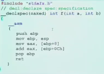

## Misc

### 12.3 补

### 12.24 最后一节课

之所以写：
```asm
push bp
mov bp, sp
```
-> `bp`本身是需要被保护的【保护的是上一层的`bp`】

!!! important
    - 若是`main`调用`f`，`f`毁掉了`bp`，问题不大
    - 若`main`→`f`→`g`，`g`改变了`bp`的值(`mov bp, sp`，没有保护和恢复)，返回到`f`，而`f`很可能用到`bp`，例如`[bp+4]`,这样的话`f`再也找不到自己的参数了。


### 递归(难理解)
C语言：
```c
    int f(int n){ //第一次函数调用，n对应的是(1)位置
        if(n==1)
            return 1;
        return n+f(n-1); //第一次函数调用，n对应的是(4)位置
    }

```
形参由3变成了2！
用汇编进行实现：
```asm
f:
    push bp;(3)(6)(9)
    mov bp, sp
    mov ax, [bp+4] ;当前
    cmp ax, 1
    je done
    dec ax
    push ax;(4)(7)
    call f;(5)(8)
there:
    add sp, 2;(12)(15)
    add ax, [bp+4]
done: ;准备返回
    pop bp;(10)(13)(16) ;ss:1FEE - 1FF4 , 1FF4函数复活，堆栈指针回落
    ret;(11)(14)(17)

main:
    mov ax,3
    push ax;(1)
    call f;(2)
here:
    add sp, 2;(18)
```

执行上述代码时的堆栈布局如下:
```text
ss:1FEE oldbp<-bp(9)
ss:1FF0 there<-(8)(10)
ss:1FF2 1<-(7)(11)
ss:1FF4 oldbp<-bp(6)12
ss:1FF6 there<-(5)(13)
ss:1FF8 2<-(4)(14)
ss:1FFA oldbp<-bp(3)(15)
ss:1FFC here <-(2)(16)
ss:1FFE 3 <-(1)(17)
ss:2000   <-(18)
```
!!! warning 
    由递归的原理，我们会避免在递归中用全局变量，特别是用全局变量传递参数

### 混合语言编程

```c
main()
{
    int i;
    for(i=0;i<10;i++){
        asm mov ah,2
        asm mov dl, 'A'
        asm int 21h
    }

}
```

利用命令行编译：
```bash
$cd \tc
$tcc asmc.c
```
会先把程序变成汇编，再从汇编进行编译

能否在汇编中访问变量`i`呢？

```c
main()
{
    int i=0;
    {
        again:
        asm mov ah,2
        asm mov dl, 'A'
        asm int 21h
        asm inc word ptr i //在汇编中使用到了变量i
        asm cmp word ptr i, 10
        asm jl again
    }
}
```

另一种`VC`内编译的形式：


`naked`：禁止编译器在代码内随意插入代码。
若不加直接编译，可能会加入堆栈的基本框架。
在`__asm`前加入：
```asm
    push ebp
    mov ebp, esp
```
在后面加入
```asm
    pop ebp
    ret
```
#### 在TC中调用汇编定义的模块
- C语言代码：
```c
#include<stdio.h>
extern void f(int a, int b, int *p); //函数f的内容在代码之外，不会报错
main(){
    int x=10,y=20,z;
    f(x,y,&z);
    printf("z=%d\n",z);
}
```