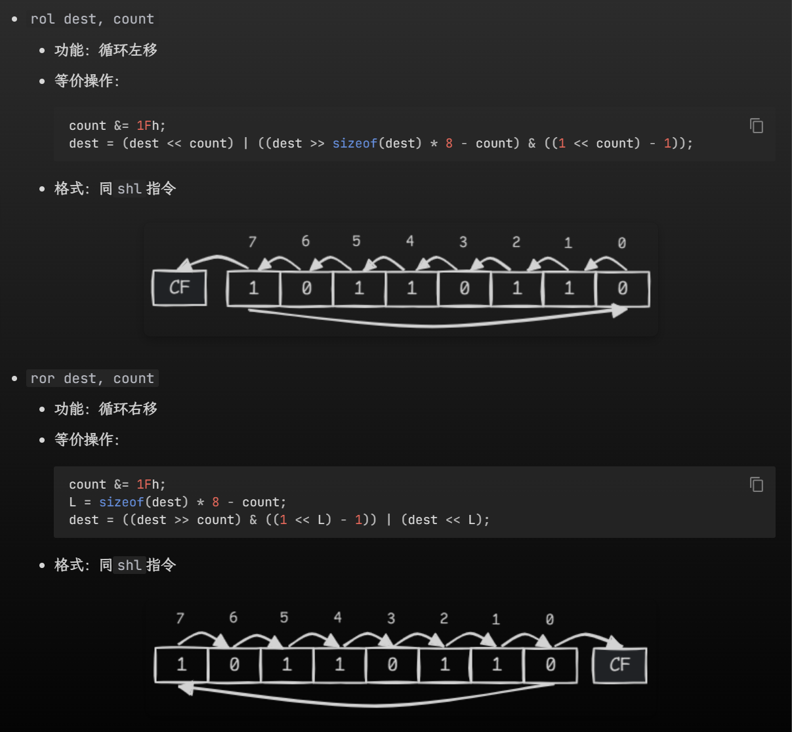
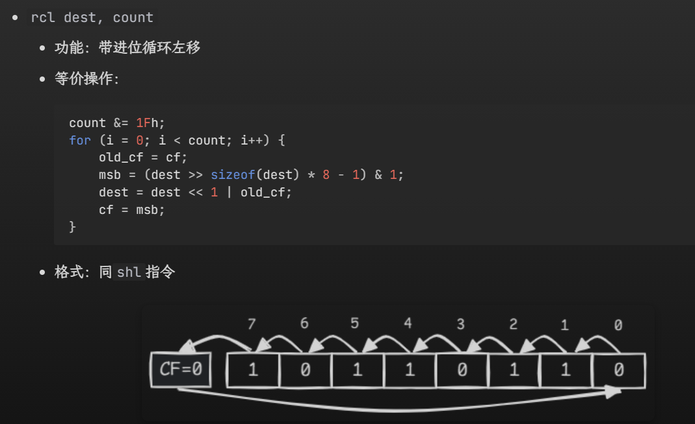

# 汇编复习提纲        
        
!!! abstract "考前补天的幻想"        
     背完它，理论考拿下!!!          
	 本章只是我自己的cheatsheet，但我基本啥也没背，所以仅限于有基础的前提下回顾知识点      
!!! warning     
	本页推荐在暗色模式下观看    
## 一、数据组织         
        
- 命名规则：        
	- 关键词：`d`+英文首字母        
	- `ptr`：        
		- 单个单词：本身        
		- 多个单词：第一个单词首字母+第二个单词本身        
## 二、寄存器        
### 2.1 通用寄存器（4数据+4变址+2指针）        
        
#### 1. 数据寄存器        
        
- `ax`: 累加器，常用于累加：        
	- 特殊用法：        
		- 乘除法：        
			- 乘法: `mul src`:        
				- `src` 8位： `ax = al*src`        
				- `src` 16位： `dx:ax = al*src`        
			- 除法：`div op`        
				- `op` 8位：`ah = ax/op`, `al=ax%op`        
				- `op` 16位： `ax=(dx:ax)/op,dx=(dx:ax)%op`        
- `bx`: 基址寄存器：常用来存放寻址的基址        
- `cx`: 计数寄存器，循环中用作计数器        
- `dx`：数据寄存器：存放I/O端口地址 // 双子运算中，作为`ax`扩展的高十六位        
#### 2. 变址寄存器        
        
- si -> source index 源变址寄存器        
- di ->destination index 目的变址寄存器        
   
注意！        
- 只有四种寄存器：`bx`、`si`、`di`、`bp`是可以在`[]`内存在的          
- 两两一组，只有四种组合：          
	- `bx`和`si`        
	- `bx`和`di`        
	- `bp`和`si`        
	- `bp`和`di`        
#### 3. 指针寄存器        
- `bp`: 只要在`[]`中使用`bp`, 但没有显性给出段地址，段地址默认在`ss`中，比如：        
	- `mov ax, [bp]` 即`(ax)=((ss)*16+(bp))`        
	- 【其他的段地址默认在`ds`】        
- `sp`：**堆栈指针**寄存器：`ss:sp`指向堆栈的顶端        
### 2.2 段寄存器：        
作用：表示**段地址**        
- `cs`: 代码段寄存器，存放代码段的段地址        
	- **不能**用mov赋值，只能用`call`/`jmp`/`retf`/`int`/`iret`指令间接改变值        
- `ds`: 数据段寄存器，存放数据段的段地址【若没有特意指定，是默认的段地址】        
- `es`: 附加段寄存器        
- `ss`: 堆栈段寄存器        
`ds`、`es`、`ss`可以用`mov`赋值，但源操作数只能是寄存器/变量（八个通用寄存器）        
        
> **CPU 执行指令的流程**        
>1. CPU 从`cs:ip`指向的内存单元读取指令，该指令会进入指令缓冲器        
>2. `ip = ip + length_of_instruction`，即指向下一条指令        
>3. 执行指令，跳到步骤 a，重复这个过程"        
>4. 8086CPU 通电或复位后，`cp = ffffh, ip = 0000h`        
<br>      
>"`retf`指令复习"        
```c        
back_ip = word ptr ss:[sp];        
back_cs = word ptr ss:[sp+2];        
sp += 4;        
if (idata16)        
	sp += idata16;        
ip = back_ip;        
cs = back_cs;        
```        
### 2.3 偏移地址寄存器        
        
作用：表示偏移地址（段地址：偏移地址）        
        
- `ip`        
	- `cs:ip`, 不能直接出现在任何指令中        
	- 可以通过`jmp reg`跳转指令等<u>控制转移指令</u>来修改`ip`的内容        
        
>控制转移指令(回头再补)        
        
- `sp`        
	- `ss:sp` 指向堆栈顶端        
	- [!!] `sp` 不是变址寄存器！不能用在`[]`里面！别记混了！！        
- `bx`（通用寄存器）、`bp`、`si`、`di`        
	- 能用`[]`间接寻址，也能参与算术、逻辑、移位运算        
        
        
        
### 2.4 标志寄存器        
        
作用：存储标志位        
寄存器: `fl`，其内部结构如下：        
        
        
        
        
> 移位指令：`shr` & `shl` & `sal` & `sar` & `rol` & `ror` & `rcl` & `rcr`, c里的`>>`        
        
> `BCD`码调整指令/十进制码调整指令        
        
和`tf`有关的指令：`pushf`,`popf`  这是样例程序：        
        
```asm        
; 令 tf = 1        
pushf           ; 将fl压入堆栈中        
pop  ax         ; 从堆栈中弹出`fl`的值并保存到ax中        
or   ax, 100h   ; 把ax的第8位置1        
push ax        
popf            ; 从堆栈中弹出ax的值并保存到fl中，此时tf = 1        
        
; 令 tf = 0        
pushf        
pop  ax        
and  ax, 0FEFFh  ; 把ax的第8位清零        
push ax        
popf             ; 从堆栈中弹出ax的值并保存到fl中，此时tf = 0        
```        
        
结合`pushf`和`popf`指令，可以实现对标志寄存器的访问        
        
- `pushf`        
	- 功能：把`fl`压入栈中        
	- 等价操作：        
```asm        
sp-=2;        
word ptr ss:[sp]=fl;        
```        
        
`popf`        
        
- 功能：从栈中弹出一个字给`fl`        
- 等价操作：        
```asm        
    fl = word ptr ss:[sp];        
	sp += 2;        
```        
        
- 格式：`popf`        
        
## 三、数据相关知识点【这部分需要理解】        
        
### 3.1 数据存放 — 小端规则        
        
        
        
- 段地址和偏移地址是 两个 16 位的地址，它们合在一起形成 一个 20 位的物理地址，转换关系式为：$phy\_addr=seg\_addr×10h+off\_addr$        
-  寻址方式这里是块难点：[这篇](https://yimitumi.com/2020/03/27/%E5%8D%81%E5%85%AB-%E5%AF%BB%E5%9D%80%E6%96%B9%E5%BC%8F-%E6%B1%87%E7%BC%96%E7%AC%94%E8%AE%B0/)讲的比较清楚！        
        
### 3.2 变量定义：        
        
- 可用字符：大小写/数字/符号：`@`、`$`、`?`、`_`        
- 不能以数字开头        
- 不能用`?`和`$`单独作为名称        
- 长度<31        
- 在缺省情况下，变量名及标号名不区分大小写        
        
- 数据段定义        
 1. `varname db|dw|dd|dq|dt value`        
 2. `dup`运算符:        
	 - `varname db|dw|dd|dq|dt n dup(x1[, x2, ..., xm])`        
		 - `n`表示重复的次数，`x1, x2, ..., xm`表示重复项，可 以有 1 个或多个，且允许嵌套        
		 - `y db 2 dup('A', 3 dup('B'), 'C') ; 等价于y db 'A', 'B', 'B', 'B', 'C', 'A', 'B', 'B', 'B', 'C'`        
        
        
- 栈的相关操作：        
	- 入栈：`push op`（`ss:sp`减小）        
	- 出栈：`pop op`（`ss:sp`增大）        
        
## 四、汇编程序相关知识点        
        
### 4.1 段定义：        
        
```asm        
segmentname segment [use] [align] [combine] ['class']        
    statements        
segmentname ends        
```        
        
主要是：        
- `use`: 段内偏移地址宽度        
- 若原程序开头语句`.386`, 默认`use32`, 要指定`use16`; 否则默认`use16`        
        
### 4.2 `assume`        
        
- 用处：建立 **段** 和 **段寄存器** 之间的关联！        
- 一般来说： `assume cs:code, ds:data, es:extra, ss:stk`        
- 但注意：“建立关联”意味着**并不是将段地址【直接赋值】给段寄存器**，而是提醒编译器在编译时将段地址替换为关联的段寄存器。        
- 若想在程序中正确引用数据段内的变量或数据元素，必须在代码段一开始对`ds`进行以下赋值：        
```asm        
mov ax, data        
mov ds, ax        
```        
        
### 4.3 定义字符串        
        
```asm        
s db 'H', 'e', 'l', 'l', 'o'        
; 等价于 s db "Hello"        
```        
        
### 4.4 常数表达式        
        
>这块我记得比较熟，但是记忆量又比较大，所以直接copy了，回头再背一遍        
        
        
### 4.5 符号常数        
        
> 印象里没有听过，不知道是不是我翘了，总之先记住！        
        
符号常数是以符号形式表示的常数，可以用`equ`和`=`定义符号常数，格式如下：        
        
```asm        
symbol equ expression        
或：        
symbol = expression        
```        
        
其中`symbol`是符号名，`expression`是表达式        
        
用法很类似C语言的宏定义        
        
>两种定义方式的区别：        
> `=` 的操作数只能是【**数值类型或字符类型**】的【**常数或常数表达式**】，可以对同一个符号进行**多次定义**        
> `equ` 的操作数还可以是【**字符串**】 或者 【**汇编语句**】，但它不允许对同一个符号多次定义        
        
例子（直接抄的）        
        
```asm        
char     =    'A'        
exitfun  equ  <mov ah, 4Ch>        
dosint   equ  <int 21h>        
code segment        
assume cs:code        
main:        
    mov ah, 2        
    mov dl, char        
    dosint        
    char = 'B'     ; 重新定义char        
    mov ah, 2        
    mov dl, char        
    dosint        
    exitfun        
    dosint        
code ends        
end main        
```        
        
### 4.6 标号        
        
直接记例子：        
        
```asm        
b label byte        
w label word        
d label dword        
db 12h, 34h, 56h, 78h        
        
; b == 12h        
; w == 3412h        
; d == 78563412h        
; 这3个变量地址相同而值不同        
```        
        
### 4.7 远/近指针/标号相关  `call`和`ret`指令      
      
>这部分参考小白的word讲义 以及 《汇编语言》Chapter10      
      
- `ret`指令用栈中的数据，修改IP的内容，从而实现近转移       
- 用汇编代码表示：      
      
```asm      
pop ip      
```      
- `retf`指令用栈中的数据，修改CS和IP的内容，从而实现远转移      
- 用汇编代码表示：      
      
```asm      
pop ip      
pop cs      
```      
      
【∴用这种方式指定的`cs`和`ip`，前面需要`push`】      
      
比如：      
实现从1000：0000处开始执行指令      
      
```asm      
assume cs:code      
stack segment      
	db 16 dup(0)      
stack ends      
      
code segment      
start:      
	mov ax, stack      
	mov ss, ax      
	mov ax, 1000h      
	push ax      
	mov ax,0      
	push ax      
	retf      
code ends      
      
end start      
```      
      
- `call 标号`:      
相当于      
```asm      
push ip      
jmp near ptr 标号      
```      
      
- `call far ptr 标号`      
	- 其中这里的`cs`和`ip`都是标号所在的！      
      
```asm      
push cs      
push ip      
jmp far ptr 标号      
```      
      
例题【检测10.3】      
      
- 问题      
      
下面的程序执行后，ax中的数值为多少？      
      
      
- 答案： ax = 1010h      
- 解析：      
      
各条指令执行后，相关寄存器的值的变化如下表所示：      
      
      
- `call + 16位reg`      
功能：      
`sp=sp-2`      
`((ss)*16+(sp))=(ip)`      
`(ip)=(16位reg)`      
      
相当于      
      
```asm      
push ip      
jmp 16位reg      
```      
      
#### 近标号和远标号      
      
关于近标号和远标号：      
      
- 两者取决于以该标号为目标的`jmp`和`call`指令是否与该标号落在同一个段内      
- 近标号：`jmp`、`call`与标号位于同一个段内      
          
    - 格式：`labelname:` 或 `labelname label near`      
    - 会转化为该标号所在段中的偏移地址，可看作一个仅含**偏移地址**的**近指针**      
- 远标号：`jmp`、`call`与标号不在同一个段内      
          
    - 格式：`labelname label far`      
    - 会转化为该标号所在段的段地址以及它所在段中的偏移地址，可看作一个含**段地址**和**偏移地址**的**远指针**      
- 标号修饰：强制将指令中的标号编译成指定指针      
    - `far ptr`：强制为远指针      
    - `near ptr`：强制为近指针      
    - 何时使用：      
        - 当`jmp`、`call`指令引用不在同一个段内**近标号**时，或者当`jmp`、`call`指令**向前引用**(forward reference)（源程序上方的语句引用下方的变量或标号）不在同一个段内**远标号**时，必须在该标号前加`far ptr`修饰      
        - 当`jmp`、`call`指令**向后引用**不在同一个段内**远标号**时，`far ptr`可省略      
        - 若某个标号既被同一个段内的`call`、`jmp`指令引用，又被其他段内的`call`、`jmp`指令引用，      
            - 将该标号定义为近标号      
            - 同一段内的`call`、`jmp`指令可加`near ptr`修饰，也可以省略      
            - 不同段内的`call`、`jmp`指令必须加`far ptr`修饰      
      
### 4.8 程序真正终止        
        
>源程序的结束并不意味着可执行程序的结束，因为此时 CPU 的控制权仍然掌握在可执行程序那边。要想让程序真正中止，需要调用 DOS 的`4Ch`号中断功能，使得控制权被转交给可执行程序的父程序（即 DOS）。这一过程称为**程序返回**。        
        
```asm        
mov ah, 4Ch        
mov al, 返回码        
int 21h        
```        
        
        
## 5. 80x86指令系统      
      
### 5.1 通用      
      
指路：-> https://note.noughtq.top/lang/asm/4      
      
太多了，熟悉的指令就抄一下过了        
      
`mov dest src`， `dest` 和 `src`不能同时是内存      
`push op`      
      
`pop op`      
      
`xchg op1, op2`      
### 5.2 端口      
      
【！全忘了！】        
      
端口访问相关的指令：      
      
- `in reg, port_num`：从`port_num`号端口读取数据到`reg`      
- `out port_num, reg`：向`port_num`号端口写入位于`reg`内的数据      
      
其中`reg`和`port_num`具体指：      
      
- 访问 8 位端口：`reg`表示寄存器`al`，`port_num` 表 示 8 位立即数      
- 访问 16 位端口：`reg`表示寄存器`ax`，`port_num`表示`dx`      
      
常用的端口号：      
      
- `70h`和`71h`：分 别是CMOS RAM 的<u>地址端口</u>和<u>数据端口</u>，因此 访问CMOS RAM 时需要同时处理这两个端口的信号      
- `60h`：键盘输入      
      
### 5.3 地址传送指令      
      
`lea dest, src`       
- 功能： 取变量`src`的偏移地址，并赋值给`dest`      
      
`lds dest, src`      
      
取出保存在变量`src`中的远指针，将远指针的段地址部分赋值给`ds`，偏移地址给`dest`      
      
`les`同理，就是把`ds`换成了`es`      
      
`lahf`: 将标志寄存器`fl`的低8位赋值给`ah`      
- load ah from fl  
`sahf`: 将`ah`赋值给`fl`的低8位      
- store ah to fl  
`pushf`: 将`fl`压入栈中      
      
`popf`: 从栈中弹出一个字给`fl`      
      
`pushfd/popfd`      
      
### 5.4 转换指令      
      
#### 5.4.1 扩充指令      
      
`cbw`: `al`->`ax      
`cwd`: `ax`->`dx:ax`      
`cbq`: `eax`->`edx:eax`      
      
`movsx dest, src` 符号扩展      
      
`movzx dest, src` 零扩展      
      
#### 5.4.2 查表指令      
      
- `xlat` (translate)      
    - 功能：把`byte ptr ds:[bx + al]`的值赋值给`al`，等价操作为`al = byte ptr ds:[bx + al]`。该指令也称**查表指令**。      
    - 格式：`xlat`      
    - 注：在该指令执行前，`ds:bx`应指向表的基地址，`al`作为列表的索引      
      
### 5.5 算术运算指令      
      
`adc dest, src`      
      
- 功能：带进位加法 (add with carry)，等价于`dest += src + CF;`      
- 格式：同`add`指令      
- 注：可以用该指令实现对更大数据的加法运算（具体可参照下面的例子）      
例子：      
计算`2F365h` + `5E024h`，其中`dx`存放结果的高 16 位，`ax`存放结果的低 16 位。      
      
```asm      
mov ax, 0F365h   ; ax = 2F365h的低16位      
mov dx, 2        ; dx = 2F365h的高16位      
      
add ax, 0E024h   ; 两数的低16位相加，产生进位，使得ax = 0D389, CF = 1      
adc dx, 5        ; 两数的高16位相加，再加上低16位加法的进位，因此dx = 2 + 5 + 1 = 8      
                 ; dx: ax = 8D389h      
```      
      
      
`sbb dest, src`      
      
- 功能：带借位减法 (subtract with borrow)，等价于`dest -= src + CF`      
- 格式：同`add`指令      
- 注：可以用该指令实现对更大数据的减法运算，注意先减低位数据，再减高位数据（具体可参照下面的例子）      
      
```asm      
mov ax, 7546h   ; ax = 127546h的低16位      
mov dx, 12h     ; dx = 127546h的高16位      
      
sub ax, 9428h   ; 两数的低16位相减，需要借位，此时ax = 0E11Eh, CF = 1      
sbb dx, 10h     ; 两数的高16位相减，再减去低16位减法的借位，因此dx = 12h - 10h - 1 = 1      
                ; dx: ax = 1E11Eh      
```      
      
      
`neg op`      
      
功能：`op=-op`      
      
会影响cf、zf、sf      
      
`cmp`: 不保存【差】，但保存符号位      
      
- 对于符号数而言，`cmp`不是只根据操作数之差来得到比较结果的，因为符号数的减法存在溢出现象，所以`cmp`会综合考虑 sf（符号标志位）和 of（溢出标志位）的值      
    - 当 of = 0 时，sf 反映了`op1 - op2`结果的符号位      
    - 当 of = 1 时，sf 的值与`op1 - op2`结果的符号位相反      
      
#### 5.5.2 浮点数调整指令      
      
##### 5.5.2.1 浮点数寄存器      
      
- FPU有8个浮点数寄存器，用于浮点计算，宽度均为80位，名称为`st(i)`，($i \in [0,7]$) `st[0]`可以简写为`st`      
- 这8个浮点数构成了一个FPU堆栈      
	- `st(i)`的逻辑编号为`i`，物理编号`p = (TOP + i) % 8`      
      
##### 5.5.2.2 浮点运算相关的指令      
      
基本算术：`fadd`,`fsub`,`fmul`,`fdiv`      
      
其他指令【（打不动了 直接ctrl+c）了…】      
      
- `fld op`      
          
    - 功能：将`op`（浮点数）压入 FPU 堆栈      
    - 格式：`op`可以是 32 位 /64 位 /80 位的内存，或者浮点数寄存器`st(i)`      
- `fild op`      
          
    - 功能：先将`op`（整数）转化为浮点数类型，然后将其压入 FPU 堆栈      
    - 格式：`op`可以是 32 位 /64 位 /80 位的内存      
- `fst op`      
          
    - 功能：把`st(0)`保存到`op`中      
    - 格式：`op`可以是 32 位 /64 位的内存，或者浮点数寄存器`st(i)`      
- `fstp op`      
          
    - 功能：先把`st(0)`保存到`op`中，再把`st(0)`从 FPU 堆栈中弹出      
    - 格式：同`fld`指令      
      
      
有一段案例程序： [float.asm](http://cc.zju.edu.cn/bhh/float.asm)      
      
```asm      
;Turbo Debugger跟踪时，      
;点菜单View->Numeric Processor查看小数堆栈      
data segment      
abc dd 3.14      
xyz dd 2.0      
result dd 0      
data ends      
code segment      
assume cs:code, ds:data      
main:      
   mov ax, data      
   mov ds, ax      
   fld abc; 把3.14载入到小数堆栈      
   fld xyz; 把2.0载入到小数堆栈      
   fmul st, st(1); 两数相乘      
   fstp result; 保存结果到result，并弹出      
   fstp st      ; 弹出小数堆栈中残余的值      
   mov ah, 4Ch      
   int 21h      
code ends      
end main      
```      
### 5.6 十进制调整指令      
- `BCD`码：用二进制编码的十进制数      
- 分为压缩`BCD`码和非压缩`BCD`码：    
	- 压缩：4个二进制位表示一个十进制位，所以8个二进制位最多00->99,共100个    
	- 非压缩：8个二进制位表示一个十进制位，高4位没意义；所以16个二进制位最多表示`0000h`->`0909h`， 也是100个非压缩`BCD`    
	- 标志位**af**与十进制调整指令密切相关    
#### 5.6.1 压缩BCD码调整指令：    
-  `daa`:    
DAA（Decimal Adjust After Addition）指令是汇编语言中用于调整AL寄存器中的值，使其符合压缩BCD（Binary-Coded Decimal）格式的指令。这条指令通常在执行加法或减法操作后使用，以确保结果是一个有效的BCD数。以下是DAA指令的一个简单示例：    
```assembly    
mov al, 35h ; 将35（即十进制的53）加载到AL寄存器    
add al, 48h ; 将48（即十进制的72）加到AL寄存器，二进制和为7Dh    
daa         ; 调整AL寄存器的值，使其成为有效的BCD格式，结果为83h（即十进制的131）    
```    
在这个例子中，我们首先将十六进制数35h（十进制的53）加载到AL寄存器中，然后将十六进制数48h（十进制的72）加到AL寄存器中。由于35h和48h都是压缩BCD格式的数，它们的和7Dh（十进制的125）不是有效的BCD格式，因为BCD格式要求每个半字节（4位）都是一个有效的十进制数。因此，我们使用DAA指令来调整AL寄存器中的值，使其成为一个有效的BCD数83h（十进制的131）。    
DAA指令的工作原理是检查AL寄存器中的低四位和高四位，如果它们超过了9，就会分别加上6（0x06）或60（0x60），以确保它们都是有效的BCD数字。同时，DAA指令还会更新进位标志（CF）和辅助进位标志（AF），以反映调整后的结果。    
- `das`    
	- 功能：在`al`被做减法后将结果`al`调整为 BCD 码    
- `aaa`:    
- 功能：加法的 ASCII 调整，在`al`被做加法后连带`ah`一起调整`ax`为非压缩 BCD 码    
等价操作：    
```asm    
if (af == 1 || (al & 0Fh) >= 0Ah) {    
    al += 6;    
    ah++;    
    af = 1;    
    cf = 1;    
} else {    
    af = 0;    
    cf = 0;    
}    
al &= 0Fh;    
```    
- `aas`    
减法操作，没啥影响    
### 5.7 逻辑运算指令    
【也比较熟悉，直接复制了】    
- `and dest, src`    
    - 功能：与运算，等价操作为`dest &= src;`    
    - 格式：同`add`指令    
- `or dest, src`    
    - 功能：或运算，等价操作为`dest |= src;`    
    - 格式：同`add`指令    
- `xor dest, src`    
    - 功能：异或运算，等价操作为`dest ^= src;`    
    - 格式：同`add`指令    
- `not op`    
    - 功能：取反运算，等价操作为`op = ~op;`    
    - 格式：`op`可以是寄存器 / 内存    
- `test dest, src`    
    - 功能：位检测指令，它计算`dest & src`而不保存结果，但会影响状态标志。等价操作为`temp = dest & src;`    
    - 格式：同`add`指令    
    - 相关影响【from kimi】    
		1. Zero Flag (ZF)：如果结果为零，则设置此标志。    
		2. Sign Flag (SF)：如果结果的最高位为1（负数），则设置此标志。    
		3. Parity Flag (PF)：如果结果中1的个数为偶数，则设置此标志。    
		4. Carry Flag (CF)：此标志位不会被 `TEST` 指令影响。    
		5. Overflow Flag (OF)：此标志位不会被 `TEST` 指令影响。    
### 5.8 移位指令    
- 第一类：多退少补，即`shr,shl,sar,sal`：直接截图了, 主要死记住`sar`有符号，`shr`无符号，其他没什么区别    
    
- 第二种：循环移位  
- 又分两种：  
	- `cf`纯纯标志：【`ror`,`rol`】主要注意溢出位要放两次，一次给`cf`，另一次给目标位   
	- `cf`参与移位：这种就通过方向决定`cf`在哪里就好了  
    
  
`rcr`一模一样，不重复放了    
### 5.8 字符串操作指令  
#### 5.8.1 和字符串有关的指令前缀  
- `rep`: 重复  
- `repe`: 若相等则重复  
- `repz`: 若结果为0则重复  
- `repne`: 若不相等则重复  
- `repnz`: 若结果不为0则重复  
其中第 2、3 个前缀等价，第 4、5 个前缀等价。这些指令前缀有一个共同的限制：**重复执行最多`cx`次字符串操作**。  
#### 5.8.2 访问方向`df`  
可以通过设置方向标志 df 的值来改变访问（包括复制、比较、读取、写入等操作）字符串的的方向：  
- 当源地址 < 目标地址时，访问按反方向，即令 df = 1（可使用`std`指令设置）  
- 当源地址 > 目标地址时，访问按正方向，即令 df = 0（可使用`cld`指令设置）  
#### 5.8.3 相关指令  
##### 5.8.3.1 复制指令->  
`movsb` ： 以【**字节**】为单位，将`ds:[si]`传送到`es:[si]`  
`rep movsb`: 相当于把`movsb`重复`cx`遍  
`movsw`: 以【**字**】为单位  
`movsd` 同理，double word  
- `[repe|repne] cmpsw`  
    - 功能：比较**字**`ds:[si]` 与 `es:[di]`  
- `[repe|repne] cmpsd`  
    - 功能：比较**双字**`ds:[si]` 与 `es:[di]`  
##### 5.8.3.2 搜索指令->  
- `[repe|repne] scasb`  
	- 功能：比较 `al` 与 `es:[di]`（1**字节**），即计算 `al - es:[di]`，丢弃结果保留符号位，并移动 `di`  
同理，`scasw`, `scasd`  
##### 5.8.3.3 写入指令->  
- `[rep] stosb`  
	- 功能：把 al 内的**字节**数据存入 `es:[di]` 中，并移动 `di`  
同理，`stosw`,`stosd`  
##### 5.8.3.4 读取字符串指令->  
`lodsb`  
- 功能：从 `ds:[si]` 读取一个**字节**存入 `al`，并移动 `si`  
同理，`lodsw`，`lodsd`  
### 5.9 控制转移指令  
#### 5.9.1 无条件跳转指令  
- `jmp short lebel|offset`: 短跳，跳到目标标号`label`或偏移地址`offset`  
- `jmp near ptr dest`: 近跳，跳到目标标号`dest`或 16 位的寄存器 / 变量  
- `jmp far ptr dest`：远跳，跳到 32 位目标地址`dest`或变量  
#### 5.9.2 条件跳转指令  
抄不动了，`jcc`继续复制了。。。  
#### 5.9.3 循环指令  
`loop`很好理解，所以我又copy了（  
- loop dest  
    - 功能：循环  
    - 等价操作：  
```asm  
cx--;  
if (cx != 0)  
	ip = dest;  
```  
- 格式：  
```asm  
loop dest  
```  
- 注：  
	- loop的跳转距离为1字节，即跳转范围为[-128, 127]  
	- 需要注意loop先会对cx减1然后再与0判断，所以在loop前令cx=0反而会循环最大次数10000h次  
- loopz dest  
- 功能：若等于0则循环  
- 等价操作：  
```asm  
old_fl = fl;  
cx--;  
fl = old_fl  
if (zf == 1 && cx != 0)  
	ip = dest;  
```  
- 格式：  
```asm  
loopz dest  
```  
- 注：loopz = loope  
`loopnz dest`  
```asm  
old_fl = fl;  
cx--;  
fl = old_fl  
if (zf == 0 && cx != 0)  
	ip = dest;  
```  
- 格式：  
```asm  
loopnz dest  
```  
- 注：loopnz = loopne  
剩下部分详见Part4关于远近指针的讲解，抄不动了...  
## 6. 进阶部分  
### 6.1 用`proc`定义函数  
```asm  
; 近函数定义  
函数名 proc near  
    ...  
    retn    ; 可简写为 ret  
函数名 endp  
; 远函数定义  
函数名 proc far  
    ...  
    retf  
函数名 endp  
```  
### 6.2 递归  
复制一下`MISC.md`部分的笔记：  
C语言：  
```c  
    int f(int n){ //第一次函数调用，n对应的是(1)位置  
        if(n==1)  
            return 1;  
        return n+f(n-1); //第一次函数调用，n对应的是(4)位置  
    }  
```  
形参由3变成了2！  
用汇编进行实现：  
```asm  
f:  
    push bp;(3)(6)(9)  
    mov bp, sp  
    mov ax, [bp+4] ;当前  
    cmp ax, 1  
    je done  
    dec ax  
    push ax;(4)(7)  
    call f;(5)(8)  
there:  
    add sp, 2;(12)(15)  
    add ax, [bp+4]  
done: ;准备返回  
    pop bp;(10)(13)(16) ;ss:1FEE - 1FF4 , 1FF4函数复活，堆栈指针回落  
    ret;(11)(14)(17)  
main:  
    mov ax,3  
    push ax;(1)  
    call f;(2)  
here:  
    add sp, 2;(18)  
```  
执行上述代码时的堆栈布局如下:  
```text  
ss:1FEE oldbp<-bp(9)  
ss:1FF0 there<-(8)(10)  
ss:1FF2 1<-(7)(11)  
ss:1FF4 oldbp<-bp(6)12  
ss:1FF6 there<-(5)(13)  
ss:1FF8 2<-(4)(14)  
ss:1FFA oldbp<-bp(3)(15)  
ss:1FFC here <-(2)(16)  
ss:1FFE 3 <-(1)(17)  
ss:2000   <-(18)  
```  
!!! warning   
    由递归的原理，我们会避免在递归中用全局变量，特别是用全局变量传递参数  
这一部分 [这里](https://note.noughtq.top/lang/asm/5#%E5%8F%82%E6%95%B0%E5%92%8C%E8%BF%94%E5%9B%9E%E5%80%BC%E7%9A%84%E4%BC%A0%E9%80%92)讲的比我好太多了，于是我决定背这个  
### 6.3 函数传参的方式：  
用寄存器传参和变量传参比较基础，略了  
ctrl+c一下用堆栈传参——三种规范，感觉实要看明白的QAQ  
- `__cdecl`（常用）  
	- 参数按**从右到左**的顺序压入堆栈  
	- 参数的清理由**调用者**(caller) 负责  
	- 当函数值是整数时由 eax 返回，是小数时则由 st(0) 返回  
	- eax、ecx、edx 由调用者负责保存和恢复  
	- ebx、ebp、esi、edi 由被调用者 (callee) 负责保存和恢复  
	- 这是 C 语言的参数传递规范  
```asm  
f:  
    push bp  
    mov bp, sp  
    ; ...  
    pop bp  
    ret  
main:  
    ...  
    push a1         ; 压入参数  
    push a0  
    call f  
back:  
    add sp, 4       ; 清理堆栈  
```  
- `__pascal`  
          
	- 参数按**从左到右**的顺序压入堆栈  
	- 参数的清理由**被调用者**负责  
	- 这是 Pascal 语言的参数传递规范  
          
- `__stdcall`  
	- 参数按**从右到左**的顺序压入堆栈  
	- 参数的清理由**被调用者**负责  
	- 这是 Windows API 函数的参数传递规范  
```asm  
f:  
    push bp  
    mov bp, sp  
    ; ...  
    pop bp  
    ret  
main:  
    ...  
    push a1         ; 压入参数  
    push a0  
    call f  
back:  
    add sp, 4       ; 清理堆栈  
```  
返回值的传递方式与传参类似（也可以把返回值放在（曾经）作为参数的寄存器或变量内），故不再赘述。  
## 7. 中断  
### 7.1 定义和基本概念  
- 定义：CPU 不再继续往下执行，而是转去处理来自 CPU 内部或外部设备的特殊信息。  
- 分类：  
	- 软件中断：显式的使用`int n`调用  
	- 硬件中断：由硬件的某个事件触发，CPU自动插入隐式`int n`  
- **中断向量表**：   
	- 存放一系列中断向量（即中断处理程序的入口地址）的列表  
	- 在8086PC机种，存在`0000:0000~0000:03FF`的1024个字节中  
	- 每个中断向量占两个字（四个字节），高地址存放段地址，低地址存放偏移地址  
	- 一般情况下，中断向量表中 0000:0200~0000:02FF 的 256 字节空间是空的，可以自定义中断  
- **中断处理程序 / 中断例程**：用于处理中断信息的程序，被中断向量定位。执行步骤为：  
      
    1. 保存用到的寄存器  
    2. 处理中断  
    3. 恢复用到的寄存器  
    4. 用`iret`指令返回  
        - `iret`指令的等价操作：  
```asm  
ip = word ptr ss:[sp];  
cs = word ptr ss:[sp+2];  
fl = word ptr ss:[sp+4];  
sp += 6;  
```  
          
- **中断过程**：  
    1. 取得中断类型码 N  
    2. `pushf`  
    3. tf = 0, if = 0  
    4. `push cs`  
    5. `push ip`  
    6. ip = N * 4, cs = N * 4 + 2  
自定义中断，大致过程为：  
- 编写中断处理程序（与编写一般函数类似）  
- 安装中断处理程序：将中断处理程序存在不太可能被覆写的内存中（一般存在 0000:0200~0000:02FF 这个空的中断向量表空间内），一般借助`rep movsb`指令完成这一步骤  
      
    - 例子：`n`号中断处理程序的标号为`int_handler`，其入口地址设为`seg_addr:ofs:addr`，那么安装过程为：  
```asm  
assume cs:code  
code segment  
main:  
    ; 设置ds:si指向源地址（中断处理程序）  
    mov ax, cs  
    mov ds, ax  
    mov si, offset int_handler  
    ; 设置es:di指向目标地址（某个安全的内存块）  
    mov ax, seg_addr  
    mov es, ax  
    mov bi, ofs_addr  
    ; cx的值设为中断处理程序的长度，通过两个标号的地址之差计算得到  
    mov cx, offset int_handler_end - offset int_handler  
    cld             ; 令 df = 0  
    rep movsb       ; copy!  
    ;设置中断向量表  
    mov ax, 4C00h  
    int 21h  
; 中断处理程序  
int_handler:  
    ; ...   
    ; ...  
int_handler_end:   
    nop  
code ends  
end main  
```  
### 7.2 内中断  
- 除法错误：  
	- 中断类型码：0  
- 单步执行：  
	- 中断类型码：1  
	- 发生条件：`tf=1`时，CPU每执行一条指令，会自动插入一条`int 1h`  
- `into` 指令  
kimi的解释：  
>在x86架构中，`INTO` 是一个汇编语言指令，其作用是触发一个中断，如果溢出标志（OF）被设置（即等于1）时。具体来说，`INTO` 指令会检查标志寄存器中的溢出标志（OF）。如果OF标志位为1，表示发生了溢出，`INTO` 指令将产生一个中断类型4的中断；如果OF标志位为0，则该指令不会产生任何效果  
#### 7.2.2 DOS中断  
很常用的一些，继续ctrl+c  

- `int 21h` 主要用的是 **输入输出**相关：  
	- `ah = 01h`号功能：输入字符    
		- `al`保存读入的字符  
	- `ah = 02h`号功能：输出字符  
		- `dl`保存待输出的字符，如果是数字则看作 ASCII 码  
	- `ah = 09h`号功能：输出字符串  
		- ds:dx 指向一个以`$`为结尾的字符串的首地址，显示的字符串不包含这个`$`  
	- `ah = 0Ah`号功能：输入字符串  
		- ds:dx 指向一个 buf，buf 的第一个字节为允许输入的最多字符数，第二个字节为实际输入的字符数，从第三个字节开始才是输入的字符内容  
		- 如果输入超过最大字符数，则会发出铃声，并且光标不再移动  
		- 
#### 7.2.3 BIOS 中断  
- `int 09h`: 处理键盘输入  
	- 通过`60h`端口读取键盘输入的扫描码，并转化为相应的ASCII码，存在内存的指定控件中  
- `int 10h`  
	- `ah=00h`: 切换显示模式  
		- `al=03h`: 80\*25 文本模式  
		- `al=13h`: 320200256图形模式  
	- `ah=09h`：在光标位置显示字符  
		- `al`用于表示字符  
		- `bl`用于设置字符颜色，详见显卡  
		- `cx`用于设置字符重复个数  
- `int 16h`: 从键盘缓冲区读取一个键盘输入，并将其从缓冲区删除  
	- 需要先设置`ah=0`  
	- `ah`保存扫描码,`al`保存 ASCII 码  
	- 配合`int 09h`实现键盘读取  
kimi的解释：  
>键盘输入中的扫描码（Scancode）是指键盘上的每个按键在按下和释放时产生的一个或一组特定的二进制代码。这些代码被键盘硬件和BIOS（基本输入输出系统）用来识别哪个键被按下或释放。扫描码通常分为两种：  
>1. **Make Code（通码）**：当按键被按下时产生。  
>2. **Break Code（断码）**：当按键被释放时产生。  
  扫描码是键盘硬件层面上的编码，它们被操作系统的中断处理程序（Interrupt Service Routine, ISR）捕获，并通过中断向操作系统报告按键事件。操作系统随后将这些扫描码转换为对应的字符或命令。  
  在x86架构的计算机中，键盘中断处理程序（通常是中断号为0x09的服务）会从键盘的数据端口（通常是0x60）读取扫描码。 当一个按键被按下时，键盘会发送一个通码到这个端口，当按键被释放时，会发送一个断码。操作系统的键盘中断服务程序会读取这些扫描码，并根据需要将它们转换成对应的ASCII码或其他系统可以理解的格式。  
  例如，如果用户按下了键盘上的“A”键，键盘会发送一个特定的扫描码到0x60端口，这个扫描码会被BIOS的键盘中断服务程序捕获，并转换成“A”的ASCII码，然后送入键盘缓冲区等待操作系统进一步处理。 这个过程涉及到硬件和软件层面的交互，确保了用户按键的输入能够被计算机系统正确识别和处理。  
