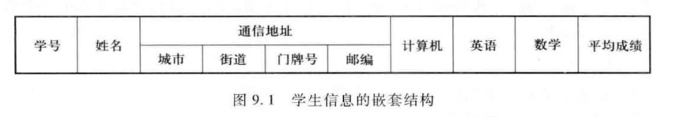
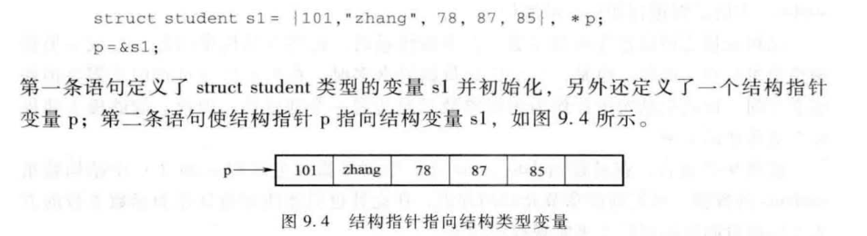

# Chapter9 Structure
## 一、概念与定义
### 1.1 一般定义

!!! example
    ```c
    struct student{
        int num;
        char name[10];
        int computer, english, math;
        double average;
    };
    ```

- 定义语法：  
```c
struct 结构名 {
    类型名 结构成员名1;
    类型名 结构成员名2;
    ...
    类型名 结构成员名n;
};
```
### 1.2 嵌套定义：

```c
struct address{
    char city [10];
    char street [20];
    int code;
    int zip;
};
struct student{
    int num;
    char name[10];
    struct address addr
    int computer, english, math;
    double average;
};
```
### 1.3 变量定义
#### 1.3.1 方法1：单独定义：
```c
struct student{
    int num;
    char name[10];
    int computer, english, math;
    double average;
};
struct student s1, max;
```

#### 1.3.2 方法2：混合定义：
```c
struct student{
    int num;
    char name[10];
    int computer, english, math;
    double average;
};s1,s2;
```

#### 1.3.3 方法3：无类型名定义：
```c
struct {
    类型名 结构成员名1;
    类型名 结构成员名2;
    ...
    类型名 结构成员名n;
} 结构变量名表;
```
因为没有结构名，所以不能再定义了。

#### 1.3.4 可以初始化
```c
struct student s1= {101,"Zhang",78,87,85};
```

### 1.4 存储


### 1.5 结构变量的使用
- 一般赋值：
  - `s1.num=101`
  - `strcpy(s1.name,"zhang")`
  - `nest_s1.addr.zip=310015`

!!! warning
    和一般运算符混合运算时，结构成员运算符优先。

- 整体赋值：`s2=s1`，相当于逐项复制，**只有相同结构类型的变量之间才可以整体赋值**

### 1.6 结构数组定义
```c
struct student students[50];
```
!!! example "定义实例：PTA9-6-2"
    ```c
    int getindex( char *s ){
        struct day{
            int index;
            char* name;
        };
    struct day days[] = {
        {0, "Sunday"},
        {1, "Monday"},
        {2, "Tuesday"},
        {3, "Wednesday"},
        {4, "Thursday"},
        {5, "Friday"},
        {6, "Saturday"}
        };
        for(int i=0;i<7;i++){
            if(strcmp(days[i].name,s)==0){
                return days[i].index;
            }
        }
        return -1;
    }
    ```

## 二、结构指针

### 2.1 Introduction



访问结构成员：
`s1.num=101`=`(*p).num=101`=`p->num=101`

### 2.2 指针作为函数参数


## 三、hw9纠错
- 取单个结构体的内存：`sizeof(struct student)`  
- 若使用`*p`来传递结构体：可以用`p++`  
- `scanf("%s",students[i].name)` 是不需要加`&`的！  