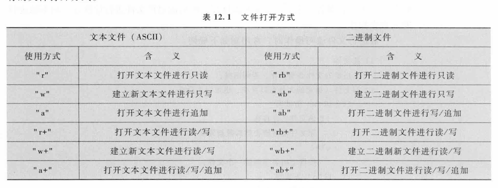

# Ch12 文件

## 常用函数

在`stdio.h`里定义

```c
FILE *fp; //定义文件指针
fp=fopen("prime.txt","w")； //打开文件，一般会判断一下fp是不是NULL
fprintf(fp,"%d",n); //写入文件
fclose(fp)//关闭文件
```

- 文件操作具有顺序性的特点，前一个数据取出后，下一次将顺序取后一个数据，`fp->curp`将发生改变，但改变隐含在文件读取操作之中，不需要写
- `fp++`将指向下一个文件结构，别轻易用！



### 字符方式读写函数

```c
ch=fgetc();
fputc(ch,fp);
```

```c
fputs(s,fp);
fgets(s,n,fp);
```

函数懒得抄了，直接翻书嚎了，给一个list自查：

rewind、fseek、ftell、feof、ferror、clearerr

理论考背到这里差不多了orz 之后寒假再好好学一边文件操作


## 零碎知识点

1. `typedf <已有类型名><新关键字>`

`<已有类型名>`也可以是`struct`的那一长串定义，也可以是已有的`int`之类

