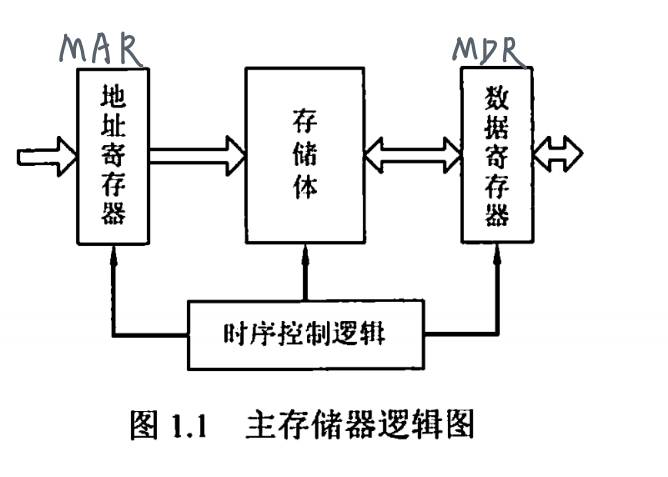
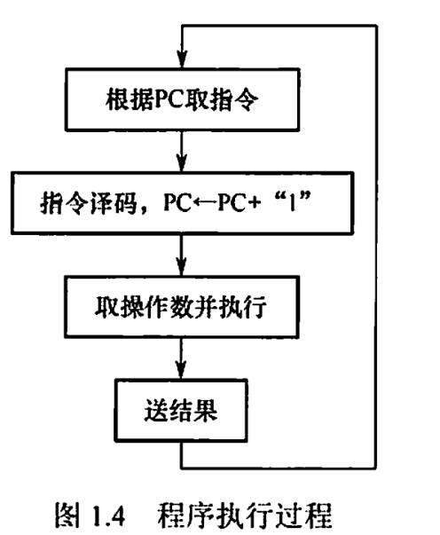
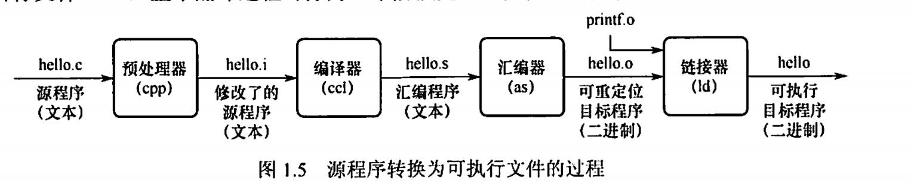

# Chap1 计算机系统概述
## 1. 计算机组成概述

- 软件的功能和硬件的功能在逻辑上是等效的

- 存储器：
	- 主存储器：按存储单元的地址进行存取【按地址存取的方式】，如下图

CPU: 运算器+控制器

- 运算器：
	- 核心：算术逻辑单元：`ALU`
	- 通用寄存器：
		- 必须具备：累加器`ACC`, 乘商寄存器`MQ`, 操作数寄存器 `X`
		- 变址寄存器`IX`，基址寄存器`BR`
	- 还有程序状态寄存器`PSW` (标志寄存器)， 用来存放 ALU 运算得到的一些标志信息或处理机的状态信息 (`of`,`cf`,`zf`)
	- 运算器内也包含数据总线！
- 控制器：
	- 程序计数器(PC), 指令寄存器(IR)和控制单元(CU)
		- PC: 存放当前欲执行指令的地址，可以自动加1指向下一条, 直通MAR
		- IR: 存放当前指令，来自MDR

- 计算机层次架构：【如图】

## 2. 计算机运行介绍

程序执行过程：

典图之，从源程序到运行文件

- 指令执行过程描述：
	- 取指令: 
		- PC -> MAR
		- M -> MDR -> IR
	- 分析指令: OP(IR) -> CU | 指令译码并送出控制信号
		- 控制器根据 IR 中指令的操作码，生成相应的控制信号，送到不同的执行部件
	- 执行指令: 
		- Ad(IR) -> MAR
		- M -> MDR -> ACC

## 3. 计算机性能指标

- 字长：内部寄存器的大小

机器字长：计算机一次能处理的二进制位数

- 数据通路带宽
- 主存储量
	- MAR 位数反应存储个数，$\times$ MDR 位数 表示存储容量
- 运算速度
	- 吞吐量和响应时间
	- CPU 时钟周期 | **Cycle Time** ：执行一个指令最少需要的时间
	- 主频 | CPU 时钟频率: CPU时钟周期 = 1 / 主频
	- CPI：执行一条指令需要的时钟周期数 | 所有指令执行的平均时钟周期数
	- CPU 执行时间 | **CPU Clock Cycles** = (指令条数 IC  $\times$ CPI)/主频
	- MIPS: 每秒执行多少百万条指令 | 指令条数/ ( 执行时间 $\times 10^6$ ) = 主频 / (CPI $\times 10^6$ )

!!! warning 
	- 不同的指令类别（比如 RISC-V 的 R 型指令、I 型指令等等）会产生不同的 CPI，如果 CPU 执行多种类型的指令，上面的公式需要修改为以下加权形式：
	$$\text{CPU Clock Cycles} = \sum_{i=1}^n \left( \text{CPI}_i \times \text{Instruction Count}_i \right)$$
	- 由此有加权平均的CPI：
	$$\text{CPI} = \frac{\text{Clock Cycles}}{\text{Instruction Count}} = \sum_{i=1}^n \left( \frac{\text{CPI}_i \times \text{Instruction Count}_i}{\text{Instruction Count}} \right)$$
	例子：
	

总结：
$$ \text{CPU Time} = \frac{\text{Seconds}}{\text{Program}} = \frac{\text{Instructions}}{\text{Program}} \times \frac{\text{Clock cycles}}{\text{Instruction}} \times \frac{\text{Seconds}}{\text{Clock Cycle}} $$
## 4. 边际收益递减定律

!!! bug "陷阱"
    - 改善CPU的其中一个方面，就能CPU的整体性能有所提升

- 阿姆达尔定律/边际收益递减规律：部分性能的提升对整体性能的提升是有限的

$$
	\mathrm{T_{improved}} = \dfrac{T_{\text{affected}}}{\mathrm{Amount\ of\ improvement}} + T_{\text{unaffected}}
	$$

例子：假设一个程序在某个CPU下运行耗时100s，其中的乘法运算耗时80s。如果我想让程序运行比原来快5倍（也就是耗时20s），乘法运算的速度需要提升多少？

解：根据条件，运用上面的公式，可以得到以下式子：
$$20 = \dfrac{80}{n} + 20$$
显然$n$无解，因此无法通过这种方式提升性能。