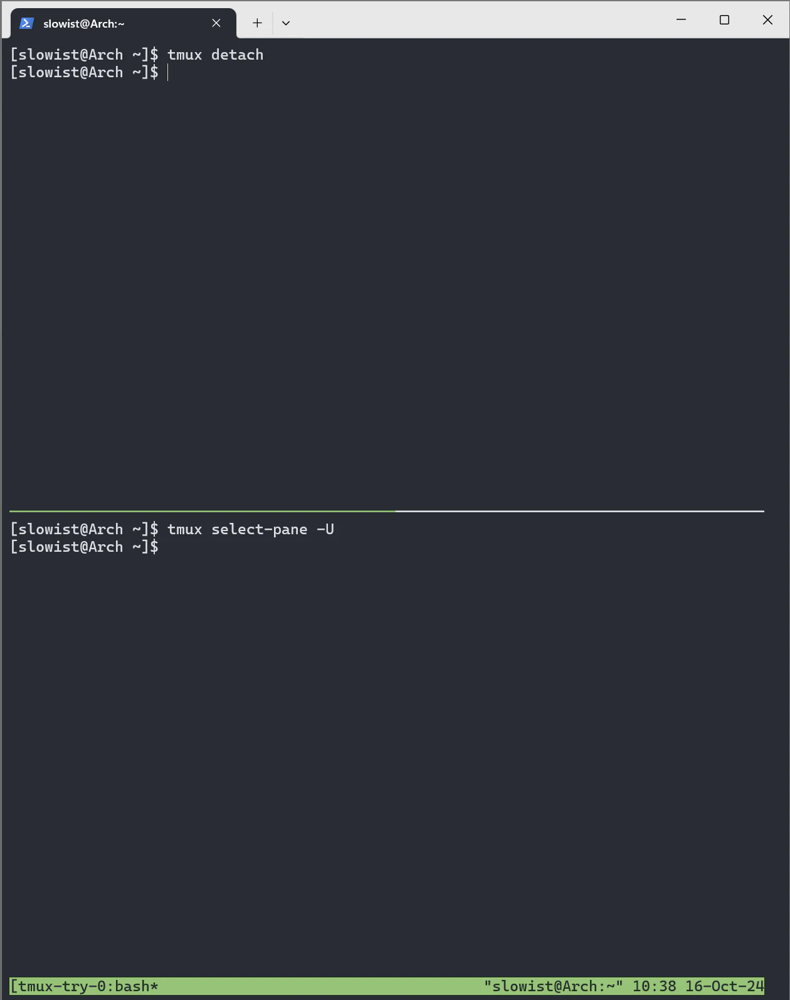

# 南大PA0: Linux/Vim/GDB等工具基本熟悉

1. 查看磁盘空间：`df-h`  
```zsh
[slowist@Arch ~]$ df -h
Filesystem      Size  Used Avail Use% Mounted on
dev             325M     0  325M   0% /dev
run             337M  936K  336M   1% /run
efivarfs        256K   25K  227K  10% /sys/firmware/efi/efivars
/dev/sda3        16G  4.4G   12G  29% /
tmpfs           337M     0  337M   0% /dev/shm
tmpfs           1.0M     0  1.0M   0% /run/credentials/systemd-udev-load-credentials.service
tmpfs           1.0M     0  1.0M   0% /run/credentials/systemd-journald.service
tmpfs           1.0M     0  1.0M   0% /run/credentials/systemd-tmpfiles-setup-dev-early.service
tmpfs           1.0M     0  1.0M   0% /run/credentials/systemd-sysctl.service
tmpfs           1.0M     0  1.0M   0% /run/credentials/systemd-sysusers.service
tmpfs           1.0M     0  1.0M   0% /run/credentials/systemd-tmpfiles-setup-dev.service
tmpfs           337M  8.0K  337M   1% /tmp
/dev/sda1       500M  160K  500M   1% /boot/efi
tmpfs           1.0M     0  1.0M   0% /run/credentials/systemd-tmpfiles-setup.service
tmpfs           1.0M     0  1.0M   0% /run/credentials/systemd-vconsole-setup.service
tmpfs            68M   44K   68M   1% /run/user/1000
```

2. Arch里面进行软件包升级
```bash
sudo pacman -S package_name # 安装软件包 
sudo pacman -Syu package_name # 升级系统并安装软件包，Arch Linux 不支持部分升级，建议用此命令先升级再安装 
sudo pacman -Syu # 升级系统 
sudo pacman -Syyu # 升级系统 yy标记强制刷新 u标记升级动作 
sudo pacman -R package_name # 删除软件包 
sudo pacman -Rs package_name # 删除软件包，及其所有没有被其他已安装软件包使用的依赖包 
sudo pacman -Qdt # 找出孤立包 Q为查询本地软件包数据库 d标记依赖包 t标记不需要的包 dt合并标记孤立包 
sudo pacman -Rs $(pacman -Qtdq) # 删除孤立软件包 
sudo pacman -Fy # 更新命令查询文件列表数据库 
sudo pacman -F xxx # 当不知道某个命令属于哪个包时，用来查询某个xxx命令属于哪个包
```

我们需要安装(手册里是ubuntu)


```bash
apt-get install build-essential    # build-essential packages, include binary utilities, gcc, make, and so on,在arch内是base-devel
apt-get install man                # on-line reference manual
apt-get install gcc-doc            # on-line reference manual for gcc
apt-get install gdb                # GNU debugger
apt-get install git                # revision control system
apt-get install libreadline-dev    # a library used later
apt-get install libsdl2-dev        # a library used later

```

一些库的简介：

- `readline` 是一个用于处理交互式输入的库。当你在终端输入命令时，可以使用方向键浏览之前输入的命令历史，或者通过快捷键进行文本编辑（如Ctrl + A移动到行首、Ctrl + E移动到行尾），这些功能通常就是由 `readline` 提供的

## vim修改配色方案

要检查系统中可用的配色方案，可以运行以下命令：

```
$ ls /usr/share/vim/vim81/colors | grep .vim
blue.vim
darkblue.vim
default.vim
delek.vim
desert.vim
elflord.vim
evening.vim
industry.vim
koehler.vim
morning.vim
murphy.vim
pablo.vim
peachpuff.vim
ron.vim
shine.vim
slate.vim
torte.vim
zellner.vim
```

试用配色方案：
```
:colo <color-scheme-name>
//或
:colors <color-scheme-name>
//或
:colorscheme <color-scheme-name>
```

常用linux命令

```
$ mkdir temp      # 创建一个目录temp
$ cd temp         # 切换到目录temp
$ touch newfile   # 创建一个空文件newfile
$ mkdir newdir    # 创建一个目录newdir
$ cd newdir       # 切换到目录newdir
$ cp ../newfile . # 将上级目录中的文件newfile复制到当前目录下
$ cp newfile aaa  # 将文件newfile复制为新文件aaa
$ mv aaa bbb      # 将文件aaa重命名为bbb
$ mv bbb ..       # 将文件bbb移动到上级目录
$ cd ..           # 切换到上级目录
$ rm bbb          # 删除文件bbb
$ cd ..           # 切换到上级目录
$ rm -r temp      # 递归删除目录temp
```

- `cp SOURCE DEST`可以将`SOURCE`文件复制为`DEST`文件; 如果`DEST`是一个目录, 则将`SOURCE`文件复制到该目录下.
- `touch NEWFILE`可以创建一个内容为空的新文件`NEWFILE`, 若`NEWFILE`已存在, 其内容不会丢失.
- `pwd`: 当前所在目录
- `grep`:
	- 基本语法：grep [选项] 搜索模式 [文件...]
	- `-i`:忽略大小写
	- 使用`-r` 或`-R`可以在目录中递归搜索所有文件：`grep -r "search_term" directory/`
	- 仅显示匹配的文件名：`grep -l "search_term" *`
	- 正则表达式：`-E` `grep -E "^a.*[0-9]$" filename`
	- 显示匹配上下文行
		- `-A n`：显示匹配行 **后面** 的 n 行。
		- `-B n`：显示匹配行 **前面** 的 n 行。
		- `-C n`：显示匹配行 **前后各** n 行。
	- 反汇编：`objdump`
		- `objdump -d myprog > output`
		- `objdump -d myprog | tee output` 屏幕上会显示`output`的内容
	- 输出重定向：
		- `> empty`                  # 创建一个名为empty的空文件
		- `cat old_file > new_file`  # 将文件old_file复制一份, 新文件名为new_file
	- 输入重定向：
		- `./myprog < data`，将输入数据一次性输入到`data`中

## Makefile的规则

目标文件名:依赖文件列表
	用于生成目标文件的命令序列   # 注意开头的tab, 而不是空格

例如：
```makefile
hello:hello.c
	gcc hello.c -o hello	# 注意开头的tab, 而不是空格

.PHONY: clean

clean:
	rm hello	# 注意开头的tab, 而不是空格
```

>上面例子中的`clean`规则比较特殊, 它并不是用来生成一个名为`clean`的文件, 而是用于清除编译结果, 并且它不依赖于其它任何文件. `make`程序总是希望通过执行命令来生成目标, 但我们给出的命令`rm hello`并不是用来生成`clean`文件, 因此这样的命令总是会被执行. 你需要键入`make clean`命令来告诉`make`程序执行`clean`规则, 这是因为`make`默认执行在`Makefile`中文本序排在最前面的规则. 但如果很不幸地, 目录下已经存在了一个名为`clean`的文件, 执行`make clean`会得到"文件已经是最新版本"的提示. 解决这个问题的方法是在`Makefile`中加入一行`PHONY: clean`, 用于指示"`clean`是一个伪目标". 这样以后, `make`程序就不会判断目标文件的新旧, 伪目标相应的命令序列总是会被执行.

GDB用法详解：https://www.cnblogs.com/lvdongjie/p/8994092.html
（GDB之前已经学过，要用了再仔细研究吧qwq）


tmux: https://www.ruanyifeng.com/blog/2019/10/tmux.html
https://docs.hpc.sjtu.edu.cn/login/tmux.html
https://louiszhai.github.io/2017/09/30/tmux/

具体也还是多用好了



- 文件管理 - `cd`, `pwd`, `mkdir`, `rmdir`, `ls`, `cp`, `rm`, `mv`, `tar`
- 文件检索 - `cat`, `more`, `less`, `head`, `tail`, `file`, `find`
- 输入输出控制 - 重定向, 管道, `tee`, `xargs`
- 文本处理 - `vim`, `grep`, `awk`, `sed`, `sort`, `wc`, `uniq`, `cut`, `tr`
- 正则表达式
- 系统监控 - `jobs`, `ps`, `top`, `kill`, `free`, `dmesg`, `lsof`
- 上述工具覆盖了程序员绝大部分的需求
    - 可以先从简单的尝试开始, 用得多就记住了, 记不住就`man`


