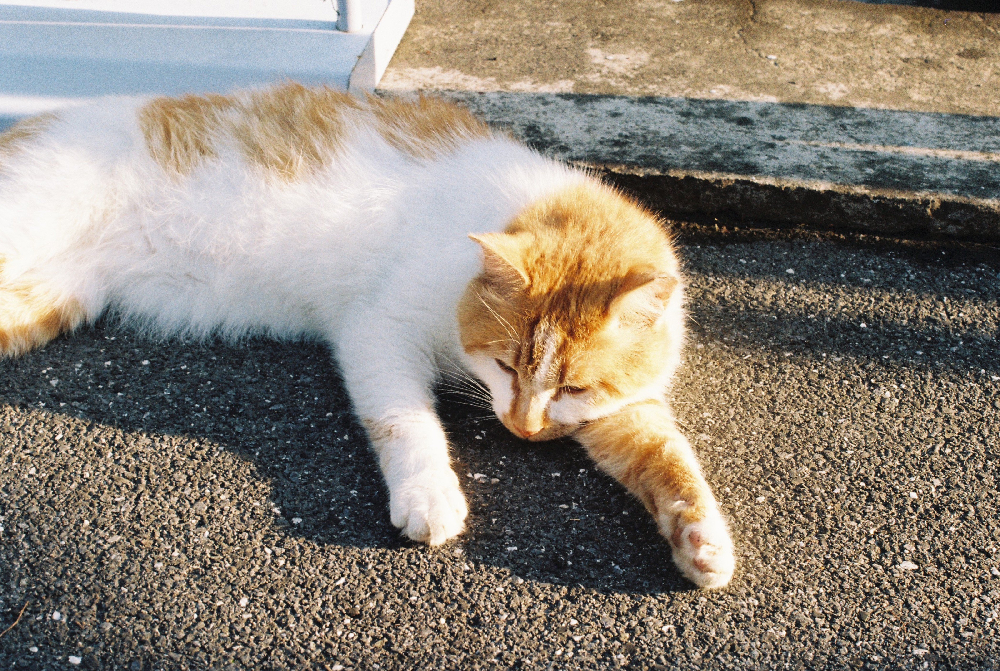

# Kodak Gold 200 No.3

这是我的第三卷胶卷，从 2025 年 6 月开始拍摄，记录了从学校到外婆家，再到小乌石塘与朋友们看日出的片段。

> 非常蓬松的橘猫，在桥边出没。期末周回宿舍路上看见它在睡觉，于是回宿舍拿相机折返拍下了这张照片，作为第三卷胶卷的开头。

<figure style="max-width:800px;margin:0 auto;text-align:center;">
	
	<figcaption style="font-size:0.95em;color:#555;margin-top:0.5rem;">图 1 — 在桥边出没的橙色橘猫（Kodak Gold 200）</figcaption>
</figure>

---

